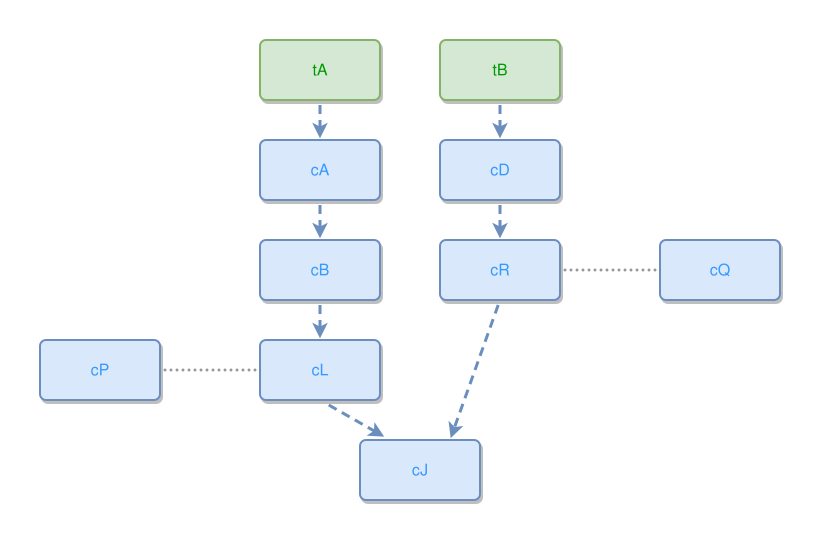

<!-- AUTO-GENERATED FILE - DO NOT EDIT -->
<!-- Generated by: gen-test-md -->
<!-- Command: go run ./cmd-dev/gen-test-md -->

# a-satellite-wraps-a-pure-grid-from-the-outer-flank

> **⚠️ Warning:** This file is auto-generated. Manual changes will be lost when tests are regenerated.

**Source:** gl:docs/dev/layout-gen/layout-alg-ext.md#L880-L886 | [docs/dev/layout-gen/layout-alg-ext.md](../../docs/dev/layout-gen/layout-alg-ext.md#a-satellite-wraps-a-pure-grid-from-the-outer-flank)

## ipmt Content

```ipmt
tA --> cA ::c --> cB ::c --> cL ::c
cL --> cJ ::c
cL --- cP ::c

tB --> cD ::c --> cR ::c --> cJ ::c
cR --- cQ ::c
```

## Generated Files

- [a-satellite-wraps-a-pure-grid-from-the-outer-flank.ipmt](a-satellite-wraps-a-pure-grid-from-the-outer-flank.ipmt) - ipmt input
- [a-satellite-wraps-a-pure-grid-from-the-outer-flank.json](a-satellite-wraps-a-pure-grid-from-the-outer-flank.json) - Parsed structure
- [a-satellite-wraps-a-pure-grid-from-the-outer-flank.layout.json](a-satellite-wraps-a-pure-grid-from-the-outer-flank.layout.json) - Layout coordinates
- [a-satellite-wraps-a-pure-grid-from-the-outer-flank.ipm.svg](a-satellite-wraps-a-pure-grid-from-the-outer-flank.ipm.svg) - Rendered diagram

## Rendered Diagram



This test case was automatically generated from the specification document.

The ipmt code block was extracted using [sync-test-cases](../../docs/dev/testing.md) and saved to [a-satellite-wraps-a-pure-grid-from-the-outer-flank.ipmt](a-satellite-wraps-a-pure-grid-from-the-outer-flank.ipmt), then parsed into the [JSON structure](a-satellite-wraps-a-pure-grid-from-the-outer-flank.json) and laid out into [layout coordinates](a-satellite-wraps-a-pure-grid-from-the-outer-flank.layout.json). The [SVG diagram](a-satellite-wraps-a-pure-grid-from-the-outer-flank.ipm.svg) was rendered using [ipmsvg-gen](../../docs/ipmsvg-gen.md).
