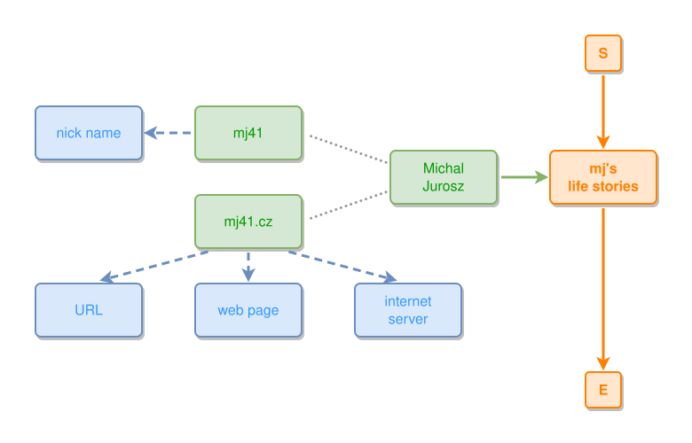

<!-- AUTO-GENERATED FILE - DO NOT EDIT -->
<!-- Generated by: gen-test-md -->
<!-- Command: go run ./cmd-dev/gen-test-md -->

# a-satellites-tree-never-evicts-its-own-frame

> **⚠️ Warning:** This file is auto-generated. Manual changes will be lost when tests are regenerated.

**Source:** gl:docs/dev/layout-gen/layout-alg-ext.md#L1184-L1188 | [docs/dev/layout-gen/layout-alg-ext.md](../../docs/dev/layout-gen/layout-alg-ext.md#a-satellites-tree-never-evicts-its-own-frame)

## ipmt Content

```ipmt
MJ::a Michal Jurosz --> life::a mj's life stories ::e
MJ --- mj41, mj41.cz
mj41 --> nick name ::c
mj41.cz --> URL ::c, web page ::c, internet server ::c
```

## Generated Files

- [a-satellites-tree-never-evicts-its-own-frame.ipmt](a-satellites-tree-never-evicts-its-own-frame.ipmt) - ipmt input
- [a-satellites-tree-never-evicts-its-own-frame.json](a-satellites-tree-never-evicts-its-own-frame.json) - Parsed structure
- [a-satellites-tree-never-evicts-its-own-frame.layout.json](a-satellites-tree-never-evicts-its-own-frame.layout.json) - Layout coordinates
- [a-satellites-tree-never-evicts-its-own-frame.ipm.svg](a-satellites-tree-never-evicts-its-own-frame.ipm.svg) - Rendered diagram

## Rendered Diagram



This test case was automatically generated from the specification document.

The ipmt code block was extracted using [sync-test-cases](../../docs/dev/testing.md) and saved to [a-satellites-tree-never-evicts-its-own-frame.ipmt](a-satellites-tree-never-evicts-its-own-frame.ipmt), then parsed into the [JSON structure](a-satellites-tree-never-evicts-its-own-frame.json) and laid out into [layout coordinates](a-satellites-tree-never-evicts-its-own-frame.layout.json). The [SVG diagram](a-satellites-tree-never-evicts-its-own-frame.ipm.svg) was rendered using [ipmsvg-gen](../../docs/ipmsvg-gen.md).
