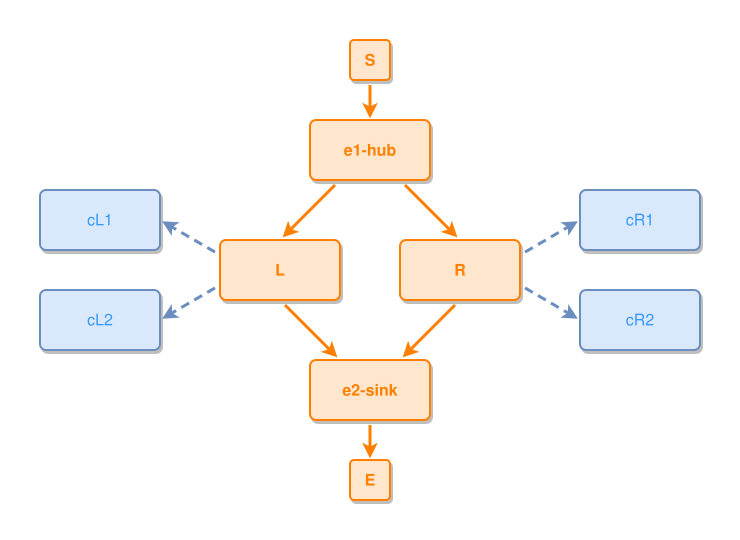

<!-- AUTO-GENERATED FILE - DO NOT EDIT -->
<!-- Generated by: gen-test-md -->
<!-- Command: go run ./cmd-dev/gen-test-md -->

# diamond-branches-stay-compact-with-outer-concepts

> **⚠️ Warning:** This file is auto-generated. Manual changes will be lost when tests are regenerated.

**Source:** gl:docs/dev/layout-gen/layout-alg-ext.md#L136-L144 | [docs/dev/layout-gen/layout-alg-ext.md](../../docs/dev/layout-gen/layout-alg-ext.md#diamond-branches-stay-compact-with-outer-concepts)

## ipmt Content

```ipmt
e1-hub ::e --> L ::e
e1-hub --> R ::e
L --> e2-sink ::e
R --> e2-sink
L --> cL1 ::c
L --> cL2 ::c
R --> cR1 ::c
R --> cR2 ::c
```

## Generated Files

- [diamond-branches-stay-compact-with-outer-concepts.ipmt](diamond-branches-stay-compact-with-outer-concepts.ipmt) - ipmt input
- [diamond-branches-stay-compact-with-outer-concepts.json](diamond-branches-stay-compact-with-outer-concepts.json) - Parsed structure
- [diamond-branches-stay-compact-with-outer-concepts.layout.json](diamond-branches-stay-compact-with-outer-concepts.layout.json) - Layout coordinates
- [diamond-branches-stay-compact-with-outer-concepts.ipm.svg](diamond-branches-stay-compact-with-outer-concepts.ipm.svg) - Rendered diagram

## Rendered Diagram



This test case was automatically generated from the specification document.

The ipmt code block was extracted using [sync-test-cases](../../docs/dev/testing.md) and saved to [diamond-branches-stay-compact-with-outer-concepts.ipmt](diamond-branches-stay-compact-with-outer-concepts.ipmt), then parsed into the [JSON structure](diamond-branches-stay-compact-with-outer-concepts.json) and laid out into [layout coordinates](diamond-branches-stay-compact-with-outer-concepts.layout.json). The [SVG diagram](diamond-branches-stay-compact-with-outer-concepts.ipm.svg) was rendered using [ipmsvg-gen](../../docs/ipmsvg-gen.md).
