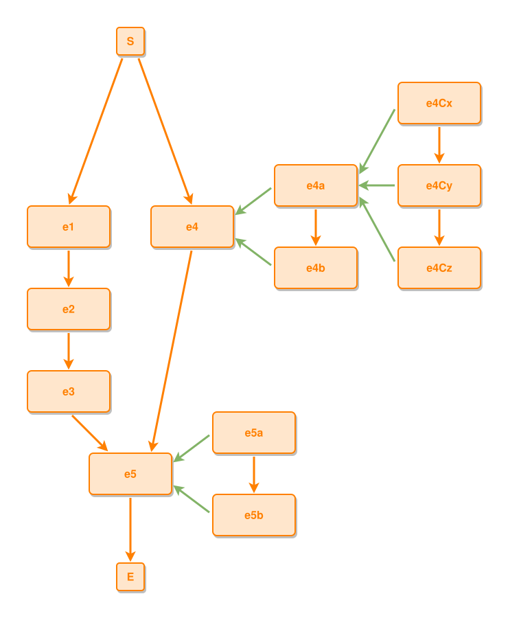

<!-- AUTO-GENERATED FILE - DO NOT EDIT -->
<!-- Generated by: gen-test-md -->
<!-- Command: go run ./cmd-dev/gen-test-md -->

# event-lines

> **⚠️ Warning:** This file is auto-generated. Manual changes will be lost when tests are regenerated.

**Source:** gl:docs/dev/layout-gen/layout-alg-ext.md#L14-L23 | [docs/dev/layout-gen/layout-alg-ext.md](../../docs/dev/layout-gen/layout-alg-ext.md#event-lines)

## ipmt Content

```ipmt
e1 ::e --> e2 ::e --> e3 ::e
e4a ::e --> e4b ::e
e4a, e4b --::P--> e4 ::e
e4Cx ::e --> e4Cy ::e --> e4Cz ::e
e4Cx, e4Cy, e4Cz --::P--> e4a
e3, e4 --> e5 ::e

e5a ::e --> e5b ::e
e5a, e5b --::P--> e5
```

## Generated Files

- [event-lines.ipmt](event-lines.ipmt) - ipmt input
- [event-lines.json](event-lines.json) - Parsed structure
- [event-lines.layout.json](event-lines.layout.json) - Layout coordinates
- [event-lines.ipm.svg](event-lines.ipm.svg) - Rendered diagram

## Rendered Diagram



This test case was automatically generated from the specification document.

The ipmt code block was extracted using [sync-test-cases](../../docs/dev/testing.md) and saved to [event-lines.ipmt](event-lines.ipmt), then parsed into the [JSON structure](event-lines.json) and laid out into [layout coordinates](event-lines.layout.json). The [SVG diagram](event-lines.ipm.svg) was rendered using [ipmsvg-gen](../../docs/ipmsvg-gen.md).
