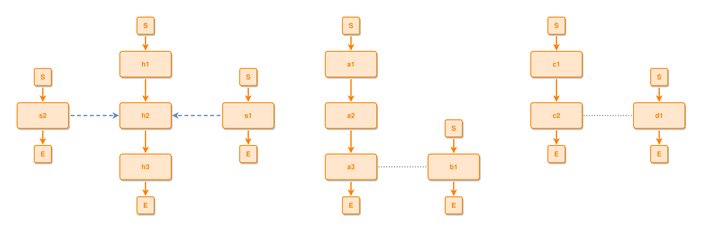

<!-- AUTO-GENERATED FILE - DO NOT EDIT -->
<!-- Generated by: gen-test-md -->
<!-- Command: go run ./cmd-dev/gen-test-md -->

# every-tied-cluster-is-its-own-snowflake-then-the-rest-wraps

> **⚠️ Warning:** This file is auto-generated. Manual changes will be lost when tests are regenerated.

**Source:** gl:docs/dev/layout-gen/layout-alg-ext.md#L1280-L1289 | [docs/dev/layout-gen/layout-alg-ext.md](../../docs/dev/layout-gen/layout-alg-ext.md#every-tied-cluster-is-its-own-snowflake-then-the-rest-wraps)

## ipmt Content

```ipmt
h1 ::e --> h2 ::e
h2 --> h3 ::e
s1 ::e --::X--> h2
s2 ::e --::X--> h2
a1 ::e --> a2 ::e
a2 --> a3 ::e
b1 ::e --::N-- a3
c1 ::e --> c2 ::e
d1 ::e --::N-- c2
```

## Generated Files

- [every-tied-cluster-is-its-own-snowflake-then-the-rest-wraps.ipmt](every-tied-cluster-is-its-own-snowflake-then-the-rest-wraps.ipmt) - ipmt input
- [every-tied-cluster-is-its-own-snowflake-then-the-rest-wraps.json](every-tied-cluster-is-its-own-snowflake-then-the-rest-wraps.json) - Parsed structure
- [every-tied-cluster-is-its-own-snowflake-then-the-rest-wraps.layout.json](every-tied-cluster-is-its-own-snowflake-then-the-rest-wraps.layout.json) - Layout coordinates
- [every-tied-cluster-is-its-own-snowflake-then-the-rest-wraps.ipm.svg](every-tied-cluster-is-its-own-snowflake-then-the-rest-wraps.ipm.svg) - Rendered diagram

## Rendered Diagram



This test case was automatically generated from the specification document.

The ipmt code block was extracted using [sync-test-cases](../../docs/dev/testing.md) and saved to [every-tied-cluster-is-its-own-snowflake-then-the-rest-wraps.ipmt](every-tied-cluster-is-its-own-snowflake-then-the-rest-wraps.ipmt), then parsed into the [JSON structure](every-tied-cluster-is-its-own-snowflake-then-the-rest-wraps.json) and laid out into [layout coordinates](every-tied-cluster-is-its-own-snowflake-then-the-rest-wraps.layout.json). The [SVG diagram](every-tied-cluster-is-its-own-snowflake-then-the-rest-wraps.ipm.svg) was rendered using [ipmsvg-gen](../../docs/ipmsvg-gen.md).
