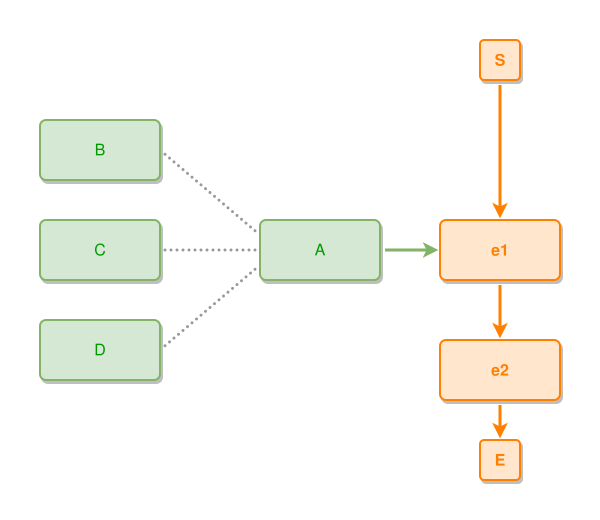

<!-- AUTO-GENERATED FILE - DO NOT EDIT -->
<!-- Generated by: gen-test-md -->
<!-- Command: go run ./cmd-dev/gen-test-md -->

# near-to-satellites-wrap-as-the-outermost-layer

> **⚠️ Warning:** This file is auto-generated. Manual changes will be lost when tests are regenerated.

**Source:** gl:docs/dev/layout-gen/layout-alg-ext.md#L872-L877 | [docs/dev/layout-gen/layout-alg-ext.md](../../docs/dev/layout-gen/layout-alg-ext.md#near-to-satellites-wrap-as-the-outermost-layer)

## ipmt Content

```ipmt
e1 ::e --> e2 ::e
A ::t --> e1
A --- B ::t
A --- C ::t
A --- D ::t
```

## Generated Files

- [near-to-satellites-wrap-as-the-outermost-layer.ipmt](near-to-satellites-wrap-as-the-outermost-layer.ipmt) - ipmt input
- [near-to-satellites-wrap-as-the-outermost-layer.json](near-to-satellites-wrap-as-the-outermost-layer.json) - Parsed structure
- [near-to-satellites-wrap-as-the-outermost-layer.layout.json](near-to-satellites-wrap-as-the-outermost-layer.layout.json) - Layout coordinates
- [near-to-satellites-wrap-as-the-outermost-layer.ipm.svg](near-to-satellites-wrap-as-the-outermost-layer.ipm.svg) - Rendered diagram

## Rendered Diagram



This test case was automatically generated from the specification document.

The ipmt code block was extracted using [sync-test-cases](../../docs/dev/testing.md) and saved to [near-to-satellites-wrap-as-the-outermost-layer.ipmt](near-to-satellites-wrap-as-the-outermost-layer.ipmt), then parsed into the [JSON structure](near-to-satellites-wrap-as-the-outermost-layer.json) and laid out into [layout coordinates](near-to-satellites-wrap-as-the-outermost-layer.layout.json). The [SVG diagram](near-to-satellites-wrap-as-the-outermost-layer.ipm.svg) was rendered using [ipmsvg-gen](../../docs/ipmsvg-gen.md).
