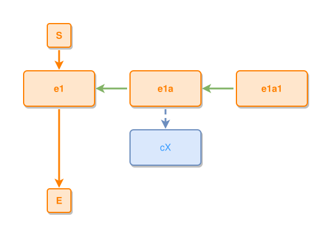

<!-- AUTO-GENERATED FILE - DO NOT EDIT -->
<!-- Generated by: gen-test-md -->
<!-- Command: go run ./cmd-dev/gen-test-md -->

# nested-composites-concept-takes-the-left-flank

> **⚠️ Warning:** This file is auto-generated. Manual changes will be lost when tests are regenerated.

**Source:** gl:docs/dev/layout-gen/layout-alg-ext.md#L172-L175 | [docs/dev/layout-gen/layout-alg-ext.md](../../docs/dev/layout-gen/layout-alg-ext.md#nested-composites-concept-takes-the-left-flank)

## ipmt Content

```ipmt
e1a ::e --::P--> e1 ::e
e1a1 ::e --::P--> e1a
e1a --> cX ::c
```

## Generated Files

- [nested-composites-concept-takes-the-left-flank.ipmt](nested-composites-concept-takes-the-left-flank.ipmt) - ipmt input
- [nested-composites-concept-takes-the-left-flank.json](nested-composites-concept-takes-the-left-flank.json) - Parsed structure
- [nested-composites-concept-takes-the-left-flank.layout.json](nested-composites-concept-takes-the-left-flank.layout.json) - Layout coordinates
- [nested-composites-concept-takes-the-left-flank.ipm.svg](nested-composites-concept-takes-the-left-flank.ipm.svg) - Rendered diagram

## Rendered Diagram



This test case was automatically generated from the specification document.

The ipmt code block was extracted using [sync-test-cases](../../docs/dev/testing.md) and saved to [nested-composites-concept-takes-the-left-flank.ipmt](nested-composites-concept-takes-the-left-flank.ipmt), then parsed into the [JSON structure](nested-composites-concept-takes-the-left-flank.json) and laid out into [layout coordinates](nested-composites-concept-takes-the-left-flank.layout.json). The [SVG diagram](nested-composites-concept-takes-the-left-flank.ipm.svg) was rendered using [ipmsvg-gen](../../docs/ipmsvg-gen.md).
