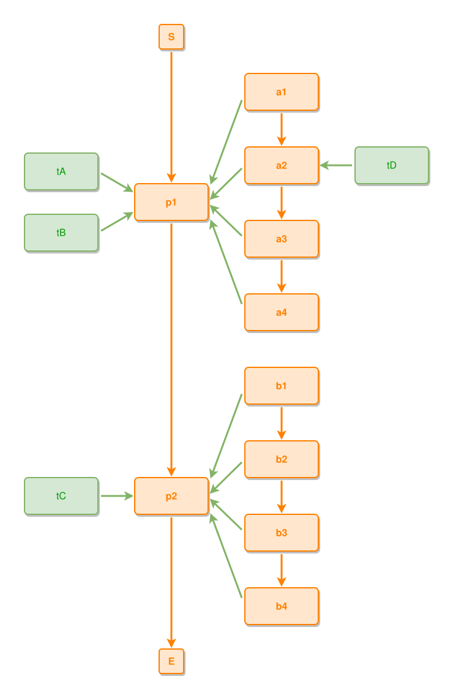

<!-- AUTO-GENERATED FILE - DO NOT EDIT -->
<!-- Generated by: gen-test-md -->
<!-- Command: go run ./cmd-dev/gen-test-md -->

# successive-composites-keep-their-grids-one-row-gap-apart

> **⚠️ Warning:** This file is auto-generated. Manual changes will be lost when tests are regenerated.

**Source:** gl:docs/dev/layout-gen/layout-alg-ext.md#L1390-L1398 | [docs/dev/layout-gen/layout-alg-ext.md](../../docs/dev/layout-gen/layout-alg-ext.md#successive-composites-keep-their-grids-one-row-gap-apart)

## ipmt Content

```ipmt
p1 ::e --> p2 ::e
a1 ::e --> a2 ::e --> a3 ::e --> a4 ::e
a1, a2, a3, a4 --::P--> p1
b1 ::e --> b2 ::e --> b3 ::e --> b4 ::e
b1, b2, b3, b4 --::P--> p2
p1 <-- tA, tB
p2 <-- tC
a2 <-- tD
```

## Generated Files

- [successive-composites-keep-their-grids-one-row-gap-apart.ipmt](successive-composites-keep-their-grids-one-row-gap-apart.ipmt) - ipmt input
- [successive-composites-keep-their-grids-one-row-gap-apart.json](successive-composites-keep-their-grids-one-row-gap-apart.json) - Parsed structure
- [successive-composites-keep-their-grids-one-row-gap-apart.layout.json](successive-composites-keep-their-grids-one-row-gap-apart.layout.json) - Layout coordinates
- [successive-composites-keep-their-grids-one-row-gap-apart.ipm.svg](successive-composites-keep-their-grids-one-row-gap-apart.ipm.svg) - Rendered diagram

## Rendered Diagram



This test case was automatically generated from the specification document.

The ipmt code block was extracted using [sync-test-cases](../../docs/dev/testing.md) and saved to [successive-composites-keep-their-grids-one-row-gap-apart.ipmt](successive-composites-keep-their-grids-one-row-gap-apart.ipmt), then parsed into the [JSON structure](successive-composites-keep-their-grids-one-row-gap-apart.json) and laid out into [layout coordinates](successive-composites-keep-their-grids-one-row-gap-apart.layout.json). The [SVG diagram](successive-composites-keep-their-grids-one-row-gap-apart.ipm.svg) was rendered using [ipmsvg-gen](../../docs/ipmsvg-gen.md).
