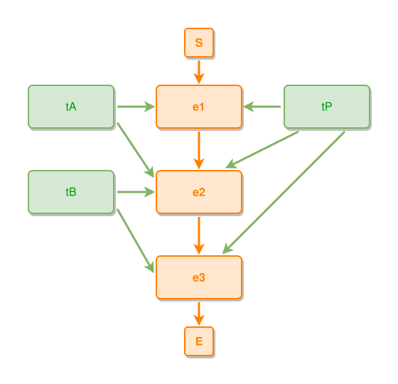

<!-- AUTO-GENERATED FILE - DO NOT EDIT -->
<!-- Generated by: gen-test-md -->
<!-- Command: go run ./cmd-dev/gen-test-md -->

# the-chain-spanning-thing-takes-the-flank-opposite-its-band-rivals

> **⚠️ Warning:** This file is auto-generated. Manual changes will be lost when tests are regenerated.

**Source:** gl:docs/dev/layout-gen/layout-alg-ext.md#L455-L462 | [docs/dev/layout-gen/layout-alg-ext.md](../../docs/dev/layout-gen/layout-alg-ext.md#the-chain-spanning-thing-takes-the-flank-opposite-its-band-rivals)

## ipmt Content

```ipmt
e1 ::e
  --> e2 ::e
  --> e3 ::e

tP --> e1, e2, e3
tA --> e1, e2
tB --> e2, e3
```

## Generated Files

- [the-chain-spanning-thing-takes-the-flank-opposite-its-band-rivals.ipmt](the-chain-spanning-thing-takes-the-flank-opposite-its-band-rivals.ipmt) - ipmt input
- [the-chain-spanning-thing-takes-the-flank-opposite-its-band-rivals.json](the-chain-spanning-thing-takes-the-flank-opposite-its-band-rivals.json) - Parsed structure
- [the-chain-spanning-thing-takes-the-flank-opposite-its-band-rivals.layout.json](the-chain-spanning-thing-takes-the-flank-opposite-its-band-rivals.layout.json) - Layout coordinates
- [the-chain-spanning-thing-takes-the-flank-opposite-its-band-rivals.ipm.svg](the-chain-spanning-thing-takes-the-flank-opposite-its-band-rivals.ipm.svg) - Rendered diagram

## Rendered Diagram



This test case was automatically generated from the specification document.

The ipmt code block was extracted using [sync-test-cases](../../docs/dev/testing.md) and saved to [the-chain-spanning-thing-takes-the-flank-opposite-its-band-rivals.ipmt](the-chain-spanning-thing-takes-the-flank-opposite-its-band-rivals.ipmt), then parsed into the [JSON structure](the-chain-spanning-thing-takes-the-flank-opposite-its-band-rivals.json) and laid out into [layout coordinates](the-chain-spanning-thing-takes-the-flank-opposite-its-band-rivals.layout.json). The [SVG diagram](the-chain-spanning-thing-takes-the-flank-opposite-its-band-rivals.ipm.svg) was rendered using [ipmsvg-gen](../../docs/ipmsvg-gen.md).
