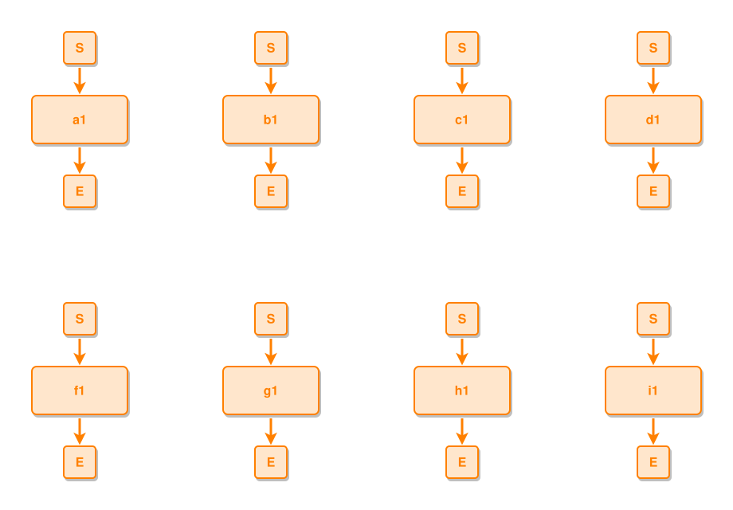

<!-- AUTO-GENERATED FILE - DO NOT EDIT -->
<!-- Generated by: gen-test-md -->
<!-- Command: go run ./cmd-dev/gen-test-md -->

# untied-components-wrap-toward-the-canvas

> **⚠️ Warning:** This file is auto-generated. Manual changes will be lost when tests are regenerated.

**Source:** gl:docs/dev/layout-gen/layout-alg-ext.md#L1209-L1217 | [docs/dev/layout-gen/layout-alg-ext.md](../../docs/dev/layout-gen/layout-alg-ext.md#untied-components-wrap-toward-the-canvas)

## ipmt Content

```ipmt
a1 ::e
b1 ::e
c1 ::e
d1 ::e
f1 ::e
g1 ::e
h1 ::e
i1 ::e
```

## Generated Files

- [untied-components-wrap-toward-the-canvas.ipmt](untied-components-wrap-toward-the-canvas.ipmt) - ipmt input
- [untied-components-wrap-toward-the-canvas.json](untied-components-wrap-toward-the-canvas.json) - Parsed structure
- [untied-components-wrap-toward-the-canvas.layout.json](untied-components-wrap-toward-the-canvas.layout.json) - Layout coordinates
- [untied-components-wrap-toward-the-canvas.ipm.svg](untied-components-wrap-toward-the-canvas.ipm.svg) - Rendered diagram

## Rendered Diagram



This test case was automatically generated from the specification document.

The ipmt code block was extracted using [sync-test-cases](../../docs/dev/testing.md) and saved to [untied-components-wrap-toward-the-canvas.ipmt](untied-components-wrap-toward-the-canvas.ipmt), then parsed into the [JSON structure](untied-components-wrap-toward-the-canvas.json) and laid out into [layout coordinates](untied-components-wrap-toward-the-canvas.layout.json). The [SVG diagram](untied-components-wrap-toward-the-canvas.ipm.svg) was rendered using [ipmsvg-gen](../../docs/ipmsvg-gen.md).
