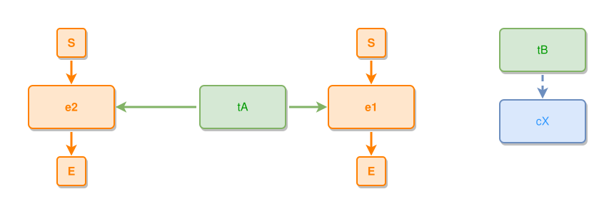

<!-- AUTO-GENERATED FILE - DO NOT EDIT -->
<!-- Generated by: gen-test-md -->
<!-- Command: go run ./cmd-dev/gen-test-md -->

# up-to-three-components-share-one-row

> **⚠️ Warning:** This file is auto-generated. Manual changes will be lost when tests are regenerated.

**Source:** gl:docs/dev/layout-gen/layout-alg-ext.md#L1131-L1134 | [docs/dev/layout-gen/layout-alg-ext.md](../../docs/dev/layout-gen/layout-alg-ext.md#up-to-three-components-share-one-row)

## ipmt Content

```ipmt
tA --> e1 ::e
tA --> e2 ::e
tB --> cX ::c
```

## Generated Files

- [up-to-three-components-share-one-row.ipmt](up-to-three-components-share-one-row.ipmt) - ipmt input
- [up-to-three-components-share-one-row.json](up-to-three-components-share-one-row.json) - Parsed structure
- [up-to-three-components-share-one-row.layout.json](up-to-three-components-share-one-row.layout.json) - Layout coordinates
- [up-to-three-components-share-one-row.ipm.svg](up-to-three-components-share-one-row.ipm.svg) - Rendered diagram

## Rendered Diagram



This test case was automatically generated from the specification document.

The ipmt code block was extracted using [sync-test-cases](../../docs/dev/testing.md) and saved to [up-to-three-components-share-one-row.ipmt](up-to-three-components-share-one-row.ipmt), then parsed into the [JSON structure](up-to-three-components-share-one-row.json) and laid out into [layout coordinates](up-to-three-components-share-one-row.layout.json). The [SVG diagram](up-to-three-components-share-one-row.ipm.svg) was rendered using [ipmsvg-gen](../../docs/ipmsvg-gen.md).
