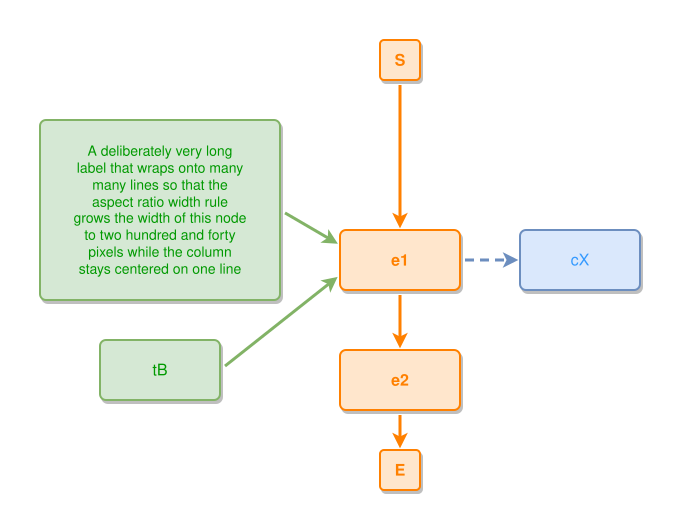

<!-- AUTO-GENERATED FILE - DO NOT EDIT -->
<!-- Generated by: gen-test-md -->
<!-- Command: go run ./cmd-dev/gen-test-md -->

# wide-thing-in-a-graph-keeps-clearances

> **⚠️ Warning:** This file is auto-generated. Manual changes will be lost when tests are regenerated.

**Source:** gl:docs/dev/layout-gen/layout-alg-ext.md#L257-L261 | [docs/dev/layout-gen/layout-alg-ext.md](../../docs/dev/layout-gen/layout-alg-ext.md#wide-thing-in-a-graph-keeps-clearances)

## ipmt Content

```ipmt
A deliberately very long label that wraps onto many many lines so that the aspect ratio width rule grows the width of this node to two hundred and forty pixels while the column stays centered on one line wideH::a ::t --> e1 ::e
tB ::t --> e1
e1 --> e2 ::e
e1 --> cX ::c
```

## Generated Files

- [wide-thing-in-a-graph-keeps-clearances.ipmt](wide-thing-in-a-graph-keeps-clearances.ipmt) - ipmt input
- [wide-thing-in-a-graph-keeps-clearances.json](wide-thing-in-a-graph-keeps-clearances.json) - Parsed structure
- [wide-thing-in-a-graph-keeps-clearances.layout.json](wide-thing-in-a-graph-keeps-clearances.layout.json) - Layout coordinates
- [wide-thing-in-a-graph-keeps-clearances.ipm.svg](wide-thing-in-a-graph-keeps-clearances.ipm.svg) - Rendered diagram

## Rendered Diagram



This test case was automatically generated from the specification document.

The ipmt code block was extracted using [sync-test-cases](../../docs/dev/testing.md) and saved to [wide-thing-in-a-graph-keeps-clearances.ipmt](wide-thing-in-a-graph-keeps-clearances.ipmt), then parsed into the [JSON structure](wide-thing-in-a-graph-keeps-clearances.json) and laid out into [layout coordinates](wide-thing-in-a-graph-keeps-clearances.layout.json). The [SVG diagram](wide-thing-in-a-graph-keeps-clearances.ipm.svg) was rendered using [ipmsvg-gen](../../docs/ipmsvg-gen.md).
