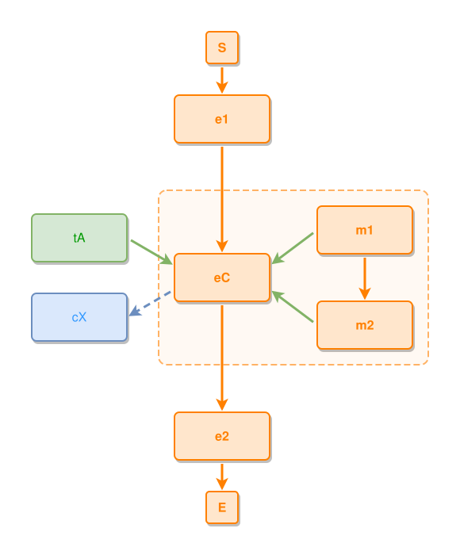

<!-- AUTO-GENERATED FILE - DO NOT EDIT -->
<!-- Generated by: gen-test-md -->
<!-- Command: go run ./cmd-dev/gen-test-md -->

# a-shell-wraps-the-composite-and-its-members-with-one-pad-of-air

> **⚠️ Warning:** This file is auto-generated. Manual changes will be lost when tests are regenerated.

**Source:** gl:docs/dev/layout-gen/layout-alg-shells.md#L37-L43 | [docs/dev/layout-gen/layout-alg-shells.md](../../docs/dev/layout-gen/layout-alg-shells.md#a-shell-wraps-the-composite-and-its-members-with-one-pad-of-air)

## ipmt Content

```ipmt
# ipmt: embed=false
e1 ::e --> eC ::e --> e2 ::e
m1 ::e --> m2 ::e
m1, m2 --::P--> eC
eC <-- tA
eC --> cX ::c
```

## Generated Files

- [a-shell-wraps-the-composite-and-its-members-with-one-pad-of-air.ipmt](a-shell-wraps-the-composite-and-its-members-with-one-pad-of-air.ipmt) - ipmt input
- [a-shell-wraps-the-composite-and-its-members-with-one-pad-of-air.json](a-shell-wraps-the-composite-and-its-members-with-one-pad-of-air.json) - Parsed structure
- [a-shell-wraps-the-composite-and-its-members-with-one-pad-of-air.layout.json](a-shell-wraps-the-composite-and-its-members-with-one-pad-of-air.layout.json) - Layout coordinates
- [a-shell-wraps-the-composite-and-its-members-with-one-pad-of-air.ipm.svg](a-shell-wraps-the-composite-and-its-members-with-one-pad-of-air.ipm.svg) - Rendered diagram

## Rendered Diagram



This test case was automatically generated from the specification document.

The ipmt code block was extracted using [sync-test-cases](../../docs/dev/testing.md) and saved to [a-shell-wraps-the-composite-and-its-members-with-one-pad-of-air.ipmt](a-shell-wraps-the-composite-and-its-members-with-one-pad-of-air.ipmt), then parsed into the [JSON structure](a-shell-wraps-the-composite-and-its-members-with-one-pad-of-air.json) and laid out into [layout coordinates](a-shell-wraps-the-composite-and-its-members-with-one-pad-of-air.layout.json). The [SVG diagram](a-shell-wraps-the-composite-and-its-members-with-one-pad-of-air.ipm.svg) was rendered using [ipmsvg-gen](../../docs/ipmsvg-gen.md).
