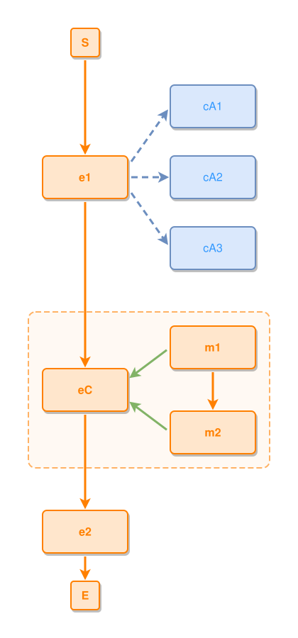

<!-- AUTO-GENERATED FILE - DO NOT EDIT -->
<!-- Generated by: gen-test-md -->
<!-- Command: go run ./cmd-dev/gen-test-md -->

# the-spine-keeps-its-row-gap-from-a-shell-hangs-included

> **⚠️ Warning:** This file is auto-generated. Manual changes will be lost when tests are regenerated.

**Source:** gl:docs/dev/layout-gen/layout-alg-shells.md#L75-L80 | [docs/dev/layout-gen/layout-alg-shells.md](../../docs/dev/layout-gen/layout-alg-shells.md#the-spine-keeps-its-row-gap-from-a-shell-hangs-included)

## ipmt Content

```ipmt
# ipmt: embed=false
e1 ::e --> eC ::e --> e2 ::e
e1 --> cA1 ::c, cA2 ::c, cA3 ::c
m1 ::e --> m2 ::e
m1, m2 --::P--> eC
```

## Generated Files

- [the-spine-keeps-its-row-gap-from-a-shell-hangs-included.ipmt](the-spine-keeps-its-row-gap-from-a-shell-hangs-included.ipmt) - ipmt input
- [the-spine-keeps-its-row-gap-from-a-shell-hangs-included.json](the-spine-keeps-its-row-gap-from-a-shell-hangs-included.json) - Parsed structure
- [the-spine-keeps-its-row-gap-from-a-shell-hangs-included.layout.json](the-spine-keeps-its-row-gap-from-a-shell-hangs-included.layout.json) - Layout coordinates
- [the-spine-keeps-its-row-gap-from-a-shell-hangs-included.ipm.svg](the-spine-keeps-its-row-gap-from-a-shell-hangs-included.ipm.svg) - Rendered diagram

## Rendered Diagram



This test case was automatically generated from the specification document.

The ipmt code block was extracted using [sync-test-cases](../../docs/dev/testing.md) and saved to [the-spine-keeps-its-row-gap-from-a-shell-hangs-included.ipmt](the-spine-keeps-its-row-gap-from-a-shell-hangs-included.ipmt), then parsed into the [JSON structure](the-spine-keeps-its-row-gap-from-a-shell-hangs-included.json) and laid out into [layout coordinates](the-spine-keeps-its-row-gap-from-a-shell-hangs-included.layout.json). The [SVG diagram](the-spine-keeps-its-row-gap-from-a-shell-hangs-included.ipm.svg) was rendered using [ipmsvg-gen](../../docs/ipmsvg-gen.md).
