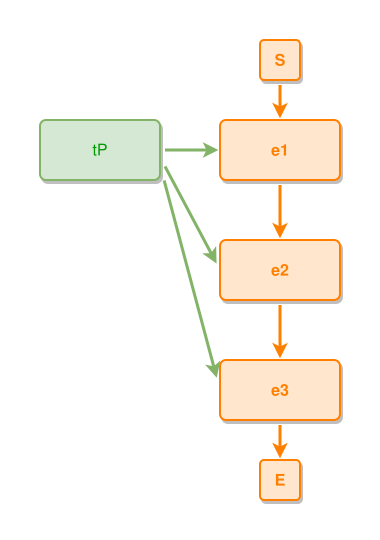

<!-- AUTO-GENERATED FILE - DO NOT EDIT -->
<!-- Generated by: gen-test-md -->
<!-- Command: go run ./cmd-dev/gen-test-md -->

# a-band-members-ties-fan-from-its-facing-side

> **⚠️ Warning:** This file is auto-generated. Manual changes will be lost when tests are regenerated.

**Source:** gl:docs/dev/layout-gen/layout-alg.md#L1504-L1509 | [docs/dev/layout-gen/layout-alg.md](../../docs/dev/layout-gen/layout-alg.md#a-band-members-ties-fan-from-its-facing-side)

## ipmt Content

```ipmt
e1 ::e
  --> e2 ::e
  --> e3 ::e

tP --> e1, e2, e3
```

## Generated Files

- [a-band-members-ties-fan-from-its-facing-side.ipmt](a-band-members-ties-fan-from-its-facing-side.ipmt) - ipmt input
- [a-band-members-ties-fan-from-its-facing-side.json](a-band-members-ties-fan-from-its-facing-side.json) - Parsed structure
- [a-band-members-ties-fan-from-its-facing-side.layout.json](a-band-members-ties-fan-from-its-facing-side.layout.json) - Layout coordinates
- [a-band-members-ties-fan-from-its-facing-side.ipm.svg](a-band-members-ties-fan-from-its-facing-side.ipm.svg) - Rendered diagram

## Layout Validation Rules

Test line: 1504

✅ All 14 rules passed

- ✓ [Line 53](gl:docs/dev/layout-gen/layout-alg.md#L53): `each edge has max-bends=0` ([edges-run-straight-by-default.dsl](../layout-gen-rules/edges-run-straight-by-default.dsl))
- ✓ [Line 1531](gl:docs/dev/layout-gen/layout-alg.md#L1531): `each edge has max-bends=0` ([a-band-members-ties-fan-from-its-facing-side.dsl](../layout-gen-rules/a-band-members-ties-fan-from-its-facing-side.dsl))
- ✓ [Line 1532](gl:docs/dev/layout-gen/layout-alg.md#L1532): `#tP,#e1 have same y` ([a-band-members-ties-fan-from-its-facing-side-02.dsl](../layout-gen-rules/a-band-members-ties-fan-from-its-facing-side-02.dsl))
- ✓ [Line 1533](gl:docs/dev/layout-gen/layout-alg.md#L1533): `#tP is left-of #e1 with gap=60` ([a-band-members-ties-fan-from-its-facing-side-03.dsl](../layout-gen-rules/a-band-members-ties-fan-from-its-facing-side-03.dsl))
- ✓ [Line 1534](gl:docs/dev/layout-gen/layout-alg.md#L1534): `edge #tP,#e1 has source-side=right` ([a-band-members-ties-fan-from-its-facing-side-04.dsl](../layout-gen-rules/a-band-members-ties-fan-from-its-facing-side-04.dsl))
- ✓ [Line 1535](gl:docs/dev/layout-gen/layout-alg.md#L1535): `edge #tP,#e2 has source-side=right` ([a-band-members-ties-fan-from-its-facing-side-05.dsl](../layout-gen-rules/a-band-members-ties-fan-from-its-facing-side-05.dsl))
- ✓ [Line 1536](gl:docs/dev/layout-gen/layout-alg.md#L1536): `edge #tP,#e3 has source-side=right` ([a-band-members-ties-fan-from-its-facing-side-06.dsl](../layout-gen-rules/a-band-members-ties-fan-from-its-facing-side-06.dsl))
- ✓ [Line 1537](gl:docs/dev/layout-gen/layout-alg.md#L1537): `edge #tP,#e1 has target-side=left` ([a-band-members-ties-fan-from-its-facing-side-07.dsl](../layout-gen-rules/a-band-members-ties-fan-from-its-facing-side-07.dsl))
- ✓ [Line 1538](gl:docs/dev/layout-gen/layout-alg.md#L1538): `edge #tP,#e2 has target-side=left` ([a-band-members-ties-fan-from-its-facing-side-08.dsl](../layout-gen-rules/a-band-members-ties-fan-from-its-facing-side-08.dsl))
- ✓ [Line 1539](gl:docs/dev/layout-gen/layout-alg.md#L1539): `edge #tP,#e3 has target-side=left` ([a-band-members-ties-fan-from-its-facing-side-09.dsl](../layout-gen-rules/a-band-members-ties-fan-from-its-facing-side-09.dsl))
- ✓ [Line 1540](gl:docs/dev/layout-gen/layout-alg.md#L1540): `edge #tP,#e1 has source-position=0.5` ([a-band-members-ties-fan-from-its-facing-side-10.dsl](../layout-gen-rules/a-band-members-ties-fan-from-its-facing-side-10.dsl))
- ✓ [Line 1541](gl:docs/dev/layout-gen/layout-alg.md#L1541): `edge #tP,#e1 does not cross edge #tP,#e2` ([a-band-members-ties-fan-from-its-facing-side-11.dsl](../layout-gen-rules/a-band-members-ties-fan-from-its-facing-side-11.dsl))
- ✓ [Line 1542](gl:docs/dev/layout-gen/layout-alg.md#L1542): `edge #tP,#e2 does not cross edge #tP,#e3` ([a-band-members-ties-fan-from-its-facing-side-12.dsl](../layout-gen-rules/a-band-members-ties-fan-from-its-facing-side-12.dsl))
- ✓ [Line 1543](gl:docs/dev/layout-gen/layout-alg.md#L1543): `edge #tP,#e1 does not cross edge #tP,#e3` ([a-band-members-ties-fan-from-its-facing-side-13.dsl](../layout-gen-rules/a-band-members-ties-fan-from-its-facing-side-13.dsl))

## Rendered Diagram



This test case was automatically generated from the specification document.

The ipmt code block was extracted using [sync-test-cases](../../docs/dev/testing.md) and saved to [a-band-members-ties-fan-from-its-facing-side.ipmt](a-band-members-ties-fan-from-its-facing-side.ipmt), then parsed into the [JSON structure](a-band-members-ties-fan-from-its-facing-side.json) and laid out into [layout coordinates](a-band-members-ties-fan-from-its-facing-side.layout.json). The [SVG diagram](a-band-members-ties-fan-from-its-facing-side.ipm.svg) was rendered using [ipmsvg-gen](../../docs/ipmsvg-gen.md).
