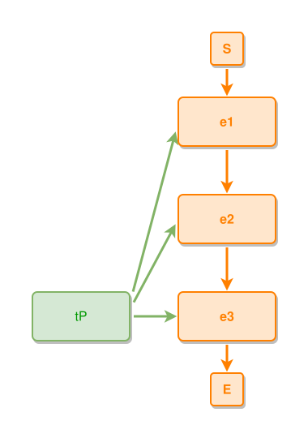

<!-- AUTO-GENERATED FILE - DO NOT EDIT -->
<!-- Generated by: gen-test-md -->
<!-- Command: go run ./cmd-dev/gen-test-md -->

# a-band-members-ties-up-the-chain-fan-from-its-facing-side-too

> **⚠️ Warning:** This file is auto-generated. Manual changes will be lost when tests are regenerated.

**Source:** gl:docs/dev/layout-gen/layout-alg.md#L1491-L1496 | [docs/dev/layout-gen/layout-alg.md](../../docs/dev/layout-gen/layout-alg.md#a-band-members-ties-up-the-chain-fan-from-its-facing-side-too)

## ipmt Content

```ipmt
e1 ::e
  --> e2 ::e
  --> e3 ::e

tP --> e3, e2, e1
```

## Generated Files

- [a-band-members-ties-up-the-chain-fan-from-its-facing-side-too.ipmt](a-band-members-ties-up-the-chain-fan-from-its-facing-side-too.ipmt) - ipmt input
- [a-band-members-ties-up-the-chain-fan-from-its-facing-side-too.json](a-band-members-ties-up-the-chain-fan-from-its-facing-side-too.json) - Parsed structure
- [a-band-members-ties-up-the-chain-fan-from-its-facing-side-too.layout.json](a-band-members-ties-up-the-chain-fan-from-its-facing-side-too.layout.json) - Layout coordinates
- [a-band-members-ties-up-the-chain-fan-from-its-facing-side-too.ipm.svg](a-band-members-ties-up-the-chain-fan-from-its-facing-side-too.ipm.svg) - Rendered diagram

## Layout Validation Rules

Test line: 1491

✅ All 15 rules passed

- ✓ [Line 53](gl:docs/dev/layout-gen/layout-alg.md#L53): `each edge has max-bends=0` ([edges-run-straight-by-default.dsl](../layout-gen-rules/edges-run-straight-by-default.dsl))
- ✓ [Line 1502](gl:docs/dev/layout-gen/layout-alg.md#L1502): `each edge has max-bends=0` ([a-band-members-ties-up-the-chain-fan-from-its-facing-side-too.dsl](../layout-gen-rules/a-band-members-ties-up-the-chain-fan-from-its-facing-side-too.dsl))
- ✓ [Line 1503](gl:docs/dev/layout-gen/layout-alg.md#L1503): `#tP is left-of #e3 with gap=60` ([a-band-members-ties-up-the-chain-fan-from-its-facing-side-too-02.dsl](../layout-gen-rules/a-band-members-ties-up-the-chain-fan-from-its-facing-side-too-02.dsl))
- ✓ [Line 1504](gl:docs/dev/layout-gen/layout-alg.md#L1504): `#tP,#e3 have same y` ([a-band-members-ties-up-the-chain-fan-from-its-facing-side-too-03.dsl](../layout-gen-rules/a-band-members-ties-up-the-chain-fan-from-its-facing-side-too-03.dsl))
- ✓ [Line 1505](gl:docs/dev/layout-gen/layout-alg.md#L1505): `edge #tP,#e3 has source-side=right` ([a-band-members-ties-up-the-chain-fan-from-its-facing-side-too-04.dsl](../layout-gen-rules/a-band-members-ties-up-the-chain-fan-from-its-facing-side-too-04.dsl))
- ✓ [Line 1506](gl:docs/dev/layout-gen/layout-alg.md#L1506): `edge #tP,#e2 has source-side=right` ([a-band-members-ties-up-the-chain-fan-from-its-facing-side-too-05.dsl](../layout-gen-rules/a-band-members-ties-up-the-chain-fan-from-its-facing-side-too-05.dsl))
- ✓ [Line 1507](gl:docs/dev/layout-gen/layout-alg.md#L1507): `edge #tP,#e1 has source-side=right` ([a-band-members-ties-up-the-chain-fan-from-its-facing-side-too-06.dsl](../layout-gen-rules/a-band-members-ties-up-the-chain-fan-from-its-facing-side-too-06.dsl))
- ✓ [Line 1508](gl:docs/dev/layout-gen/layout-alg.md#L1508): `edge #tP,#e3 has target-side=left` ([a-band-members-ties-up-the-chain-fan-from-its-facing-side-too-07.dsl](../layout-gen-rules/a-band-members-ties-up-the-chain-fan-from-its-facing-side-too-07.dsl))
- ✓ [Line 1509](gl:docs/dev/layout-gen/layout-alg.md#L1509): `edge #tP,#e2 has target-side=left` ([a-band-members-ties-up-the-chain-fan-from-its-facing-side-too-08.dsl](../layout-gen-rules/a-band-members-ties-up-the-chain-fan-from-its-facing-side-too-08.dsl))
- ✓ [Line 1510](gl:docs/dev/layout-gen/layout-alg.md#L1510): `edge #tP,#e1 has target-side=left` ([a-band-members-ties-up-the-chain-fan-from-its-facing-side-too-09.dsl](../layout-gen-rules/a-band-members-ties-up-the-chain-fan-from-its-facing-side-too-09.dsl))
- ✓ [Line 1511](gl:docs/dev/layout-gen/layout-alg.md#L1511): `edge #tP,#e3 has source-position=0.5` ([a-band-members-ties-up-the-chain-fan-from-its-facing-side-too-10.dsl](../layout-gen-rules/a-band-members-ties-up-the-chain-fan-from-its-facing-side-too-10.dsl))
- ✓ [Line 1512](gl:docs/dev/layout-gen/layout-alg.md#L1512): `edge #tP,#e1 has source-position=0.25` ([a-band-members-ties-up-the-chain-fan-from-its-facing-side-too-11.dsl](../layout-gen-rules/a-band-members-ties-up-the-chain-fan-from-its-facing-side-too-11.dsl))
- ✓ [Line 1513](gl:docs/dev/layout-gen/layout-alg.md#L1513): `edge #tP,#e1 does not cross edge #tP,#e2` ([a-band-members-ties-up-the-chain-fan-from-its-facing-side-too-12.dsl](../layout-gen-rules/a-band-members-ties-up-the-chain-fan-from-its-facing-side-too-12.dsl))
- ✓ [Line 1514](gl:docs/dev/layout-gen/layout-alg.md#L1514): `edge #tP,#e2 does not cross edge #tP,#e3` ([a-band-members-ties-up-the-chain-fan-from-its-facing-side-too-13.dsl](../layout-gen-rules/a-band-members-ties-up-the-chain-fan-from-its-facing-side-too-13.dsl))
- ✓ [Line 1515](gl:docs/dev/layout-gen/layout-alg.md#L1515): `edge #tP,#e1 does not cross edge #tP,#e3` ([a-band-members-ties-up-the-chain-fan-from-its-facing-side-too-14.dsl](../layout-gen-rules/a-band-members-ties-up-the-chain-fan-from-its-facing-side-too-14.dsl))

## Rendered Diagram



This test case was automatically generated from the specification document.

The ipmt code block was extracted using [sync-test-cases](../../docs/dev/testing.md) and saved to [a-band-members-ties-up-the-chain-fan-from-its-facing-side-too.ipmt](a-band-members-ties-up-the-chain-fan-from-its-facing-side-too.ipmt), then parsed into the [JSON structure](a-band-members-ties-up-the-chain-fan-from-its-facing-side-too.json) and laid out into [layout coordinates](a-band-members-ties-up-the-chain-fan-from-its-facing-side-too.layout.json). The [SVG diagram](a-band-members-ties-up-the-chain-fan-from-its-facing-side-too.ipm.svg) was rendered using [ipmsvg-gen](../../docs/ipmsvg-gen.md).
