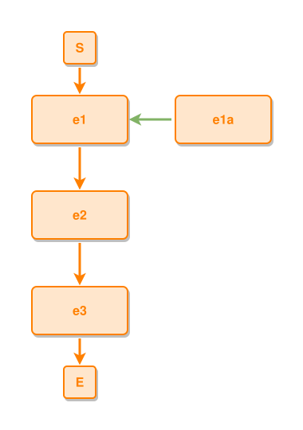

<!-- AUTO-GENERATED FILE - DO NOT EDIT -->
<!-- Generated by: gen-test-md -->
<!-- Command: go run ./cmd-dev/gen-test-md -->

# a-composites-successor-sits-under-the-composite-its-part-beside-it

> **⚠️ Warning:** This file is auto-generated. Manual changes will be lost when tests are regenerated.

**Source:** gl:docs/dev/layout-gen/layout-alg.md#L1073-L1077 | [docs/dev/layout-gen/layout-alg.md](../../docs/dev/layout-gen/layout-alg.md#a-composites-successor-sits-under-the-composite-its-part-beside-it)

## ipmt Content

```ipmt
e1 ::e
e1a ::e --::P--> e1
e1 --> e2 ::e
e2 --> e3 ::e
```

## Generated Files

- [a-composites-successor-sits-under-the-composite-its-part-beside-it.ipmt](a-composites-successor-sits-under-the-composite-its-part-beside-it.ipmt) - ipmt input
- [a-composites-successor-sits-under-the-composite-its-part-beside-it.json](a-composites-successor-sits-under-the-composite-its-part-beside-it.json) - Parsed structure
- [a-composites-successor-sits-under-the-composite-its-part-beside-it.layout.json](a-composites-successor-sits-under-the-composite-its-part-beside-it.layout.json) - Layout coordinates
- [a-composites-successor-sits-under-the-composite-its-part-beside-it.ipm.svg](a-composites-successor-sits-under-the-composite-its-part-beside-it.ipm.svg) - Rendered diagram

## Layout Validation Rules

Test line: 1073

✅ All 13 rules passed

- ✓ [Line 53](gl:docs/dev/layout-gen/layout-alg.md#L53): `each edge has max-bends=0` ([edges-run-straight-by-default.dsl](../layout-gen-rules/edges-run-straight-by-default.dsl))
- ✓ [Line 82](gl:docs/dev/layout-gen/layout-alg.md#L82): `type=event has width=120` ([one-event.dsl](../layout-gen-rules/one-event.dsl))
- ✓ [Line 83](gl:docs/dev/layout-gen/layout-alg.md#L83): `type=event has min-gap-to-others>=10` ([one-event-02.dsl](../layout-gen-rules/one-event-02.dsl))
- ✓ [Line 84](gl:docs/dev/layout-gen/layout-alg.md#L84): `type=boundary has size=40x40` ([one-event-03.dsl](../layout-gen-rules/one-event-03.dsl))
- ✓ [Line 1093](gl:docs/dev/layout-gen/layout-alg.md#L1093): `#e1a is right-of #e1 with gap=60` ([a-composites-successor-sits-under-the-composite-its-part-beside-it.dsl](../layout-gen-rules/a-composites-successor-sits-under-the-composite-its-part-beside-it.dsl))
- ✓ [Line 1094](gl:docs/dev/layout-gen/layout-alg.md#L1094): `#e1,#e1a have same y` ([a-composites-successor-sits-under-the-composite-its-part-beside-it-02.dsl](../layout-gen-rules/a-composites-successor-sits-under-the-composite-its-part-beside-it-02.dsl))
- ✓ [Line 1095](gl:docs/dev/layout-gen/layout-alg.md#L1095): `#S,#e1,#e2,#e3,#E have same center-x` ([a-composites-successor-sits-under-the-composite-its-part-beside-it-03.dsl](../layout-gen-rules/a-composites-successor-sits-under-the-composite-its-part-beside-it-03.dsl))
- ✓ [Line 1096](gl:docs/dev/layout-gen/layout-alg.md#L1096): `#e2 is below #e1 with gap=60` ([a-composites-successor-sits-under-the-composite-its-part-beside-it-04.dsl](../layout-gen-rules/a-composites-successor-sits-under-the-composite-its-part-beside-it-04.dsl))
- ✓ [Line 1097](gl:docs/dev/layout-gen/layout-alg.md#L1097): `#e3 is below #e2 with gap=60` ([a-composites-successor-sits-under-the-composite-its-part-beside-it-05.dsl](../layout-gen-rules/a-composites-successor-sits-under-the-composite-its-part-beside-it-05.dsl))
- ✓ [Line 1098](gl:docs/dev/layout-gen/layout-alg.md#L1098): `edge #e1,#e2 is vertical` ([a-composites-successor-sits-under-the-composite-its-part-beside-it-06.dsl](../layout-gen-rules/a-composites-successor-sits-under-the-composite-its-part-beside-it-06.dsl))
- ✓ [Line 1099](gl:docs/dev/layout-gen/layout-alg.md#L1099): `edge #e2,#e3 is vertical` ([a-composites-successor-sits-under-the-composite-its-part-beside-it-07.dsl](../layout-gen-rules/a-composites-successor-sits-under-the-composite-its-part-beside-it-07.dsl))
- ✓ [Line 1100](gl:docs/dev/layout-gen/layout-alg.md#L1100): `#S is above #e1 with gap=40` ([a-composites-successor-sits-under-the-composite-its-part-beside-it-08.dsl](../layout-gen-rules/a-composites-successor-sits-under-the-composite-its-part-beside-it-08.dsl))
- ✓ [Line 1101](gl:docs/dev/layout-gen/layout-alg.md#L1101): `#E is below #e3 with gap=40` ([a-composites-successor-sits-under-the-composite-its-part-beside-it-09.dsl](../layout-gen-rules/a-composites-successor-sits-under-the-composite-its-part-beside-it-09.dsl))

## Rendered Diagram



This test case was automatically generated from the specification document.

The ipmt code block was extracted using [sync-test-cases](../../docs/dev/testing.md) and saved to [a-composites-successor-sits-under-the-composite-its-part-beside-it.ipmt](a-composites-successor-sits-under-the-composite-its-part-beside-it.ipmt), then parsed into the [JSON structure](a-composites-successor-sits-under-the-composite-its-part-beside-it.json) and laid out into [layout coordinates](a-composites-successor-sits-under-the-composite-its-part-beside-it.layout.json). The [SVG diagram](a-composites-successor-sits-under-the-composite-its-part-beside-it.ipm.svg) was rendered using [ipmsvg-gen](../../docs/ipmsvg-gen.md).
