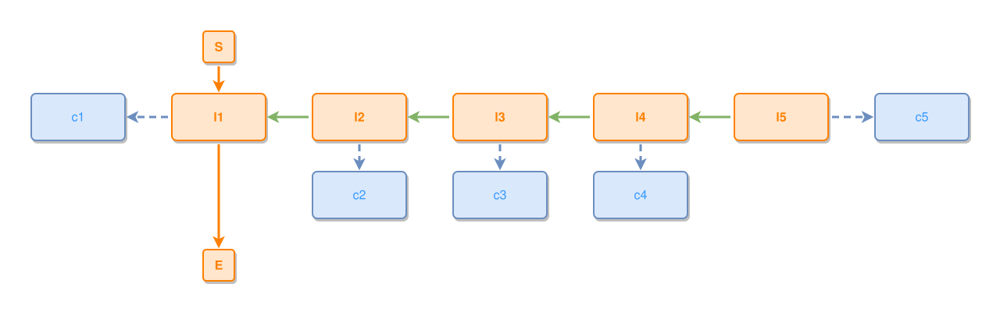

<!-- AUTO-GENERATED FILE - DO NOT EDIT -->
<!-- Generated by: gen-test-md -->
<!-- Command: go run ./cmd-dev/gen-test-md -->

# a-concept-at-every-layer

> **⚠️ Warning:** This file is auto-generated. Manual changes will be lost when tests are regenerated.

**Source:** gl:docs/dev/layout-gen/layout-alg.md#L1305-L1314 | [docs/dev/layout-gen/layout-alg.md](../../docs/dev/layout-gen/layout-alg.md#a-concept-at-every-layer)

## ipmt Content

```ipmt
l2 ::e --::P--> l1 ::e
l3 ::e --::P--> l2
l4 ::e --::P--> l3
l5 ::e --::P--> l4
l1 --> c1 ::c
l2 --> c2 ::c
l3 --> c3 ::c
l4 --> c4 ::c
l5 --> c5 ::c
```

## Generated Files

- [a-concept-at-every-layer.ipmt](a-concept-at-every-layer.ipmt) - ipmt input
- [a-concept-at-every-layer.json](a-concept-at-every-layer.json) - Parsed structure
- [a-concept-at-every-layer.layout.json](a-concept-at-every-layer.layout.json) - Layout coordinates
- [a-concept-at-every-layer.ipm.svg](a-concept-at-every-layer.ipm.svg) - Rendered diagram

## Layout Validation Rules

Test line: 1305

✅ All 17 rules passed

- ✓ [Line 53](gl:docs/dev/layout-gen/layout-alg.md#L53): `each edge has max-bends=0` ([edges-run-straight-by-default.dsl](../layout-gen-rules/edges-run-straight-by-default.dsl))
- ✓ [Line 1330](gl:docs/dev/layout-gen/layout-alg.md#L1330): `#l1,#l2,#l3,#l4,#l5 have same y` ([a-concept-at-every-layer.dsl](../layout-gen-rules/a-concept-at-every-layer.dsl))
- ✓ [Line 1331](gl:docs/dev/layout-gen/layout-alg.md#L1331): `#c1 is left-of #l1 with gap=60` ([a-concept-at-every-layer-02.dsl](../layout-gen-rules/a-concept-at-every-layer-02.dsl))
- ✓ [Line 1332](gl:docs/dev/layout-gen/layout-alg.md#L1332): `#c2,#l2 have same center-x` ([a-concept-at-every-layer-03.dsl](../layout-gen-rules/a-concept-at-every-layer-03.dsl))
- ✓ [Line 1333](gl:docs/dev/layout-gen/layout-alg.md#L1333): `#c2 is below #l2 with gap=40` ([a-concept-at-every-layer-04.dsl](../layout-gen-rules/a-concept-at-every-layer-04.dsl))
- ✓ [Line 1334](gl:docs/dev/layout-gen/layout-alg.md#L1334): `#c3,#l3 have same center-x` ([a-concept-at-every-layer-05.dsl](../layout-gen-rules/a-concept-at-every-layer-05.dsl))
- ✓ [Line 1335](gl:docs/dev/layout-gen/layout-alg.md#L1335): `#c3 is below #l3 with gap=40` ([a-concept-at-every-layer-06.dsl](../layout-gen-rules/a-concept-at-every-layer-06.dsl))
- ✓ [Line 1336](gl:docs/dev/layout-gen/layout-alg.md#L1336): `#c4,#l4 have same center-x` ([a-concept-at-every-layer-07.dsl](../layout-gen-rules/a-concept-at-every-layer-07.dsl))
- ✓ [Line 1337](gl:docs/dev/layout-gen/layout-alg.md#L1337): `#c4 is below #l4 with gap=40` ([a-concept-at-every-layer-08.dsl](../layout-gen-rules/a-concept-at-every-layer-08.dsl))
- ✓ [Line 1338](gl:docs/dev/layout-gen/layout-alg.md#L1338): `#c5 is right-of #l5 with gap=60` ([a-concept-at-every-layer-09.dsl](../layout-gen-rules/a-concept-at-every-layer-09.dsl))
- ✓ [Line 1339](gl:docs/dev/layout-gen/layout-alg.md#L1339): `#l5,#c5 have same y` ([a-concept-at-every-layer-10.dsl](../layout-gen-rules/a-concept-at-every-layer-10.dsl))
- ✓ [Line 1340](gl:docs/dev/layout-gen/layout-alg.md#L1340): `node #c2 does not straddle edge #l3,#l2` ([a-concept-at-every-layer-11.dsl](../layout-gen-rules/a-concept-at-every-layer-11.dsl))
- ✓ [Line 1341](gl:docs/dev/layout-gen/layout-alg.md#L1341): `node #c3 does not straddle edge #l4,#l3` ([a-concept-at-every-layer-12.dsl](../layout-gen-rules/a-concept-at-every-layer-12.dsl))
- ✓ [Line 1342](gl:docs/dev/layout-gen/layout-alg.md#L1342): `node #c4 does not straddle edge #l5,#l4` ([a-concept-at-every-layer-13.dsl](../layout-gen-rules/a-concept-at-every-layer-13.dsl))
- ✓ [Line 1343](gl:docs/dev/layout-gen/layout-alg.md#L1343): `node #c2 does not straddle edge #l2,#l1` ([a-concept-at-every-layer-14.dsl](../layout-gen-rules/a-concept-at-every-layer-14.dsl))
- ✓ [Line 1344](gl:docs/dev/layout-gen/layout-alg.md#L1344): `node #c3 does not straddle edge #l3,#l2` ([a-concept-at-every-layer-15.dsl](../layout-gen-rules/a-concept-at-every-layer-15.dsl))
- ✓ [Line 1345](gl:docs/dev/layout-gen/layout-alg.md#L1345): `node #c4 does not straddle edge #l4,#l3` ([a-concept-at-every-layer-16.dsl](../layout-gen-rules/a-concept-at-every-layer-16.dsl))

## Rendered Diagram



This test case was automatically generated from the specification document.

The ipmt code block was extracted using [sync-test-cases](../../docs/dev/testing.md) and saved to [a-concept-at-every-layer.ipmt](a-concept-at-every-layer.ipmt), then parsed into the [JSON structure](a-concept-at-every-layer.json) and laid out into [layout coordinates](a-concept-at-every-layer.layout.json). The [SVG diagram](a-concept-at-every-layer.ipm.svg) was rendered using [ipmsvg-gen](../../docs/ipmsvg-gen.md).
