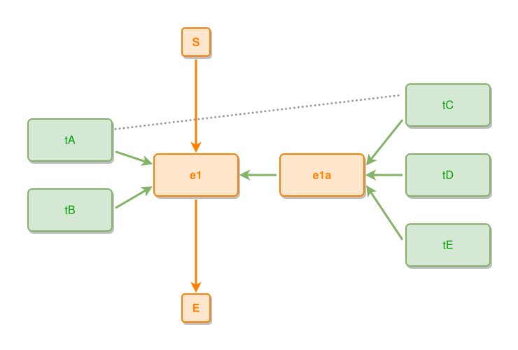

<!-- AUTO-GENERATED FILE - DO NOT EDIT -->
<!-- Generated by: gen-test-md -->
<!-- Command: go run ./cmd-dev/gen-test-md -->

# a-diagonal-near-to-connects-the-facing-sides

> **⚠️ Warning:** This file is auto-generated. Manual changes will be lost when tests are regenerated.

**Source:** gl:docs/dev/layout-gen/layout-alg.md#L3325-L3329 | [docs/dev/layout-gen/layout-alg.md](../../docs/dev/layout-gen/layout-alg.md#a-diagonal-near-to-connects-the-facing-sides)

## ipmt Content

```ipmt
e1 ::e
tA, tB --> e1
tC, tD, tE --> e1a ::e --::P--> e1
tA --- tC
```

## Generated Files

- [a-diagonal-near-to-connects-the-facing-sides.ipmt](a-diagonal-near-to-connects-the-facing-sides.ipmt) - ipmt input
- [a-diagonal-near-to-connects-the-facing-sides.json](a-diagonal-near-to-connects-the-facing-sides.json) - Parsed structure
- [a-diagonal-near-to-connects-the-facing-sides.layout.json](a-diagonal-near-to-connects-the-facing-sides.layout.json) - Layout coordinates
- [a-diagonal-near-to-connects-the-facing-sides.ipm.svg](a-diagonal-near-to-connects-the-facing-sides.ipm.svg) - Rendered diagram

## Layout Validation Rules

Test line: 3325

✅ All 4 rules passed

- ✓ [Line 53](gl:docs/dev/layout-gen/layout-alg.md#L53): `each edge has max-bends=0` ([edges-run-straight-by-default.dsl](../layout-gen-rules/edges-run-straight-by-default.dsl))
- ✓ [Line 3344](gl:docs/dev/layout-gen/layout-alg.md#L3344): `edge #tA,#tC has visibility=visible` ([a-diagonal-near-to-connects-the-facing-sides.dsl](../layout-gen-rules/a-diagonal-near-to-connects-the-facing-sides.dsl))
- ✓ [Line 3345](gl:docs/dev/layout-gen/layout-alg.md#L3345): `edge #tA,#tC has source-side=right` ([a-diagonal-near-to-connects-the-facing-sides-02.dsl](../layout-gen-rules/a-diagonal-near-to-connects-the-facing-sides-02.dsl))
- ✓ [Line 3346](gl:docs/dev/layout-gen/layout-alg.md#L3346): `edge #tA,#tC has target-side=left` ([a-diagonal-near-to-connects-the-facing-sides-03.dsl](../layout-gen-rules/a-diagonal-near-to-connects-the-facing-sides-03.dsl))

## Rendered Diagram



This test case was automatically generated from the specification document.

The ipmt code block was extracted using [sync-test-cases](../../docs/dev/testing.md) and saved to [a-diagonal-near-to-connects-the-facing-sides.ipmt](a-diagonal-near-to-connects-the-facing-sides.ipmt), then parsed into the [JSON structure](a-diagonal-near-to-connects-the-facing-sides.json) and laid out into [layout coordinates](a-diagonal-near-to-connects-the-facing-sides.layout.json). The [SVG diagram](a-diagonal-near-to-connects-the-facing-sides.ipm.svg) was rendered using [ipmsvg-gen](../../docs/ipmsvg-gen.md).
