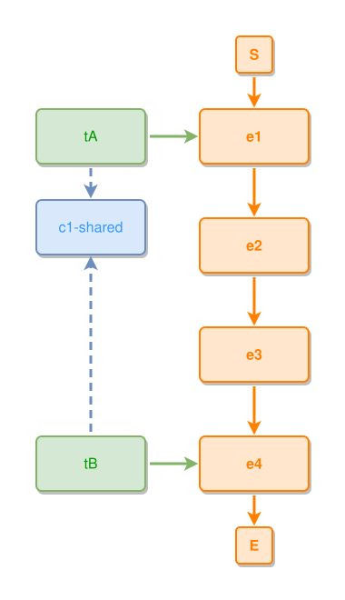

<!-- AUTO-GENERATED FILE - DO NOT EDIT -->
<!-- Generated by: gen-test-md -->
<!-- Command: go run ./cmd-dev/gen-test-md -->

# a-far-shared-concept-anchors-to-its-first-usage

> **⚠️ Warning:** This file is auto-generated. Manual changes will be lost when tests are regenerated.

**Source:** gl:docs/dev/layout-gen/layout-alg.md#L2530-L2535 | [docs/dev/layout-gen/layout-alg.md](../../docs/dev/layout-gen/layout-alg.md#a-far-shared-concept-anchors-to-its-first-usage)

## ipmt Content

```ipmt
e1 ::e --> e2 ::e --> e3 ::e --> e4 ::e
tA ::t --> e1
tB ::t --> e4
tA --::X--> c1-shared ::c
tB --::X--> c1-shared
```

## Generated Files

- [a-far-shared-concept-anchors-to-its-first-usage.ipmt](a-far-shared-concept-anchors-to-its-first-usage.ipmt) - ipmt input
- [a-far-shared-concept-anchors-to-its-first-usage.json](a-far-shared-concept-anchors-to-its-first-usage.json) - Parsed structure
- [a-far-shared-concept-anchors-to-its-first-usage.layout.json](a-far-shared-concept-anchors-to-its-first-usage.layout.json) - Layout coordinates
- [a-far-shared-concept-anchors-to-its-first-usage.ipm.svg](a-far-shared-concept-anchors-to-its-first-usage.ipm.svg) - Rendered diagram

## Layout Validation Rules

Test line: 2530

✅ All 9 rules passed

- ✓ [Line 53](gl:docs/dev/layout-gen/layout-alg.md#L53): `each edge has max-bends=0` ([edges-run-straight-by-default.dsl](../layout-gen-rules/edges-run-straight-by-default.dsl))
- ✓ [Line 2554](gl:docs/dev/layout-gen/layout-alg.md#L2554): `each edge has max-bends=0` ([a-far-shared-concept-anchors-to-its-first-usage.dsl](../layout-gen-rules/a-far-shared-concept-anchors-to-its-first-usage.dsl))
- ✓ [Line 2555](gl:docs/dev/layout-gen/layout-alg.md#L2555): `edge #tA,#c1-shared has source-side=bottom` ([a-far-shared-concept-anchors-to-its-first-usage-02.dsl](../layout-gen-rules/a-far-shared-concept-anchors-to-its-first-usage-02.dsl))
- ✓ [Line 2556](gl:docs/dev/layout-gen/layout-alg.md#L2556): `edge #tA,#c1-shared has target-side=top` ([a-far-shared-concept-anchors-to-its-first-usage-03.dsl](../layout-gen-rules/a-far-shared-concept-anchors-to-its-first-usage-03.dsl))
- ✓ [Line 2557](gl:docs/dev/layout-gen/layout-alg.md#L2557): `edge #tB,#c1-shared has source-side=top` ([a-far-shared-concept-anchors-to-its-first-usage-04.dsl](../layout-gen-rules/a-far-shared-concept-anchors-to-its-first-usage-04.dsl))
- ✓ [Line 2558](gl:docs/dev/layout-gen/layout-alg.md#L2558): `edge #tB,#c1-shared has target-side=bottom` ([a-far-shared-concept-anchors-to-its-first-usage-05.dsl](../layout-gen-rules/a-far-shared-concept-anchors-to-its-first-usage-05.dsl))
- ✓ [Line 2559](gl:docs/dev/layout-gen/layout-alg.md#L2559): `edge #tA,#c1-shared has visibility=visible` ([a-far-shared-concept-anchors-to-its-first-usage-06.dsl](../layout-gen-rules/a-far-shared-concept-anchors-to-its-first-usage-06.dsl))
- ✓ [Line 2560](gl:docs/dev/layout-gen/layout-alg.md#L2560): `edge #tB,#c1-shared has visibility=visible` ([a-far-shared-concept-anchors-to-its-first-usage-07.dsl](../layout-gen-rules/a-far-shared-concept-anchors-to-its-first-usage-07.dsl))
- ✓ [Line 2561](gl:docs/dev/layout-gen/layout-alg.md#L2561): `edge #tA,#c1-shared is vertical` ([a-far-shared-concept-anchors-to-its-first-usage-08.dsl](../layout-gen-rules/a-far-shared-concept-anchors-to-its-first-usage-08.dsl))

## Rendered Diagram



This test case was automatically generated from the specification document.

The ipmt code block was extracted using [sync-test-cases](../../docs/dev/testing.md) and saved to [a-far-shared-concept-anchors-to-its-first-usage.ipmt](a-far-shared-concept-anchors-to-its-first-usage.ipmt), then parsed into the [JSON structure](a-far-shared-concept-anchors-to-its-first-usage.json) and laid out into [layout coordinates](a-far-shared-concept-anchors-to-its-first-usage.layout.json). The [SVG diagram](a-far-shared-concept-anchors-to-its-first-usage.ipm.svg) was rendered using [ipmsvg-gen](../../docs/ipmsvg-gen.md).
