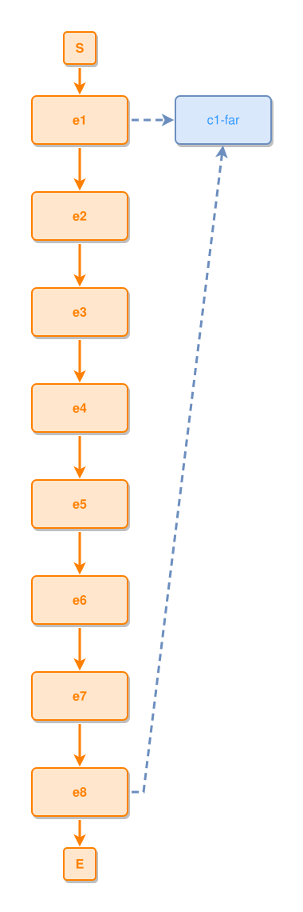

<!-- AUTO-GENERATED FILE - DO NOT EDIT -->
<!-- Generated by: gen-test-md -->
<!-- Command: go run ./cmd-dev/gen-test-md -->

# a-far-tie-draws-long-the-concept-stays-beside-its-anchor

> **⚠️ Warning:** This file is auto-generated. Manual changes will be lost when tests are regenerated.

**Source:** gl:docs/dev/layout-gen/layout-alg.md#L2648-L2651 | [docs/dev/layout-gen/layout-alg.md](../../docs/dev/layout-gen/layout-alg.md#a-far-tie-draws-long-the-concept-stays-beside-its-anchor)

## ipmt Content

```ipmt
e1 ::e --> e2 ::e --> e3 ::e --> e4 ::e --> e5 ::e --> e6 ::e --> e7 ::e --> e8 ::e
e1 --::X--> c1-far ::c
e8 --::X--> c1-far
```

## Generated Files

- [a-far-tie-draws-long-the-concept-stays-beside-its-anchor.ipmt](a-far-tie-draws-long-the-concept-stays-beside-its-anchor.ipmt) - ipmt input
- [a-far-tie-draws-long-the-concept-stays-beside-its-anchor.json](a-far-tie-draws-long-the-concept-stays-beside-its-anchor.json) - Parsed structure
- [a-far-tie-draws-long-the-concept-stays-beside-its-anchor.layout.json](a-far-tie-draws-long-the-concept-stays-beside-its-anchor.layout.json) - Layout coordinates
- [a-far-tie-draws-long-the-concept-stays-beside-its-anchor.ipm.svg](a-far-tie-draws-long-the-concept-stays-beside-its-anchor.ipm.svg) - Rendered diagram

## Layout Validation Rules

Test line: 2648

⚠️ 11/12 rules passed

- ✗ [Line 53](gl:docs/dev/layout-gen/layout-alg.md#L53): `each edge has max-bends=0` - **edge e8->c1-far has 1 bends > max-bends 0 (each-edge default; if the detour is intended, add it to `except` and pin it with `edge #e8,#c1-far has max-bends=1`)** ([edges-run-straight-by-default.dsl](../layout-gen-rules/edges-run-straight-by-default.dsl))
- ✓ [Line 2673](gl:docs/dev/layout-gen/layout-alg.md#L2673): `each edge has max-bends=0 except #e8,#c1-far` ([a-far-tie-draws-long-the-concept-stays-beside-its-anchor.dsl](../layout-gen-rules/a-far-tie-draws-long-the-concept-stays-beside-its-anchor.dsl))
- ✓ [Line 2674](gl:docs/dev/layout-gen/layout-alg.md#L2674): `edge #e8,#c1-far has max-bends=1` ([a-far-tie-draws-long-the-concept-stays-beside-its-anchor-02.dsl](../layout-gen-rules/a-far-tie-draws-long-the-concept-stays-beside-its-anchor-02.dsl))
- ✓ [Line 2675](gl:docs/dev/layout-gen/layout-alg.md#L2675): `edge #e8,#c1-far has source-side=right` ([a-far-tie-draws-long-the-concept-stays-beside-its-anchor-03.dsl](../layout-gen-rules/a-far-tie-draws-long-the-concept-stays-beside-its-anchor-03.dsl))
- ✓ [Line 2676](gl:docs/dev/layout-gen/layout-alg.md#L2676): `edge #e8,#c1-far has target-side=bottom` ([a-far-tie-draws-long-the-concept-stays-beside-its-anchor-04.dsl](../layout-gen-rules/a-far-tie-draws-long-the-concept-stays-beside-its-anchor-04.dsl))
- ✓ [Line 2677](gl:docs/dev/layout-gen/layout-alg.md#L2677): `edge #e8,#c1-far has target-position=0.5` ([a-far-tie-draws-long-the-concept-stays-beside-its-anchor-05.dsl](../layout-gen-rules/a-far-tie-draws-long-the-concept-stays-beside-its-anchor-05.dsl))
- ✓ [Line 2678](gl:docs/dev/layout-gen/layout-alg.md#L2678): `#e1,#c1-far have same y` ([a-far-tie-draws-long-the-concept-stays-beside-its-anchor-06.dsl](../layout-gen-rules/a-far-tie-draws-long-the-concept-stays-beside-its-anchor-06.dsl))
- ✓ [Line 2679](gl:docs/dev/layout-gen/layout-alg.md#L2679): `#c1-far is right-of #e1 with gap=60` ([a-far-tie-draws-long-the-concept-stays-beside-its-anchor-07.dsl](../layout-gen-rules/a-far-tie-draws-long-the-concept-stays-beside-its-anchor-07.dsl))
- ✓ [Line 2680](gl:docs/dev/layout-gen/layout-alg.md#L2680): `edge #e1,#c1-far has visibility=visible` ([a-far-tie-draws-long-the-concept-stays-beside-its-anchor-08.dsl](../layout-gen-rules/a-far-tie-draws-long-the-concept-stays-beside-its-anchor-08.dsl))
- ✓ [Line 2681](gl:docs/dev/layout-gen/layout-alg.md#L2681): `edge #e8,#c1-far has visibility=visible` ([a-far-tie-draws-long-the-concept-stays-beside-its-anchor-09.dsl](../layout-gen-rules/a-far-tie-draws-long-the-concept-stays-beside-its-anchor-09.dsl))
- ✓ [Line 2682](gl:docs/dev/layout-gen/layout-alg.md#L2682): `node #e6 does not straddle edge #e8,#c1-far` ([a-far-tie-draws-long-the-concept-stays-beside-its-anchor-10.dsl](../layout-gen-rules/a-far-tie-draws-long-the-concept-stays-beside-its-anchor-10.dsl))
- ✓ [Line 2683](gl:docs/dev/layout-gen/layout-alg.md#L2683): `node #e7 does not straddle edge #e8,#c1-far` ([a-far-tie-draws-long-the-concept-stays-beside-its-anchor-11.dsl](../layout-gen-rules/a-far-tie-draws-long-the-concept-stays-beside-its-anchor-11.dsl))

## Rendered Diagram



This test case was automatically generated from the specification document.

The ipmt code block was extracted using [sync-test-cases](../../docs/dev/testing.md) and saved to [a-far-tie-draws-long-the-concept-stays-beside-its-anchor.ipmt](a-far-tie-draws-long-the-concept-stays-beside-its-anchor.ipmt), then parsed into the [JSON structure](a-far-tie-draws-long-the-concept-stays-beside-its-anchor.json) and laid out into [layout coordinates](a-far-tie-draws-long-the-concept-stays-beside-its-anchor.layout.json). The [SVG diagram](a-far-tie-draws-long-the-concept-stays-beside-its-anchor.ipm.svg) was rendered using [ipmsvg-gen](../../docs/ipmsvg-gen.md).
