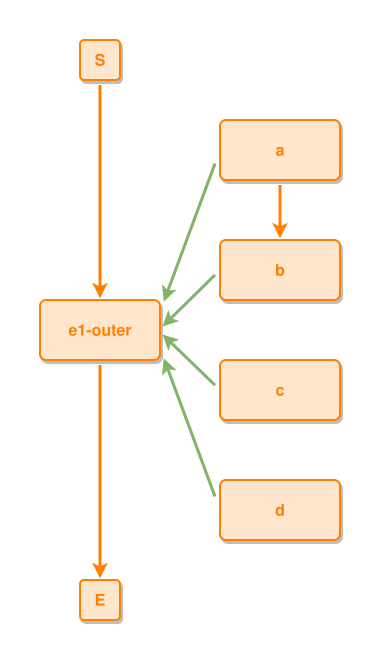

<!-- AUTO-GENERATED FILE - DO NOT EDIT -->
<!-- Generated by: gen-test-md -->
<!-- Command: go run ./cmd-dev/gen-test-md -->

# a-leads-to-between-sub-events-keeps-the-pair-adjacent

> **⚠️ Warning:** This file is auto-generated. Manual changes will be lost when tests are regenerated.

**Source:** gl:docs/dev/layout-gen/layout-alg.md#L721-L727 | [docs/dev/layout-gen/layout-alg.md](../../docs/dev/layout-gen/layout-alg.md#a-leads-to-between-sub-events-keeps-the-pair-adjacent)

## ipmt Content

```ipmt
e1-outer ::e
b ::e --::P--> e1-outer
a ::e --::P--> e1-outer
a --> b
c ::e --::P--> e1-outer
d ::e --::P--> e1-outer
```

## Generated Files

- [a-leads-to-between-sub-events-keeps-the-pair-adjacent.ipmt](a-leads-to-between-sub-events-keeps-the-pair-adjacent.ipmt) - ipmt input
- [a-leads-to-between-sub-events-keeps-the-pair-adjacent.json](a-leads-to-between-sub-events-keeps-the-pair-adjacent.json) - Parsed structure
- [a-leads-to-between-sub-events-keeps-the-pair-adjacent.layout.json](a-leads-to-between-sub-events-keeps-the-pair-adjacent.layout.json) - Layout coordinates
- [a-leads-to-between-sub-events-keeps-the-pair-adjacent.ipm.svg](a-leads-to-between-sub-events-keeps-the-pair-adjacent.ipm.svg) - Rendered diagram

## Layout Validation Rules

Test line: 721

✅ All 9 rules passed

- ✓ [Line 53](gl:docs/dev/layout-gen/layout-alg.md#L53): `each edge has max-bends=0` ([edges-run-straight-by-default.dsl](../layout-gen-rules/edges-run-straight-by-default.dsl))
- ✓ [Line 82](gl:docs/dev/layout-gen/layout-alg.md#L82): `type=event has width=120` ([one-event.dsl](../layout-gen-rules/one-event.dsl))
- ✓ [Line 83](gl:docs/dev/layout-gen/layout-alg.md#L83): `type=event has min-gap-to-others>=10` ([one-event-02.dsl](../layout-gen-rules/one-event-02.dsl))
- ✓ [Line 84](gl:docs/dev/layout-gen/layout-alg.md#L84): `type=boundary has size=40x40` ([one-event-03.dsl](../layout-gen-rules/one-event-03.dsl))
- ✓ [Line 744](gl:docs/dev/layout-gen/layout-alg.md#L744): `#a,#b,#c,#d have same center-x` ([a-leads-to-between-sub-events-keeps-the-pair-adjacent.dsl](../layout-gen-rules/a-leads-to-between-sub-events-keeps-the-pair-adjacent.dsl))
- ✓ [Line 745](gl:docs/dev/layout-gen/layout-alg.md#L745): `#b is below #a with gap=60` ([a-leads-to-between-sub-events-keeps-the-pair-adjacent-02.dsl](../layout-gen-rules/a-leads-to-between-sub-events-keeps-the-pair-adjacent-02.dsl))
- ✓ [Line 746](gl:docs/dev/layout-gen/layout-alg.md#L746): `edge #a,#b is vertical` ([a-leads-to-between-sub-events-keeps-the-pair-adjacent-03.dsl](../layout-gen-rules/a-leads-to-between-sub-events-keeps-the-pair-adjacent-03.dsl))
- ✓ [Line 747](gl:docs/dev/layout-gen/layout-alg.md#L747): `#c is below #b with gap=60` ([a-leads-to-between-sub-events-keeps-the-pair-adjacent-04.dsl](../layout-gen-rules/a-leads-to-between-sub-events-keeps-the-pair-adjacent-04.dsl))
- ✓ [Line 748](gl:docs/dev/layout-gen/layout-alg.md#L748): `#d is below #c with gap=60` ([a-leads-to-between-sub-events-keeps-the-pair-adjacent-05.dsl](../layout-gen-rules/a-leads-to-between-sub-events-keeps-the-pair-adjacent-05.dsl))

## Rendered Diagram



This test case was automatically generated from the specification document.

The ipmt code block was extracted using [sync-test-cases](../../docs/dev/testing.md) and saved to [a-leads-to-between-sub-events-keeps-the-pair-adjacent.ipmt](a-leads-to-between-sub-events-keeps-the-pair-adjacent.ipmt), then parsed into the [JSON structure](a-leads-to-between-sub-events-keeps-the-pair-adjacent.json) and laid out into [layout coordinates](a-leads-to-between-sub-events-keeps-the-pair-adjacent.layout.json). The [SVG diagram](a-leads-to-between-sub-events-keeps-the-pair-adjacent.ipm.svg) was rendered using [ipmsvg-gen](../../docs/ipmsvg-gen.md).
