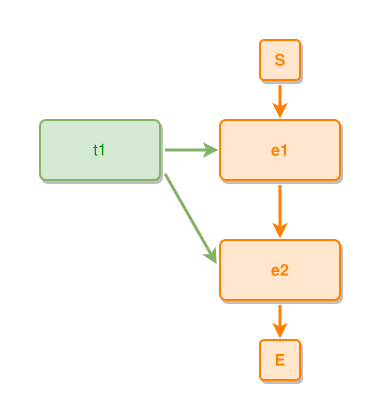

<!-- AUTO-GENERATED FILE - DO NOT EDIT -->
<!-- Generated by: gen-test-md -->
<!-- Command: go run ./cmd-dev/gen-test-md -->

# a-leads-to-edge-stays-straight-past-a-thing-or-concept

> **⚠️ Warning:** This file is auto-generated. Manual changes will be lost when tests are regenerated.

**Source:** gl:docs/dev/layout-gen/layout-alg.md#L375-L377 | [docs/dev/layout-gen/layout-alg.md](../../docs/dev/layout-gen/layout-alg.md#a-leads-to-edge-stays-straight-past-a-thing-or-concept)

## ipmt Content

```ipmt
e1 ::e --> e2 ::e
e1, e2 <--::P-- t1 ::t
```

## Generated Files

- [a-leads-to-edge-stays-straight-past-a-thing-or-concept.ipmt](a-leads-to-edge-stays-straight-past-a-thing-or-concept.ipmt) - ipmt input
- [a-leads-to-edge-stays-straight-past-a-thing-or-concept.json](a-leads-to-edge-stays-straight-past-a-thing-or-concept.json) - Parsed structure
- [a-leads-to-edge-stays-straight-past-a-thing-or-concept.layout.json](a-leads-to-edge-stays-straight-past-a-thing-or-concept.layout.json) - Layout coordinates
- [a-leads-to-edge-stays-straight-past-a-thing-or-concept.ipm.svg](a-leads-to-edge-stays-straight-past-a-thing-or-concept.ipm.svg) - Rendered diagram

## Layout Validation Rules

Test line: 375

✅ All 5 rules passed

- ✓ [Line 53](gl:docs/dev/layout-gen/layout-alg.md#L53): `each edge has max-bends=0` ([edges-run-straight-by-default.dsl](../layout-gen-rules/edges-run-straight-by-default.dsl))
- ✓ [Line 82](gl:docs/dev/layout-gen/layout-alg.md#L82): `type=event has width=120` ([one-event.dsl](../layout-gen-rules/one-event.dsl))
- ✓ [Line 83](gl:docs/dev/layout-gen/layout-alg.md#L83): `type=event has min-gap-to-others>=10` ([one-event-02.dsl](../layout-gen-rules/one-event-02.dsl))
- ✓ [Line 84](gl:docs/dev/layout-gen/layout-alg.md#L84): `type=boundary has size=40x40` ([one-event-03.dsl](../layout-gen-rules/one-event-03.dsl))
- ✓ [Line 391](gl:docs/dev/layout-gen/layout-alg.md#L391): `edge #e1,#e2 is vertical` ([a-leads-to-edge-stays-straight-past-a-thing-or-concept.dsl](../layout-gen-rules/a-leads-to-edge-stays-straight-past-a-thing-or-concept.dsl))

## Rendered Diagram



This test case was automatically generated from the specification document.

The ipmt code block was extracted using [sync-test-cases](../../docs/dev/testing.md) and saved to [a-leads-to-edge-stays-straight-past-a-thing-or-concept.ipmt](a-leads-to-edge-stays-straight-past-a-thing-or-concept.ipmt), then parsed into the [JSON structure](a-leads-to-edge-stays-straight-past-a-thing-or-concept.json) and laid out into [layout coordinates](a-leads-to-edge-stays-straight-past-a-thing-or-concept.layout.json). The [SVG diagram](a-leads-to-edge-stays-straight-past-a-thing-or-concept.ipm.svg) was rendered using [ipmsvg-gen](../../docs/ipmsvg-gen.md).
