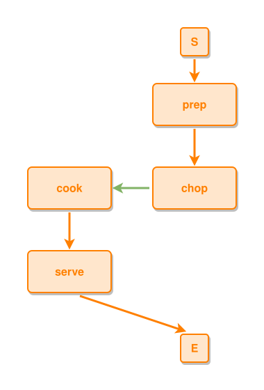

<!-- AUTO-GENERATED FILE - DO NOT EDIT -->
<!-- Generated by: gen-test-md -->
<!-- Command: go run ./cmd-dev/gen-test-md -->

# a-leads-to-into-a-sub-event-lanes-the-composite-under-the-predecessor

> **⚠️ Warning:** This file is auto-generated. Manual changes will be lost when tests are regenerated.

**Source:** gl:docs/dev/layout-gen/layout-alg.md#L1107-L1110 | [docs/dev/layout-gen/layout-alg.md](../../docs/dev/layout-gen/layout-alg.md#a-leads-to-into-a-sub-event-lanes-the-composite-under-the-predecessor)

## ipmt Content

```ipmt
prep ::e --> chop ::e
chop --::P--> cook ::e
cook --> serve ::e
```

## Generated Files

- [a-leads-to-into-a-sub-event-lanes-the-composite-under-the-predecessor.ipmt](a-leads-to-into-a-sub-event-lanes-the-composite-under-the-predecessor.ipmt) - ipmt input
- [a-leads-to-into-a-sub-event-lanes-the-composite-under-the-predecessor.json](a-leads-to-into-a-sub-event-lanes-the-composite-under-the-predecessor.json) - Parsed structure
- [a-leads-to-into-a-sub-event-lanes-the-composite-under-the-predecessor.layout.json](a-leads-to-into-a-sub-event-lanes-the-composite-under-the-predecessor.layout.json) - Layout coordinates
- [a-leads-to-into-a-sub-event-lanes-the-composite-under-the-predecessor.ipm.svg](a-leads-to-into-a-sub-event-lanes-the-composite-under-the-predecessor.ipm.svg) - Rendered diagram

## Layout Validation Rules

Test line: 1107

✅ All 14 rules passed

- ✓ [Line 53](gl:docs/dev/layout-gen/layout-alg.md#L53): `each edge has max-bends=0` ([edges-run-straight-by-default.dsl](../layout-gen-rules/edges-run-straight-by-default.dsl))
- ✓ [Line 82](gl:docs/dev/layout-gen/layout-alg.md#L82): `type=event has width=120` ([one-event.dsl](../layout-gen-rules/one-event.dsl))
- ✓ [Line 83](gl:docs/dev/layout-gen/layout-alg.md#L83): `type=event has min-gap-to-others>=10` ([one-event-02.dsl](../layout-gen-rules/one-event-02.dsl))
- ✓ [Line 84](gl:docs/dev/layout-gen/layout-alg.md#L84): `type=boundary has size=40x40` ([one-event-03.dsl](../layout-gen-rules/one-event-03.dsl))
- ✓ [Line 1123](gl:docs/dev/layout-gen/layout-alg.md#L1123): `#prep,#chop have same center-x` ([a-leads-to-into-a-sub-event-lanes-the-composite-under-the-predecessor.dsl](../layout-gen-rules/a-leads-to-into-a-sub-event-lanes-the-composite-under-the-predecessor.dsl))
- ✓ [Line 1124](gl:docs/dev/layout-gen/layout-alg.md#L1124): `#chop is below #prep with gap=60` ([a-leads-to-into-a-sub-event-lanes-the-composite-under-the-predecessor-02.dsl](../layout-gen-rules/a-leads-to-into-a-sub-event-lanes-the-composite-under-the-predecessor-02.dsl))
- ✓ [Line 1125](gl:docs/dev/layout-gen/layout-alg.md#L1125): `edge #prep,#chop is vertical` ([a-leads-to-into-a-sub-event-lanes-the-composite-under-the-predecessor-03.dsl](../layout-gen-rules/a-leads-to-into-a-sub-event-lanes-the-composite-under-the-predecessor-03.dsl))
- ✓ [Line 1126](gl:docs/dev/layout-gen/layout-alg.md#L1126): `#chop is right-of #cook with gap=60` ([a-leads-to-into-a-sub-event-lanes-the-composite-under-the-predecessor-04.dsl](../layout-gen-rules/a-leads-to-into-a-sub-event-lanes-the-composite-under-the-predecessor-04.dsl))
- ✓ [Line 1127](gl:docs/dev/layout-gen/layout-alg.md#L1127): `#cook,#serve have same center-x` ([a-leads-to-into-a-sub-event-lanes-the-composite-under-the-predecessor-05.dsl](../layout-gen-rules/a-leads-to-into-a-sub-event-lanes-the-composite-under-the-predecessor-05.dsl))
- ✓ [Line 1128](gl:docs/dev/layout-gen/layout-alg.md#L1128): `#serve is below #cook with gap=60` ([a-leads-to-into-a-sub-event-lanes-the-composite-under-the-predecessor-06.dsl](../layout-gen-rules/a-leads-to-into-a-sub-event-lanes-the-composite-under-the-predecessor-06.dsl))
- ✓ [Line 1129](gl:docs/dev/layout-gen/layout-alg.md#L1129): `edge #cook,#serve is vertical` ([a-leads-to-into-a-sub-event-lanes-the-composite-under-the-predecessor-07.dsl](../layout-gen-rules/a-leads-to-into-a-sub-event-lanes-the-composite-under-the-predecessor-07.dsl))
- ✓ [Line 1130](gl:docs/dev/layout-gen/layout-alg.md#L1130): `#S,#prep have same center-x` ([a-leads-to-into-a-sub-event-lanes-the-composite-under-the-predecessor-08.dsl](../layout-gen-rules/a-leads-to-into-a-sub-event-lanes-the-composite-under-the-predecessor-08.dsl))
- ✓ [Line 1131](gl:docs/dev/layout-gen/layout-alg.md#L1131): `#S is above #prep with gap=40` ([a-leads-to-into-a-sub-event-lanes-the-composite-under-the-predecessor-09.dsl](../layout-gen-rules/a-leads-to-into-a-sub-event-lanes-the-composite-under-the-predecessor-09.dsl))
- ✓ [Line 1132](gl:docs/dev/layout-gen/layout-alg.md#L1132): `#E is below #serve with gap=60` ([a-leads-to-into-a-sub-event-lanes-the-composite-under-the-predecessor-10.dsl](../layout-gen-rules/a-leads-to-into-a-sub-event-lanes-the-composite-under-the-predecessor-10.dsl))

## Rendered Diagram



This test case was automatically generated from the specification document.

The ipmt code block was extracted using [sync-test-cases](../../docs/dev/testing.md) and saved to [a-leads-to-into-a-sub-event-lanes-the-composite-under-the-predecessor.ipmt](a-leads-to-into-a-sub-event-lanes-the-composite-under-the-predecessor.ipmt), then parsed into the [JSON structure](a-leads-to-into-a-sub-event-lanes-the-composite-under-the-predecessor.json) and laid out into [layout coordinates](a-leads-to-into-a-sub-event-lanes-the-composite-under-the-predecessor.layout.json). The [SVG diagram](a-leads-to-into-a-sub-event-lanes-the-composite-under-the-predecessor.ipm.svg) was rendered using [ipmsvg-gen](../../docs/ipmsvg-gen.md).
