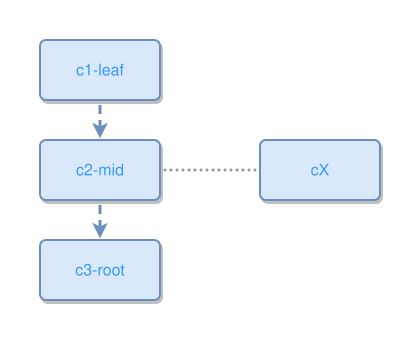

<!-- AUTO-GENERATED FILE - DO NOT EDIT -->
<!-- Generated by: gen-test-md -->
<!-- Command: go run ./cmd-dev/gen-test-md -->

# a-near-to-concept-stays-beside-its-anchor-not-ringed

> **⚠️ Warning:** This file is auto-generated. Manual changes will be lost when tests are regenerated.

**Source:** gl:docs/dev/layout-gen/layout-alg.md#L2831-L2833 | [docs/dev/layout-gen/layout-alg.md](../../docs/dev/layout-gen/layout-alg.md#a-near-to-concept-stays-beside-its-anchor-not-ringed)

## ipmt Content

```ipmt
c1-leaf ::c --> c2-mid ::c --> c3-root ::c
c2-mid ::c --- cX ::c
```

## Generated Files

- [a-near-to-concept-stays-beside-its-anchor-not-ringed.ipmt](a-near-to-concept-stays-beside-its-anchor-not-ringed.ipmt) - ipmt input
- [a-near-to-concept-stays-beside-its-anchor-not-ringed.json](a-near-to-concept-stays-beside-its-anchor-not-ringed.json) - Parsed structure
- [a-near-to-concept-stays-beside-its-anchor-not-ringed.layout.json](a-near-to-concept-stays-beside-its-anchor-not-ringed.layout.json) - Layout coordinates
- [a-near-to-concept-stays-beside-its-anchor-not-ringed.ipm.svg](a-near-to-concept-stays-beside-its-anchor-not-ringed.ipm.svg) - Rendered diagram

## Layout Validation Rules

Test line: 2831

✅ All 4 rules passed

- ✓ [Line 53](gl:docs/dev/layout-gen/layout-alg.md#L53): `each edge has max-bends=0` ([edges-run-straight-by-default.dsl](../layout-gen-rules/edges-run-straight-by-default.dsl))
- ✓ [Line 2849](gl:docs/dev/layout-gen/layout-alg.md#L2849): `#c1-leaf,#c2-mid,#c3-root have same center-x` ([a-near-to-concept-stays-beside-its-anchor-not-ringed.dsl](../layout-gen-rules/a-near-to-concept-stays-beside-its-anchor-not-ringed.dsl))
- ✓ [Line 2850](gl:docs/dev/layout-gen/layout-alg.md#L2850): `#c2-mid,#cX have same y` ([a-near-to-concept-stays-beside-its-anchor-not-ringed-02.dsl](../layout-gen-rules/a-near-to-concept-stays-beside-its-anchor-not-ringed-02.dsl))
- ✓ [Line 2851](gl:docs/dev/layout-gen/layout-alg.md#L2851): `#cX is right-of #c2-mid with gap=100` ([a-near-to-concept-stays-beside-its-anchor-not-ringed-03.dsl](../layout-gen-rules/a-near-to-concept-stays-beside-its-anchor-not-ringed-03.dsl))

## Rendered Diagram



This test case was automatically generated from the specification document.

The ipmt code block was extracted using [sync-test-cases](../../docs/dev/testing.md) and saved to [a-near-to-concept-stays-beside-its-anchor-not-ringed.ipmt](a-near-to-concept-stays-beside-its-anchor-not-ringed.ipmt), then parsed into the [JSON structure](a-near-to-concept-stays-beside-its-anchor-not-ringed.json) and laid out into [layout coordinates](a-near-to-concept-stays-beside-its-anchor-not-ringed.layout.json). The [SVG diagram](a-near-to-concept-stays-beside-its-anchor-not-ringed.ipm.svg) was rendered using [ipmsvg-gen](../../docs/ipmsvg-gen.md).
