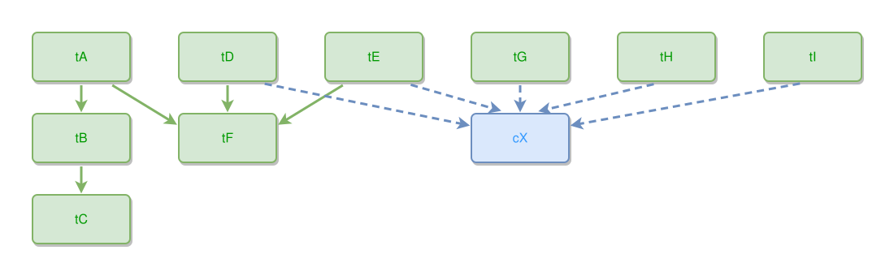

<!-- AUTO-GENERATED FILE - DO NOT EDIT -->
<!-- Generated by: gen-test-md -->
<!-- Command: go run ./cmd-dev/gen-test-md -->

# a-part-of-two-wholes-stays-on-the-root-row

> **⚠️ Warning:** This file is auto-generated. Manual changes will be lost when tests are regenerated.

**Source:** gl:docs/dev/layout-gen/layout-alg.md#L1786-L1792 | [docs/dev/layout-gen/layout-alg.md](../../docs/dev/layout-gen/layout-alg.md#a-part-of-two-wholes-stays-on-the-root-row)

## ipmt Content

```ipmt
tA --> tB
tB --> tC
tD, tE --> tF
tA --> tF
tG, tH, tI --> cX ::c
tD, tE --> cX
```

## Generated Files

- [a-part-of-two-wholes-stays-on-the-root-row.ipmt](a-part-of-two-wholes-stays-on-the-root-row.ipmt) - ipmt input
- [a-part-of-two-wholes-stays-on-the-root-row.json](a-part-of-two-wholes-stays-on-the-root-row.json) - Parsed structure
- [a-part-of-two-wholes-stays-on-the-root-row.layout.json](a-part-of-two-wholes-stays-on-the-root-row.layout.json) - Layout coordinates
- [a-part-of-two-wholes-stays-on-the-root-row.ipm.svg](a-part-of-two-wholes-stays-on-the-root-row.ipm.svg) - Rendered diagram

## Layout Validation Rules

Test line: 1786

✅ All 6 rules passed

- ✓ [Line 53](gl:docs/dev/layout-gen/layout-alg.md#L53): `each edge has max-bends=0` ([edges-run-straight-by-default.dsl](../layout-gen-rules/edges-run-straight-by-default.dsl))
- ✓ [Line 1807](gl:docs/dev/layout-gen/layout-alg.md#L1807): `#tA,#tD,#tE,#tG,#tH,#tI have same y` ([a-part-of-two-wholes-stays-on-the-root-row.dsl](../layout-gen-rules/a-part-of-two-wholes-stays-on-the-root-row.dsl))
- ✓ [Line 1808](gl:docs/dev/layout-gen/layout-alg.md#L1808): `#tB,#tF,#cX have same y` ([a-part-of-two-wholes-stays-on-the-root-row-02.dsl](../layout-gen-rules/a-part-of-two-wholes-stays-on-the-root-row-02.dsl))
- ✓ [Line 1809](gl:docs/dev/layout-gen/layout-alg.md#L1809): `#tB,#tC have same center-x` ([a-part-of-two-wholes-stays-on-the-root-row-03.dsl](../layout-gen-rules/a-part-of-two-wholes-stays-on-the-root-row-03.dsl))
- ✓ [Line 1810](gl:docs/dev/layout-gen/layout-alg.md#L1810): `#tC is below #tB with gap=40` ([a-part-of-two-wholes-stays-on-the-root-row-04.dsl](../layout-gen-rules/a-part-of-two-wholes-stays-on-the-root-row-04.dsl))
- ✓ [Line 1811](gl:docs/dev/layout-gen/layout-alg.md#L1811): `#tD is right-of #tA with gap=60` ([a-part-of-two-wholes-stays-on-the-root-row-05.dsl](../layout-gen-rules/a-part-of-two-wholes-stays-on-the-root-row-05.dsl))

## Rendered Diagram



This test case was automatically generated from the specification document.

The ipmt code block was extracted using [sync-test-cases](../../docs/dev/testing.md) and saved to [a-part-of-two-wholes-stays-on-the-root-row.ipmt](a-part-of-two-wholes-stays-on-the-root-row.ipmt), then parsed into the [JSON structure](a-part-of-two-wholes-stays-on-the-root-row.json) and laid out into [layout coordinates](a-part-of-two-wholes-stays-on-the-root-row.layout.json). The [SVG diagram](a-part-of-two-wholes-stays-on-the-root-row.ipm.svg) was rendered using [ipmsvg-gen](../../docs/ipmsvg-gen.md).
