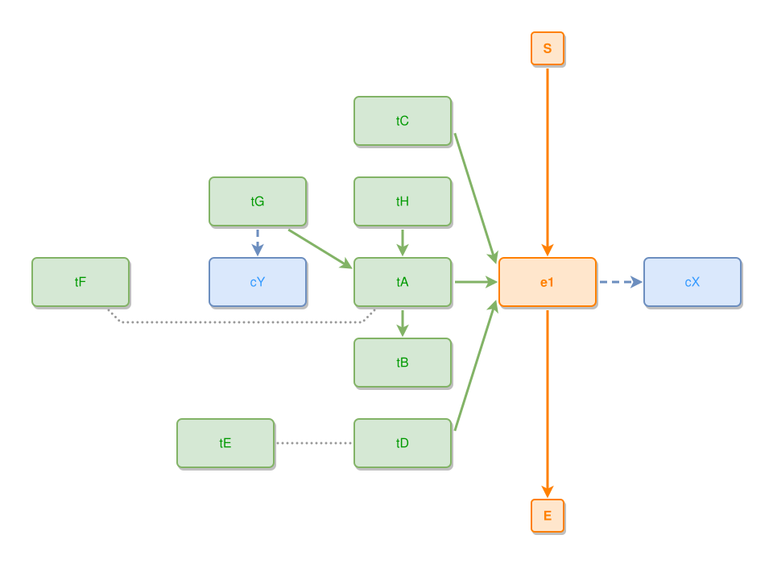

<!-- AUTO-GENERATED FILE - DO NOT EDIT -->
<!-- Generated by: gen-test-md -->
<!-- Command: go run ./cmd-dev/gen-test-md -->

# a-satellite-wraps-its-own-rows-not-the-whole-flank

> **⚠️ Warning:** This file is auto-generated. Manual changes will be lost when tests are regenerated.

**Source:** gl:docs/dev/layout-gen/layout-alg.md#L2776-L2785 | [docs/dev/layout-gen/layout-alg.md](../../docs/dev/layout-gen/layout-alg.md#a-satellite-wraps-its-own-rows-not-the-whole-flank)

## ipmt Content

```ipmt
tA --> tB
tC, tA --> e1 ::e
tD --> e1
e1 --> cX ::c
tD --- tE
tF --- tA
tG --> tA
tH --> tA
tG --> cY ::c
```

## Generated Files

- [a-satellite-wraps-its-own-rows-not-the-whole-flank.ipmt](a-satellite-wraps-its-own-rows-not-the-whole-flank.ipmt) - ipmt input
- [a-satellite-wraps-its-own-rows-not-the-whole-flank.json](a-satellite-wraps-its-own-rows-not-the-whole-flank.json) - Parsed structure
- [a-satellite-wraps-its-own-rows-not-the-whole-flank.layout.json](a-satellite-wraps-its-own-rows-not-the-whole-flank.layout.json) - Layout coordinates
- [a-satellite-wraps-its-own-rows-not-the-whole-flank.ipm.svg](a-satellite-wraps-its-own-rows-not-the-whole-flank.ipm.svg) - Rendered diagram

## Layout Validation Rules

Test line: 2776

⚠️ 12/13 rules passed

- ✗ [Line 53](gl:docs/dev/layout-gen/layout-alg.md#L53): `each edge has max-bends=0` - **edge tF->tA has 2 bends > max-bends 0 (each-edge default; if the detour is intended, add it to `except` and pin it with `edge #tF,#tA has max-bends=2`)** ([edges-run-straight-by-default.dsl](../layout-gen-rules/edges-run-straight-by-default.dsl))
- ✓ [Line 2804](gl:docs/dev/layout-gen/layout-alg.md#L2804): `each edge has max-bends=0 except #tF,#tA #tG,#tA #tH,#tA #tC,#e1` ([a-satellite-wraps-its-own-rows-not-the-whole-flank.dsl](../layout-gen-rules/a-satellite-wraps-its-own-rows-not-the-whole-flank.dsl))
- ✓ [Line 2805](gl:docs/dev/layout-gen/layout-alg.md#L2805): `edge #tF,#tA has max-bends=2` ([a-satellite-wraps-its-own-rows-not-the-whole-flank-02.dsl](../layout-gen-rules/a-satellite-wraps-its-own-rows-not-the-whole-flank-02.dsl))
- ✓ [Line 2806](gl:docs/dev/layout-gen/layout-alg.md#L2806): `edge #tC,#e1 has max-bends=1` ([a-satellite-wraps-its-own-rows-not-the-whole-flank-03.dsl](../layout-gen-rules/a-satellite-wraps-its-own-rows-not-the-whole-flank-03.dsl))
- ✓ [Line 2807](gl:docs/dev/layout-gen/layout-alg.md#L2807): `edge #tG,#tA has max-bends=2` ([a-satellite-wraps-its-own-rows-not-the-whole-flank-04.dsl](../layout-gen-rules/a-satellite-wraps-its-own-rows-not-the-whole-flank-04.dsl))
- ✓ [Line 2808](gl:docs/dev/layout-gen/layout-alg.md#L2808): `edge #tH,#tA has max-bends=2` ([a-satellite-wraps-its-own-rows-not-the-whole-flank-05.dsl](../layout-gen-rules/a-satellite-wraps-its-own-rows-not-the-whole-flank-05.dsl))
- ✓ [Line 2809](gl:docs/dev/layout-gen/layout-alg.md#L2809): `edge #tF,#tA has visibility=visible` ([a-satellite-wraps-its-own-rows-not-the-whole-flank-06.dsl](../layout-gen-rules/a-satellite-wraps-its-own-rows-not-the-whole-flank-06.dsl))
- ✓ [Line 2810](gl:docs/dev/layout-gen/layout-alg.md#L2810): `#tA,#tF,#cY have same y` ([a-satellite-wraps-its-own-rows-not-the-whole-flank-07.dsl](../layout-gen-rules/a-satellite-wraps-its-own-rows-not-the-whole-flank-07.dsl))
- ✓ [Line 2811](gl:docs/dev/layout-gen/layout-alg.md#L2811): `#tB is below #tA with gap=40` ([a-satellite-wraps-its-own-rows-not-the-whole-flank-08.dsl](../layout-gen-rules/a-satellite-wraps-its-own-rows-not-the-whole-flank-08.dsl))
- ✓ [Line 2812](gl:docs/dev/layout-gen/layout-alg.md#L2812): `#tF is left-of #cY with gap=100` ([a-satellite-wraps-its-own-rows-not-the-whole-flank-09.dsl](../layout-gen-rules/a-satellite-wraps-its-own-rows-not-the-whole-flank-09.dsl))
- ✓ [Line 2813](gl:docs/dev/layout-gen/layout-alg.md#L2813): `#tD,#tE have same y` ([a-satellite-wraps-its-own-rows-not-the-whole-flank-10.dsl](../layout-gen-rules/a-satellite-wraps-its-own-rows-not-the-whole-flank-10.dsl))
- ✓ [Line 2814](gl:docs/dev/layout-gen/layout-alg.md#L2814): `#tE is left-of #tD with gap=100` ([a-satellite-wraps-its-own-rows-not-the-whole-flank-11.dsl](../layout-gen-rules/a-satellite-wraps-its-own-rows-not-the-whole-flank-11.dsl))
- ✓ [Line 2815](gl:docs/dev/layout-gen/layout-alg.md#L2815): `edge #tD,#tE has visibility=visible` ([a-satellite-wraps-its-own-rows-not-the-whole-flank-12.dsl](../layout-gen-rules/a-satellite-wraps-its-own-rows-not-the-whole-flank-12.dsl))

## Rendered Diagram



This test case was automatically generated from the specification document.

The ipmt code block was extracted using [sync-test-cases](../../docs/dev/testing.md) and saved to [a-satellite-wraps-its-own-rows-not-the-whole-flank.ipmt](a-satellite-wraps-its-own-rows-not-the-whole-flank.ipmt), then parsed into the [JSON structure](a-satellite-wraps-its-own-rows-not-the-whole-flank.json) and laid out into [layout coordinates](a-satellite-wraps-its-own-rows-not-the-whole-flank.layout.json). The [SVG diagram](a-satellite-wraps-its-own-rows-not-the-whole-flank.ipm.svg) was rendered using [ipmsvg-gen](../../docs/ipmsvg-gen.md).
