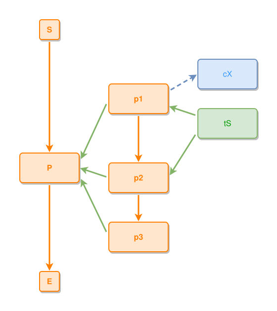

<!-- AUTO-GENERATED FILE - DO NOT EDIT -->
<!-- Generated by: gen-test-md -->
<!-- Command: go run ./cmd-dev/gen-test-md -->

# a-shared-part-keeps-its-band-and-ties-its-second-anchor

> **⚠️ Warning:** This file is auto-generated. Manual changes will be lost when tests are regenerated.

**Source:** gl:docs/dev/layout-gen/layout-alg.md#L1073-L1080 | [docs/dev/layout-gen/layout-alg.md](../../docs/dev/layout-gen/layout-alg.md#a-shared-part-keeps-its-band-and-ties-its-second-anchor)

## ipmt Content

```ipmt
P ::e
p1 ::e --::P--> P
p2 ::e --::P--> P
p3 ::e --::P--> P
p1 --> p2 --> p3
p1 --> cX ::c
tS ::t --> p1, p2
```

## Generated Files

- [a-shared-part-keeps-its-band-and-ties-its-second-anchor.ipmt](a-shared-part-keeps-its-band-and-ties-its-second-anchor.ipmt) - ipmt input
- [a-shared-part-keeps-its-band-and-ties-its-second-anchor.json](a-shared-part-keeps-its-band-and-ties-its-second-anchor.json) - Parsed structure
- [a-shared-part-keeps-its-band-and-ties-its-second-anchor.layout.json](a-shared-part-keeps-its-band-and-ties-its-second-anchor.layout.json) - Layout coordinates
- [a-shared-part-keeps-its-band-and-ties-its-second-anchor.ipm.svg](a-shared-part-keeps-its-band-and-ties-its-second-anchor.ipm.svg) - Rendered diagram

## Layout Validation Rules

Test line: 1073

✅ All 10 rules passed

- ✓ [Line 53](gl:docs/dev/layout-gen/layout-alg.md#L53): `each edge has max-bends=0` ([edges-run-straight-by-default.dsl](../layout-gen-rules/edges-run-straight-by-default.dsl))
- ✓ [Line 82](gl:docs/dev/layout-gen/layout-alg.md#L82): `type=event has width=120` ([one-event.dsl](../layout-gen-rules/one-event.dsl))
- ✓ [Line 83](gl:docs/dev/layout-gen/layout-alg.md#L83): `type=event has min-gap-to-others>=10` ([one-event-02.dsl](../layout-gen-rules/one-event-02.dsl))
- ✓ [Line 84](gl:docs/dev/layout-gen/layout-alg.md#L84): `type=boundary has size=40x40` ([one-event-03.dsl](../layout-gen-rules/one-event-03.dsl))
- ✓ [Line 1095](gl:docs/dev/layout-gen/layout-alg.md#L1095): `#cX,#tS have same center-x` ([a-shared-part-keeps-its-band-and-ties-its-second-anchor.dsl](../layout-gen-rules/a-shared-part-keeps-its-band-and-ties-its-second-anchor.dsl))
- ✓ [Line 1096](gl:docs/dev/layout-gen/layout-alg.md#L1096): `#tS is below #cX with gap=40` ([a-shared-part-keeps-its-band-and-ties-its-second-anchor-02.dsl](../layout-gen-rules/a-shared-part-keeps-its-band-and-ties-its-second-anchor-02.dsl))
- ✓ [Line 1097](gl:docs/dev/layout-gen/layout-alg.md#L1097): `#tS is right-of #p1 with gap=60` ([a-shared-part-keeps-its-band-and-ties-its-second-anchor-03.dsl](../layout-gen-rules/a-shared-part-keeps-its-band-and-ties-its-second-anchor-03.dsl))
- ✓ [Line 1098](gl:docs/dev/layout-gen/layout-alg.md#L1098): `#p1 is vertically-centered-between #cX,#tS` ([a-shared-part-keeps-its-band-and-ties-its-second-anchor-04.dsl](../layout-gen-rules/a-shared-part-keeps-its-band-and-ties-its-second-anchor-04.dsl))
- ✓ [Line 1099](gl:docs/dev/layout-gen/layout-alg.md#L1099): `edge #tS,#p2 has visibility=visible` ([a-shared-part-keeps-its-band-and-ties-its-second-anchor-05.dsl](../layout-gen-rules/a-shared-part-keeps-its-band-and-ties-its-second-anchor-05.dsl))
- ✓ [Line 1100](gl:docs/dev/layout-gen/layout-alg.md#L1100): `edge #tS,#p2 does not cross edge #p1,#cX` ([a-shared-part-keeps-its-band-and-ties-its-second-anchor-06.dsl](../layout-gen-rules/a-shared-part-keeps-its-band-and-ties-its-second-anchor-06.dsl))

## Rendered Diagram



This test case was automatically generated from the specification document.

The ipmt code block was extracted using [sync-test-cases](../../docs/dev/testing.md) and saved to [a-shared-part-keeps-its-band-and-ties-its-second-anchor.ipmt](a-shared-part-keeps-its-band-and-ties-its-second-anchor.ipmt), then parsed into the [JSON structure](a-shared-part-keeps-its-band-and-ties-its-second-anchor.json) and laid out into [layout coordinates](a-shared-part-keeps-its-band-and-ties-its-second-anchor.layout.json). The [SVG diagram](a-shared-part-keeps-its-band-and-ties-its-second-anchor.ipm.svg) was rendered using [ipmsvg-gen](../../docs/ipmsvg-gen.md).
