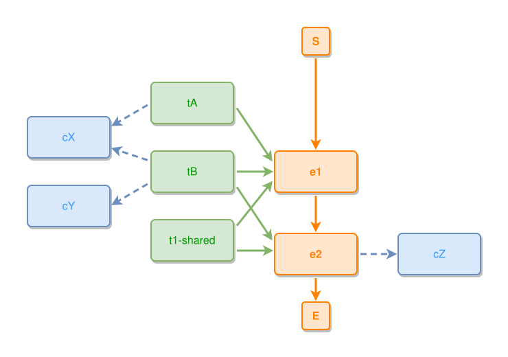

<!-- AUTO-GENERATED FILE - DO NOT EDIT -->
<!-- Generated by: gen-test-md -->
<!-- Command: go run ./cmd-dev/gen-test-md -->

# a-stack-members-own-concept-steps-outward-under-the-shared-one

> **⚠️ Warning:** This file is auto-generated. Manual changes will be lost when tests are regenerated.

**Source:** gl:docs/dev/layout-gen/layout-alg.md#L1202-L1212 | [docs/dev/layout-gen/layout-alg.md](../../docs/dev/layout-gen/layout-alg.md#a-stack-members-own-concept-steps-outward-under-the-shared-one)

## ipmt Content

```ipmt
tA ::t --> cX ::c
tB ::t --> cX
tB --> cY ::c
e1 ::e --> e2 ::e
e2 --> cZ ::c
tA --> e1
tB --> e1
tB --> e2
t1-shared ::t --> e1
t1-shared --> e2
```

## Generated Files

- [a-stack-members-own-concept-steps-outward-under-the-shared-one.ipmt](a-stack-members-own-concept-steps-outward-under-the-shared-one.ipmt) - ipmt input
- [a-stack-members-own-concept-steps-outward-under-the-shared-one.json](a-stack-members-own-concept-steps-outward-under-the-shared-one.json) - Parsed structure
- [a-stack-members-own-concept-steps-outward-under-the-shared-one.layout.json](a-stack-members-own-concept-steps-outward-under-the-shared-one.layout.json) - Layout coordinates
- [a-stack-members-own-concept-steps-outward-under-the-shared-one.ipm.svg](a-stack-members-own-concept-steps-outward-under-the-shared-one.ipm.svg) - Rendered diagram

## Layout Validation Rules

Test line: 1202

✅ All 6 rules passed

- ✓ [Line 53](gl:docs/dev/layout-gen/layout-alg.md#L53): `each edge has max-bends=0` ([edges-run-straight-by-default.dsl](../layout-gen-rules/edges-run-straight-by-default.dsl))
- ✓ [Line 1230](gl:docs/dev/layout-gen/layout-alg.md#L1230): `#tA,#tB,#t1-shared have same center-x` ([a-stack-members-own-concept-steps-outward-under-the-shared-one.dsl](../layout-gen-rules/a-stack-members-own-concept-steps-outward-under-the-shared-one.dsl))
- ✓ [Line 1231](gl:docs/dev/layout-gen/layout-alg.md#L1231): `#cX,#cY have same center-x` ([a-stack-members-own-concept-steps-outward-under-the-shared-one-02.dsl](../layout-gen-rules/a-stack-members-own-concept-steps-outward-under-the-shared-one-02.dsl))
- ✓ [Line 1232](gl:docs/dev/layout-gen/layout-alg.md#L1232): `#cY is below #cX with gap=40` ([a-stack-members-own-concept-steps-outward-under-the-shared-one-03.dsl](../layout-gen-rules/a-stack-members-own-concept-steps-outward-under-the-shared-one-03.dsl))
- ✓ [Line 1233](gl:docs/dev/layout-gen/layout-alg.md#L1233): `#tB is vertically-centered-between #cX,#cY` ([a-stack-members-own-concept-steps-outward-under-the-shared-one-04.dsl](../layout-gen-rules/a-stack-members-own-concept-steps-outward-under-the-shared-one-04.dsl))
- ✓ [Line 1234](gl:docs/dev/layout-gen/layout-alg.md#L1234): `edge #tB,#cY has visibility=visible` ([a-stack-members-own-concept-steps-outward-under-the-shared-one-05.dsl](../layout-gen-rules/a-stack-members-own-concept-steps-outward-under-the-shared-one-05.dsl))

## Rendered Diagram



This test case was automatically generated from the specification document.

The ipmt code block was extracted using [sync-test-cases](../../docs/dev/testing.md) and saved to [a-stack-members-own-concept-steps-outward-under-the-shared-one.ipmt](a-stack-members-own-concept-steps-outward-under-the-shared-one.ipmt), then parsed into the [JSON structure](a-stack-members-own-concept-steps-outward-under-the-shared-one.json) and laid out into [layout coordinates](a-stack-members-own-concept-steps-outward-under-the-shared-one.layout.json). The [SVG diagram](a-stack-members-own-concept-steps-outward-under-the-shared-one.ipm.svg) was rendered using [ipmsvg-gen](../../docs/ipmsvg-gen.md).
