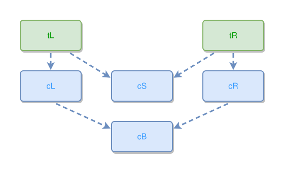

<!-- AUTO-GENERATED FILE - DO NOT EDIT -->
<!-- Generated by: gen-test-md -->
<!-- Command: go run ./cmd-dev/gen-test-md -->

# a-standalone-shared-concept-diamond-centres-symmetrically

> **⚠️ Warning:** This file is auto-generated. Manual changes will be lost when tests are regenerated.

**Source:** gl:docs/dev/layout-gen/layout-alg.md#L3076-L3079 | [docs/dev/layout-gen/layout-alg.md](../../docs/dev/layout-gen/layout-alg.md#a-standalone-shared-concept-diamond-centres-symmetrically)

## ipmt Content

```ipmt
tL --> cS ::c, cL ::c
tR --> cS, cR ::c
cL ::c, cR ::c --> cB ::c
```

## Generated Files

- [a-standalone-shared-concept-diamond-centres-symmetrically.ipmt](a-standalone-shared-concept-diamond-centres-symmetrically.ipmt) - ipmt input
- [a-standalone-shared-concept-diamond-centres-symmetrically.json](a-standalone-shared-concept-diamond-centres-symmetrically.json) - Parsed structure
- [a-standalone-shared-concept-diamond-centres-symmetrically.layout.json](a-standalone-shared-concept-diamond-centres-symmetrically.layout.json) - Layout coordinates
- [a-standalone-shared-concept-diamond-centres-symmetrically.ipm.svg](a-standalone-shared-concept-diamond-centres-symmetrically.ipm.svg) - Rendered diagram

## Layout Validation Rules

Test line: 3076

✅ All 13 rules passed

- ✓ [Line 53](gl:docs/dev/layout-gen/layout-alg.md#L53): `each edge has max-bends=0` ([edges-run-straight-by-default.dsl](../layout-gen-rules/edges-run-straight-by-default.dsl))
- ✓ [Line 3085](gl:docs/dev/layout-gen/layout-alg.md#L3085): `#cS,#cB have same center-x` ([a-standalone-shared-concept-diamond-centres-symmetrically.dsl](../layout-gen-rules/a-standalone-shared-concept-diamond-centres-symmetrically.dsl))
- ✓ [Line 3086](gl:docs/dev/layout-gen/layout-alg.md#L3086): `#cS is horizontally-centered-between #tL,#tR` ([a-standalone-shared-concept-diamond-centres-symmetrically-02.dsl](../layout-gen-rules/a-standalone-shared-concept-diamond-centres-symmetrically-02.dsl))
- ✓ [Line 3087](gl:docs/dev/layout-gen/layout-alg.md#L3087): `#cL is left-of #cS with gap=60` ([a-standalone-shared-concept-diamond-centres-symmetrically-03.dsl](../layout-gen-rules/a-standalone-shared-concept-diamond-centres-symmetrically-03.dsl))
- ✓ [Line 3088](gl:docs/dev/layout-gen/layout-alg.md#L3088): `#cR is right-of #cS with gap=60` ([a-standalone-shared-concept-diamond-centres-symmetrically-04.dsl](../layout-gen-rules/a-standalone-shared-concept-diamond-centres-symmetrically-04.dsl))
- ✓ [Line 3089](gl:docs/dev/layout-gen/layout-alg.md#L3089): `edge #tL,#cS has target-side=left` ([a-standalone-shared-concept-diamond-centres-symmetrically-05.dsl](../layout-gen-rules/a-standalone-shared-concept-diamond-centres-symmetrically-05.dsl))
- ✓ [Line 3090](gl:docs/dev/layout-gen/layout-alg.md#L3090): `edge #tL,#cS has target-position=0.25` ([a-standalone-shared-concept-diamond-centres-symmetrically-06.dsl](../layout-gen-rules/a-standalone-shared-concept-diamond-centres-symmetrically-06.dsl))
- ✓ [Line 3091](gl:docs/dev/layout-gen/layout-alg.md#L3091): `edge #tR,#cS has target-side=right` ([a-standalone-shared-concept-diamond-centres-symmetrically-07.dsl](../layout-gen-rules/a-standalone-shared-concept-diamond-centres-symmetrically-07.dsl))
- ✓ [Line 3092](gl:docs/dev/layout-gen/layout-alg.md#L3092): `edge #tR,#cS has target-position=0.25` ([a-standalone-shared-concept-diamond-centres-symmetrically-08.dsl](../layout-gen-rules/a-standalone-shared-concept-diamond-centres-symmetrically-08.dsl))
- ✓ [Line 3093](gl:docs/dev/layout-gen/layout-alg.md#L3093): `edge #cL,#cB has target-side=left` ([a-standalone-shared-concept-diamond-centres-symmetrically-09.dsl](../layout-gen-rules/a-standalone-shared-concept-diamond-centres-symmetrically-09.dsl))
- ✓ [Line 3094](gl:docs/dev/layout-gen/layout-alg.md#L3094): `edge #cL,#cB has target-position=0.25` ([a-standalone-shared-concept-diamond-centres-symmetrically-10.dsl](../layout-gen-rules/a-standalone-shared-concept-diamond-centres-symmetrically-10.dsl))
- ✓ [Line 3095](gl:docs/dev/layout-gen/layout-alg.md#L3095): `edge #cR,#cB has target-side=right` ([a-standalone-shared-concept-diamond-centres-symmetrically-11.dsl](../layout-gen-rules/a-standalone-shared-concept-diamond-centres-symmetrically-11.dsl))
- ✓ [Line 3096](gl:docs/dev/layout-gen/layout-alg.md#L3096): `edge #cR,#cB has target-position=0.25` ([a-standalone-shared-concept-diamond-centres-symmetrically-12.dsl](../layout-gen-rules/a-standalone-shared-concept-diamond-centres-symmetrically-12.dsl))

## Rendered Diagram



This test case was automatically generated from the specification document.

The ipmt code block was extracted using [sync-test-cases](../../docs/dev/testing.md) and saved to [a-standalone-shared-concept-diamond-centres-symmetrically.ipmt](a-standalone-shared-concept-diamond-centres-symmetrically.ipmt), then parsed into the [JSON structure](a-standalone-shared-concept-diamond-centres-symmetrically.json) and laid out into [layout coordinates](a-standalone-shared-concept-diamond-centres-symmetrically.layout.json). The [SVG diagram](a-standalone-shared-concept-diamond-centres-symmetrically.ipm.svg) was rendered using [ipmsvg-gen](../../docs/ipmsvg-gen.md).
