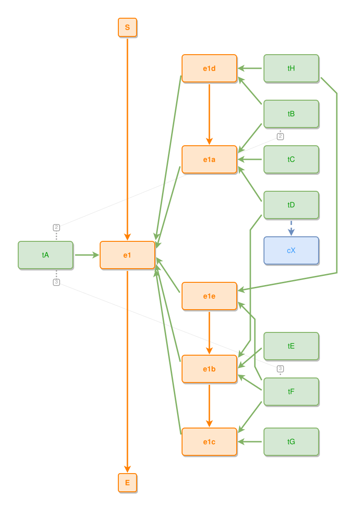

<!-- AUTO-GENERATED FILE - DO NOT EDIT -->
<!-- Generated by: gen-test-md -->
<!-- Command: go run ./cmd-dev/gen-test-md -->

# a-stranded-leaf-concept-comes-back-to-its-owner

> **⚠️ Warning:** This file is auto-generated. Manual changes will be lost when tests are regenerated.

**Source:** gl:docs/dev/layout-gen/layout-alg.md#L2520-L2537 | [docs/dev/layout-gen/layout-alg.md](../../docs/dev/layout-gen/layout-alg.md#a-stranded-leaf-concept-comes-back-to-its-owner)

## ipmt Content

```ipmt
e1 ::e
tA --> e1
tB, tC, tD --> e1a ::e --::P--> e1
tA --- tB

e1b ::e --::P--> e1
tE, tF --> e1b
tD --> e1b
tD --> cX ::c
e1c ::e --::P--> e1
tG, tF --> e1c
tA --- tF

tH, tB --> e1d ::e --::P--> e1
e1d --> e1a
tH, tF --> e1e ::e --::P--> e1
e1e --> e1b --> e1c
```

## Generated Files

- [a-stranded-leaf-concept-comes-back-to-its-owner.ipmt](a-stranded-leaf-concept-comes-back-to-its-owner.ipmt) - ipmt input
- [a-stranded-leaf-concept-comes-back-to-its-owner.json](a-stranded-leaf-concept-comes-back-to-its-owner.json) - Parsed structure
- [a-stranded-leaf-concept-comes-back-to-its-owner.layout.json](a-stranded-leaf-concept-comes-back-to-its-owner.layout.json) - Layout coordinates
- [a-stranded-leaf-concept-comes-back-to-its-owner.ipm.svg](a-stranded-leaf-concept-comes-back-to-its-owner.ipm.svg) - Rendered diagram

## Layout Validation Rules

Test line: 2520

⚠️ 13/14 rules passed

- ✗ [Line 53](gl:docs/dev/layout-gen/layout-alg.md#L53): `each edge has max-bends=0` - **edge tD->e1b has 2 bends > max-bends 0 (each-edge default; if the detour is intended, add it to `except` and pin it with `edge #tD,#e1b has max-bends=2`)** ([edges-run-straight-by-default.dsl](../layout-gen-rules/edges-run-straight-by-default.dsl))
- ✓ [Line 2555](gl:docs/dev/layout-gen/layout-alg.md#L2555): `each edge has max-bends=0 except #tA,#tB #tD,#e1b #tH,#e1e #tF,#e1e` ([a-stranded-leaf-concept-comes-back-to-its-owner.dsl](../layout-gen-rules/a-stranded-leaf-concept-comes-back-to-its-owner.dsl))
- ✓ [Line 2556](gl:docs/dev/layout-gen/layout-alg.md#L2556): `edge #tA,#tB has max-bends=2` ([a-stranded-leaf-concept-comes-back-to-its-owner-02.dsl](../layout-gen-rules/a-stranded-leaf-concept-comes-back-to-its-owner-02.dsl))
- ✓ [Line 2557](gl:docs/dev/layout-gen/layout-alg.md#L2557): `edge #tD,#e1b has max-bends=2` ([a-stranded-leaf-concept-comes-back-to-its-owner-03.dsl](../layout-gen-rules/a-stranded-leaf-concept-comes-back-to-its-owner-03.dsl))
- ✓ [Line 2558](gl:docs/dev/layout-gen/layout-alg.md#L2558): `edge #tH,#e1e has max-bends=2` ([a-stranded-leaf-concept-comes-back-to-its-owner-04.dsl](../layout-gen-rules/a-stranded-leaf-concept-comes-back-to-its-owner-04.dsl))
- ✓ [Line 2559](gl:docs/dev/layout-gen/layout-alg.md#L2559): `edge #tF,#e1e has max-bends=2` ([a-stranded-leaf-concept-comes-back-to-its-owner-05.dsl](../layout-gen-rules/a-stranded-leaf-concept-comes-back-to-its-owner-05.dsl))
- ✓ [Line 2560](gl:docs/dev/layout-gen/layout-alg.md#L2560): `edge #tD,#cX has max-bends=0` ([a-stranded-leaf-concept-comes-back-to-its-owner-06.dsl](../layout-gen-rules/a-stranded-leaf-concept-comes-back-to-its-owner-06.dsl))
- ✓ [Line 2561](gl:docs/dev/layout-gen/layout-alg.md#L2561): `edge #tD,#cX has visibility=visible` ([a-stranded-leaf-concept-comes-back-to-its-owner-07.dsl](../layout-gen-rules/a-stranded-leaf-concept-comes-back-to-its-owner-07.dsl))
- ✓ [Line 2562](gl:docs/dev/layout-gen/layout-alg.md#L2562): `edge #tD,#cX has source-side=bottom` ([a-stranded-leaf-concept-comes-back-to-its-owner-08.dsl](../layout-gen-rules/a-stranded-leaf-concept-comes-back-to-its-owner-08.dsl))
- ✓ [Line 2563](gl:docs/dev/layout-gen/layout-alg.md#L2563): `edge #tD,#cX has target-side=top` ([a-stranded-leaf-concept-comes-back-to-its-owner-09.dsl](../layout-gen-rules/a-stranded-leaf-concept-comes-back-to-its-owner-09.dsl))
- ✓ [Line 2564](gl:docs/dev/layout-gen/layout-alg.md#L2564): `#tD,#cX have same center-x` ([a-stranded-leaf-concept-comes-back-to-its-owner-10.dsl](../layout-gen-rules/a-stranded-leaf-concept-comes-back-to-its-owner-10.dsl))
- ✓ [Line 2565](gl:docs/dev/layout-gen/layout-alg.md#L2565): `#cX is below #tD with gap=40` ([a-stranded-leaf-concept-comes-back-to-its-owner-11.dsl](../layout-gen-rules/a-stranded-leaf-concept-comes-back-to-its-owner-11.dsl))
- ✓ [Line 2566](gl:docs/dev/layout-gen/layout-alg.md#L2566): `#tH,#e1d have same y` ([a-stranded-leaf-concept-comes-back-to-its-owner-12.dsl](../layout-gen-rules/a-stranded-leaf-concept-comes-back-to-its-owner-12.dsl))
- ✓ [Line 2567](gl:docs/dev/layout-gen/layout-alg.md#L2567): `#tH is right-of #e1d with gap=60` ([a-stranded-leaf-concept-comes-back-to-its-owner-13.dsl](../layout-gen-rules/a-stranded-leaf-concept-comes-back-to-its-owner-13.dsl))

## Rendered Diagram



This test case was automatically generated from the specification document.

The ipmt code block was extracted using [sync-test-cases](../../docs/dev/testing.md) and saved to [a-stranded-leaf-concept-comes-back-to-its-owner.ipmt](a-stranded-leaf-concept-comes-back-to-its-owner.ipmt), then parsed into the [JSON structure](a-stranded-leaf-concept-comes-back-to-its-owner.json) and laid out into [layout coordinates](a-stranded-leaf-concept-comes-back-to-its-owner.layout.json). The [SVG diagram](a-stranded-leaf-concept-comes-back-to-its-owner.ipm.svg) was rendered using [ipmsvg-gen](../../docs/ipmsvg-gen.md).
