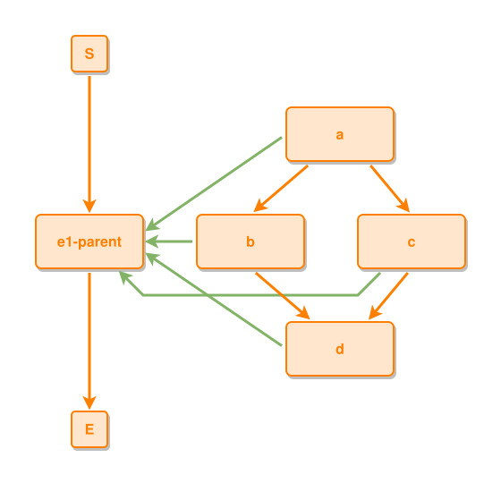

<!-- AUTO-GENERATED FILE - DO NOT EDIT -->
<!-- Generated by: gen-test-md -->
<!-- Command: go run ./cmd-dev/gen-test-md -->

# a-sub-grid-return-lane-centres-in-the-free-row-gap

> **⚠️ Warning:** This file is auto-generated. Manual changes will be lost when tests are regenerated.

**Source:** gl:docs/dev/layout-gen/layout-alg.md#L951-L960 | [docs/dev/layout-gen/layout-alg.md](../../docs/dev/layout-gen/layout-alg.md#a-sub-grid-return-lane-centres-in-the-free-row-gap)

## ipmt Content

```ipmt
e1-parent ::e
a ::e --::P--> e1-parent
b ::e --::P--> e1-parent
c ::e --::P--> e1-parent
d ::e --::P--> e1-parent
a --> b
a --> c
b --> d
c --> d
```

## Generated Files

- [a-sub-grid-return-lane-centres-in-the-free-row-gap.ipmt](a-sub-grid-return-lane-centres-in-the-free-row-gap.ipmt) - ipmt input
- [a-sub-grid-return-lane-centres-in-the-free-row-gap.json](a-sub-grid-return-lane-centres-in-the-free-row-gap.json) - Parsed structure
- [a-sub-grid-return-lane-centres-in-the-free-row-gap.layout.json](a-sub-grid-return-lane-centres-in-the-free-row-gap.layout.json) - Layout coordinates
- [a-sub-grid-return-lane-centres-in-the-free-row-gap.ipm.svg](a-sub-grid-return-lane-centres-in-the-free-row-gap.ipm.svg) - Rendered diagram

## Layout Validation Rules

Test line: 951

⚠️ 10/11 rules passed

- ✗ [Line 53](gl:docs/dev/layout-gen/layout-alg.md#L53): `each edge has max-bends=0` - **edge c->e1-parent has 2 bends > max-bends 0 (each-edge default; if the detour is intended, add it to `except` and pin it with `edge #c,#e1-parent has max-bends=2`)** ([edges-run-straight-by-default.dsl](../layout-gen-rules/edges-run-straight-by-default.dsl))
- ✓ [Line 82](gl:docs/dev/layout-gen/layout-alg.md#L82): `type=event has width=120` ([one-event.dsl](../layout-gen-rules/one-event.dsl))
- ✓ [Line 83](gl:docs/dev/layout-gen/layout-alg.md#L83): `type=event has min-gap-to-others>=10` ([one-event-02.dsl](../layout-gen-rules/one-event-02.dsl))
- ✓ [Line 84](gl:docs/dev/layout-gen/layout-alg.md#L84): `type=boundary has size=40x40` ([one-event-03.dsl](../layout-gen-rules/one-event-03.dsl))
- ✓ [Line 977](gl:docs/dev/layout-gen/layout-alg.md#L977): `#b,#c have same y` ([a-sub-grid-return-lane-centres-in-the-free-row-gap.dsl](../layout-gen-rules/a-sub-grid-return-lane-centres-in-the-free-row-gap.dsl))
- ✓ [Line 978](gl:docs/dev/layout-gen/layout-alg.md#L978): `#a is horizontally-centered-between #b,#c` ([a-sub-grid-return-lane-centres-in-the-free-row-gap-02.dsl](../layout-gen-rules/a-sub-grid-return-lane-centres-in-the-free-row-gap-02.dsl))
- ✓ [Line 979](gl:docs/dev/layout-gen/layout-alg.md#L979): `#a,#d have same center-x` ([a-sub-grid-return-lane-centres-in-the-free-row-gap-03.dsl](../layout-gen-rules/a-sub-grid-return-lane-centres-in-the-free-row-gap-03.dsl))
- ✓ [Line 980](gl:docs/dev/layout-gen/layout-alg.md#L980): `each edge has max-bends=0 except #c,#e1-parent` ([a-sub-grid-return-lane-centres-in-the-free-row-gap-04.dsl](../layout-gen-rules/a-sub-grid-return-lane-centres-in-the-free-row-gap-04.dsl))
- ✓ [Line 981](gl:docs/dev/layout-gen/layout-alg.md#L981): `edge #c,#e1-parent has max-bends=2` ([a-sub-grid-return-lane-centres-in-the-free-row-gap-05.dsl](../layout-gen-rules/a-sub-grid-return-lane-centres-in-the-free-row-gap-05.dsl))
- ✓ [Line 982](gl:docs/dev/layout-gen/layout-alg.md#L982): `edge #c,#e1-parent has source-side=bottom` ([a-sub-grid-return-lane-centres-in-the-free-row-gap-06.dsl](../layout-gen-rules/a-sub-grid-return-lane-centres-in-the-free-row-gap-06.dsl))
- ✓ [Line 983](gl:docs/dev/layout-gen/layout-alg.md#L983): `edge #c,#e1-parent has target-side=bottom` ([a-sub-grid-return-lane-centres-in-the-free-row-gap-07.dsl](../layout-gen-rules/a-sub-grid-return-lane-centres-in-the-free-row-gap-07.dsl))

## Rendered Diagram



This test case was automatically generated from the specification document.

The ipmt code block was extracted using [sync-test-cases](../../docs/dev/testing.md) and saved to [a-sub-grid-return-lane-centres-in-the-free-row-gap.ipmt](a-sub-grid-return-lane-centres-in-the-free-row-gap.ipmt), then parsed into the [JSON structure](a-sub-grid-return-lane-centres-in-the-free-row-gap.json) and laid out into [layout coordinates](a-sub-grid-return-lane-centres-in-the-free-row-gap.layout.json). The [SVG diagram](a-sub-grid-return-lane-centres-in-the-free-row-gap.ipm.svg) was rendered using [ipmsvg-gen](../../docs/ipmsvg-gen.md).
