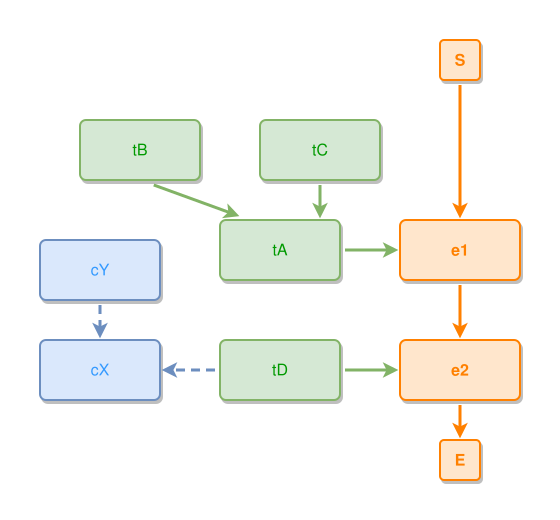

<!-- AUTO-GENERATED FILE - DO NOT EDIT -->
<!-- Generated by: gen-test-md -->
<!-- Command: go run ./cmd-dev/gen-test-md -->

# a-thing-hierarchy-and-its-concepts-join-the-event-chain

> **⚠️ Warning:** This file is auto-generated. Manual changes will be lost when tests are regenerated.

**Source:** gl:docs/dev/layout-gen/layout-alg.md#L1807-L1814 | [docs/dev/layout-gen/layout-alg.md](../../docs/dev/layout-gen/layout-alg.md#a-thing-hierarchy-and-its-concepts-join-the-event-chain)

## ipmt Content

```ipmt
e1 ::e --> e2 ::e
tA ::t --> e1
tD ::t --> e2
tB ::t --> tA
tC ::t --> tA
tD --> cX ::c
cY ::c --> cX
```

## Generated Files

- [a-thing-hierarchy-and-its-concepts-join-the-event-chain.ipmt](a-thing-hierarchy-and-its-concepts-join-the-event-chain.ipmt) - ipmt input
- [a-thing-hierarchy-and-its-concepts-join-the-event-chain.json](a-thing-hierarchy-and-its-concepts-join-the-event-chain.json) - Parsed structure
- [a-thing-hierarchy-and-its-concepts-join-the-event-chain.layout.json](a-thing-hierarchy-and-its-concepts-join-the-event-chain.layout.json) - Layout coordinates
- [a-thing-hierarchy-and-its-concepts-join-the-event-chain.ipm.svg](a-thing-hierarchy-and-its-concepts-join-the-event-chain.ipm.svg) - Rendered diagram

## Layout Validation Rules

Test line: 1807

✅ All 15 rules passed

- ✓ [Line 53](gl:docs/dev/layout-gen/layout-alg.md#L53): `each edge has max-bends=0` ([edges-run-straight-by-default.dsl](../layout-gen-rules/edges-run-straight-by-default.dsl))
- ✓ [Line 1832](gl:docs/dev/layout-gen/layout-alg.md#L1832): `each edge has max-bends=0` ([a-thing-hierarchy-and-its-concepts-join-the-event-chain.dsl](../layout-gen-rules/a-thing-hierarchy-and-its-concepts-join-the-event-chain.dsl))
- ✓ [Line 1833](gl:docs/dev/layout-gen/layout-alg.md#L1833): `#tA,#e1 have same y` ([a-thing-hierarchy-and-its-concepts-join-the-event-chain-02.dsl](../layout-gen-rules/a-thing-hierarchy-and-its-concepts-join-the-event-chain-02.dsl))
- ✓ [Line 1834](gl:docs/dev/layout-gen/layout-alg.md#L1834): `#tD,#e2 have same y` ([a-thing-hierarchy-and-its-concepts-join-the-event-chain-03.dsl](../layout-gen-rules/a-thing-hierarchy-and-its-concepts-join-the-event-chain-03.dsl))
- ✓ [Line 1835](gl:docs/dev/layout-gen/layout-alg.md#L1835): `#tA is left-of #e1 with gap=60` ([a-thing-hierarchy-and-its-concepts-join-the-event-chain-04.dsl](../layout-gen-rules/a-thing-hierarchy-and-its-concepts-join-the-event-chain-04.dsl))
- ✓ [Line 1836](gl:docs/dev/layout-gen/layout-alg.md#L1836): `#tD is left-of #e2 with gap=60` ([a-thing-hierarchy-and-its-concepts-join-the-event-chain-05.dsl](../layout-gen-rules/a-thing-hierarchy-and-its-concepts-join-the-event-chain-05.dsl))
- ✓ [Line 1837](gl:docs/dev/layout-gen/layout-alg.md#L1837): `#tB,#tC have same y` ([a-thing-hierarchy-and-its-concepts-join-the-event-chain-06.dsl](../layout-gen-rules/a-thing-hierarchy-and-its-concepts-join-the-event-chain-06.dsl))
- ✓ [Line 1838](gl:docs/dev/layout-gen/layout-alg.md#L1838): `#tB is left-of #tC with gap=60` ([a-thing-hierarchy-and-its-concepts-join-the-event-chain-07.dsl](../layout-gen-rules/a-thing-hierarchy-and-its-concepts-join-the-event-chain-07.dsl))
- ✓ [Line 1839](gl:docs/dev/layout-gen/layout-alg.md#L1839): `#tC is above #tA with gap=40` ([a-thing-hierarchy-and-its-concepts-join-the-event-chain-08.dsl](../layout-gen-rules/a-thing-hierarchy-and-its-concepts-join-the-event-chain-08.dsl))
- ✓ [Line 1840](gl:docs/dev/layout-gen/layout-alg.md#L1840): `#cX is left-of #tD with gap=60` ([a-thing-hierarchy-and-its-concepts-join-the-event-chain-09.dsl](../layout-gen-rules/a-thing-hierarchy-and-its-concepts-join-the-event-chain-09.dsl))
- ✓ [Line 1841](gl:docs/dev/layout-gen/layout-alg.md#L1841): `#cX,#tD have same y` ([a-thing-hierarchy-and-its-concepts-join-the-event-chain-10.dsl](../layout-gen-rules/a-thing-hierarchy-and-its-concepts-join-the-event-chain-10.dsl))
- ✓ [Line 1842](gl:docs/dev/layout-gen/layout-alg.md#L1842): `#cX,#cY have same center-x` ([a-thing-hierarchy-and-its-concepts-join-the-event-chain-11.dsl](../layout-gen-rules/a-thing-hierarchy-and-its-concepts-join-the-event-chain-11.dsl))
- ✓ [Line 1843](gl:docs/dev/layout-gen/layout-alg.md#L1843): `#cY is above #cX with gap=40` ([a-thing-hierarchy-and-its-concepts-join-the-event-chain-12.dsl](../layout-gen-rules/a-thing-hierarchy-and-its-concepts-join-the-event-chain-12.dsl))
- ✓ [Line 1844](gl:docs/dev/layout-gen/layout-alg.md#L1844): `edge #tD,#cX has visibility=visible` ([a-thing-hierarchy-and-its-concepts-join-the-event-chain-13.dsl](../layout-gen-rules/a-thing-hierarchy-and-its-concepts-join-the-event-chain-13.dsl))
- ✓ [Line 1845](gl:docs/dev/layout-gen/layout-alg.md#L1845): `edge #cY,#cX has visibility=visible` ([a-thing-hierarchy-and-its-concepts-join-the-event-chain-14.dsl](../layout-gen-rules/a-thing-hierarchy-and-its-concepts-join-the-event-chain-14.dsl))

## Rendered Diagram



This test case was automatically generated from the specification document.

The ipmt code block was extracted using [sync-test-cases](../../docs/dev/testing.md) and saved to [a-thing-hierarchy-and-its-concepts-join-the-event-chain.ipmt](a-thing-hierarchy-and-its-concepts-join-the-event-chain.ipmt), then parsed into the [JSON structure](a-thing-hierarchy-and-its-concepts-join-the-event-chain.json) and laid out into [layout coordinates](a-thing-hierarchy-and-its-concepts-join-the-event-chain.layout.json). The [SVG diagram](a-thing-hierarchy-and-its-concepts-join-the-event-chain.ipm.svg) was rendered using [ipmsvg-gen](../../docs/ipmsvg-gen.md).
