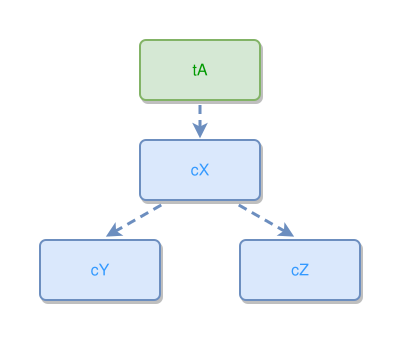

<!-- AUTO-GENERATED FILE - DO NOT EDIT -->
<!-- Generated by: gen-test-md -->
<!-- Command: go run ./cmd-dev/gen-test-md -->

# a-two-concept-fan-mirrors-exactly-about-its-parent

> **⚠️ Warning:** This file is auto-generated. Manual changes will be lost when tests are regenerated.

**Source:** gl:docs/dev/layout-gen/layout-alg.md#L3040-L3041 | [docs/dev/layout-gen/layout-alg.md](../../docs/dev/layout-gen/layout-alg.md#a-two-concept-fan-mirrors-exactly-about-its-parent)

## ipmt Content

```ipmt
tA --> cX ::c --> cY ::c, cZ ::c
```

## Generated Files

- [a-two-concept-fan-mirrors-exactly-about-its-parent.ipmt](a-two-concept-fan-mirrors-exactly-about-its-parent.ipmt) - ipmt input
- [a-two-concept-fan-mirrors-exactly-about-its-parent.json](a-two-concept-fan-mirrors-exactly-about-its-parent.json) - Parsed structure
- [a-two-concept-fan-mirrors-exactly-about-its-parent.layout.json](a-two-concept-fan-mirrors-exactly-about-its-parent.layout.json) - Layout coordinates
- [a-two-concept-fan-mirrors-exactly-about-its-parent.ipm.svg](a-two-concept-fan-mirrors-exactly-about-its-parent.ipm.svg) - Rendered diagram

## Layout Validation Rules

Test line: 3040

✅ All 3 rules passed

- ✓ [Line 53](gl:docs/dev/layout-gen/layout-alg.md#L53): `each edge has max-bends=0` ([edges-run-straight-by-default.dsl](../layout-gen-rules/edges-run-straight-by-default.dsl))
- ✓ [Line 3054](gl:docs/dev/layout-gen/layout-alg.md#L3054): `#cY,#cZ have same y` ([a-two-concept-fan-mirrors-exactly-about-its-parent.dsl](../layout-gen-rules/a-two-concept-fan-mirrors-exactly-about-its-parent.dsl))
- ✓ [Line 3055](gl:docs/dev/layout-gen/layout-alg.md#L3055): `#cY is left-of #cZ with gap=80` ([a-two-concept-fan-mirrors-exactly-about-its-parent-02.dsl](../layout-gen-rules/a-two-concept-fan-mirrors-exactly-about-its-parent-02.dsl))

## Rendered Diagram



This test case was automatically generated from the specification document.

The ipmt code block was extracted using [sync-test-cases](../../docs/dev/testing.md) and saved to [a-two-concept-fan-mirrors-exactly-about-its-parent.ipmt](a-two-concept-fan-mirrors-exactly-about-its-parent.ipmt), then parsed into the [JSON structure](a-two-concept-fan-mirrors-exactly-about-its-parent.json) and laid out into [layout coordinates](a-two-concept-fan-mirrors-exactly-about-its-parent.layout.json). The [SVG diagram](a-two-concept-fan-mirrors-exactly-about-its-parent.ipm.svg) was rendered using [ipmsvg-gen](../../docs/ipmsvg-gen.md).
