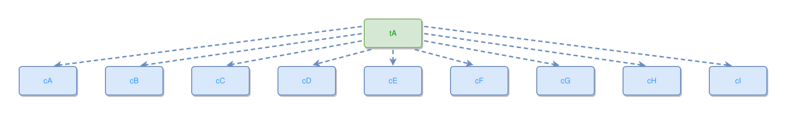

<!-- AUTO-GENERATED FILE - DO NOT EDIT -->
<!-- Generated by: gen-test-md -->
<!-- Command: go run ./cmd-dev/gen-test-md -->

# a-wide-expresses-fan-orders-its-sides-and-lands-on-the-rows-tops

> **⚠️ Warning:** This file is auto-generated. Manual changes will be lost when tests are regenerated.

**Source:** gl:docs/dev/layout-gen/layout-alg.md#L3191-L3200 | [docs/dev/layout-gen/layout-alg.md](../../docs/dev/layout-gen/layout-alg.md#a-wide-expresses-fan-orders-its-sides-and-lands-on-the-rows-tops)

## ipmt Content

```ipmt
tA --> cA ::c
tA --> cB ::c
tA --> cC ::c
tA --> cD ::c
tA --> cE ::c
tA --> cF ::c
tA --> cG ::c
tA --> cH ::c
tA --> cI ::c
```

## Generated Files

- [a-wide-expresses-fan-orders-its-sides-and-lands-on-the-rows-tops.ipmt](a-wide-expresses-fan-orders-its-sides-and-lands-on-the-rows-tops.ipmt) - ipmt input
- [a-wide-expresses-fan-orders-its-sides-and-lands-on-the-rows-tops.json](a-wide-expresses-fan-orders-its-sides-and-lands-on-the-rows-tops.json) - Parsed structure
- [a-wide-expresses-fan-orders-its-sides-and-lands-on-the-rows-tops.layout.json](a-wide-expresses-fan-orders-its-sides-and-lands-on-the-rows-tops.layout.json) - Layout coordinates
- [a-wide-expresses-fan-orders-its-sides-and-lands-on-the-rows-tops.ipm.svg](a-wide-expresses-fan-orders-its-sides-and-lands-on-the-rows-tops.ipm.svg) - Rendered diagram

## Layout Validation Rules

Test line: 3191

✅ All 14 rules passed

- ✓ [Line 53](gl:docs/dev/layout-gen/layout-alg.md#L53): `each edge has max-bends=0` ([edges-run-straight-by-default.dsl](../layout-gen-rules/edges-run-straight-by-default.dsl))
- ✓ [Line 3221](gl:docs/dev/layout-gen/layout-alg.md#L3221): `edge #tA,#cA has target-side=top` ([a-wide-expresses-fan-orders-its-sides-and-lands-on-the-rows-tops.dsl](../layout-gen-rules/a-wide-expresses-fan-orders-its-sides-and-lands-on-the-rows-tops.dsl))
- ✓ [Line 3222](gl:docs/dev/layout-gen/layout-alg.md#L3222): `edge #tA,#cC has target-side=top` ([a-wide-expresses-fan-orders-its-sides-and-lands-on-the-rows-tops-02.dsl](../layout-gen-rules/a-wide-expresses-fan-orders-its-sides-and-lands-on-the-rows-tops-02.dsl))
- ✓ [Line 3223](gl:docs/dev/layout-gen/layout-alg.md#L3223): `edge #tA,#cE has target-side=top` ([a-wide-expresses-fan-orders-its-sides-and-lands-on-the-rows-tops-03.dsl](../layout-gen-rules/a-wide-expresses-fan-orders-its-sides-and-lands-on-the-rows-tops-03.dsl))
- ✓ [Line 3224](gl:docs/dev/layout-gen/layout-alg.md#L3224): `edge #tA,#cG has target-side=top` ([a-wide-expresses-fan-orders-its-sides-and-lands-on-the-rows-tops-04.dsl](../layout-gen-rules/a-wide-expresses-fan-orders-its-sides-and-lands-on-the-rows-tops-04.dsl))
- ✓ [Line 3225](gl:docs/dev/layout-gen/layout-alg.md#L3225): `edge #tA,#cI has target-side=top` ([a-wide-expresses-fan-orders-its-sides-and-lands-on-the-rows-tops-05.dsl](../layout-gen-rules/a-wide-expresses-fan-orders-its-sides-and-lands-on-the-rows-tops-05.dsl))
- ✓ [Line 3226](gl:docs/dev/layout-gen/layout-alg.md#L3226): `edge #tA,#cA has source-side=left` ([a-wide-expresses-fan-orders-its-sides-and-lands-on-the-rows-tops-06.dsl](../layout-gen-rules/a-wide-expresses-fan-orders-its-sides-and-lands-on-the-rows-tops-06.dsl))
- ✓ [Line 3227](gl:docs/dev/layout-gen/layout-alg.md#L3227): `edge #tA,#cA has source-position=0.25` ([a-wide-expresses-fan-orders-its-sides-and-lands-on-the-rows-tops-07.dsl](../layout-gen-rules/a-wide-expresses-fan-orders-its-sides-and-lands-on-the-rows-tops-07.dsl))
- ✓ [Line 3228](gl:docs/dev/layout-gen/layout-alg.md#L3228): `edge #tA,#cC has source-side=left` ([a-wide-expresses-fan-orders-its-sides-and-lands-on-the-rows-tops-08.dsl](../layout-gen-rules/a-wide-expresses-fan-orders-its-sides-and-lands-on-the-rows-tops-08.dsl))
- ✓ [Line 3229](gl:docs/dev/layout-gen/layout-alg.md#L3229): `edge #tA,#cC has source-position=0.75` ([a-wide-expresses-fan-orders-its-sides-and-lands-on-the-rows-tops-09.dsl](../layout-gen-rules/a-wide-expresses-fan-orders-its-sides-and-lands-on-the-rows-tops-09.dsl))
- ✓ [Line 3230](gl:docs/dev/layout-gen/layout-alg.md#L3230): `edge #tA,#cI has source-side=right` ([a-wide-expresses-fan-orders-its-sides-and-lands-on-the-rows-tops-10.dsl](../layout-gen-rules/a-wide-expresses-fan-orders-its-sides-and-lands-on-the-rows-tops-10.dsl))
- ✓ [Line 3231](gl:docs/dev/layout-gen/layout-alg.md#L3231): `edge #tA,#cI has source-position=0.25` ([a-wide-expresses-fan-orders-its-sides-and-lands-on-the-rows-tops-11.dsl](../layout-gen-rules/a-wide-expresses-fan-orders-its-sides-and-lands-on-the-rows-tops-11.dsl))
- ✓ [Line 3232](gl:docs/dev/layout-gen/layout-alg.md#L3232): `edge #tA,#cG has source-side=right` ([a-wide-expresses-fan-orders-its-sides-and-lands-on-the-rows-tops-12.dsl](../layout-gen-rules/a-wide-expresses-fan-orders-its-sides-and-lands-on-the-rows-tops-12.dsl))
- ✓ [Line 3233](gl:docs/dev/layout-gen/layout-alg.md#L3233): `edge #tA,#cG has source-position=0.75` ([a-wide-expresses-fan-orders-its-sides-and-lands-on-the-rows-tops-13.dsl](../layout-gen-rules/a-wide-expresses-fan-orders-its-sides-and-lands-on-the-rows-tops-13.dsl))

## Rendered Diagram



This test case was automatically generated from the specification document.

The ipmt code block was extracted using [sync-test-cases](../../docs/dev/testing.md) and saved to [a-wide-expresses-fan-orders-its-sides-and-lands-on-the-rows-tops.ipmt](a-wide-expresses-fan-orders-its-sides-and-lands-on-the-rows-tops.ipmt), then parsed into the [JSON structure](a-wide-expresses-fan-orders-its-sides-and-lands-on-the-rows-tops.json) and laid out into [layout coordinates](a-wide-expresses-fan-orders-its-sides-and-lands-on-the-rows-tops.layout.json). The [SVG diagram](a-wide-expresses-fan-orders-its-sides-and-lands-on-the-rows-tops.ipm.svg) was rendered using [ipmsvg-gen](../../docs/ipmsvg-gen.md).
