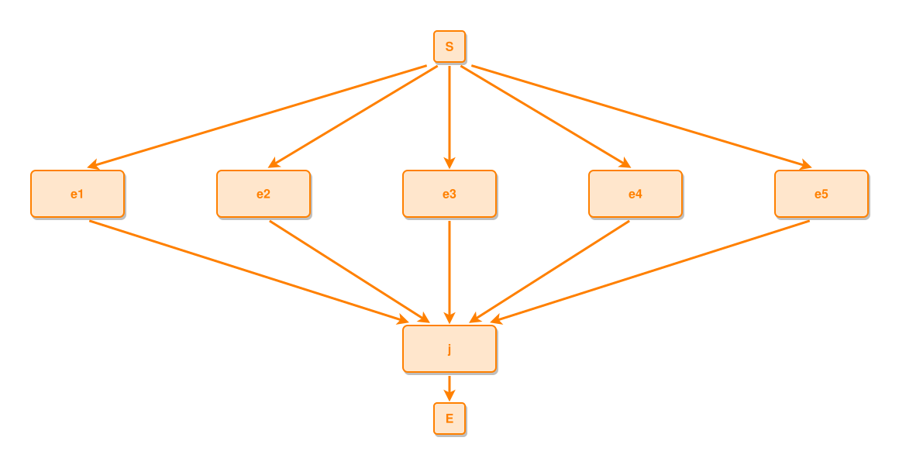

<!-- AUTO-GENERATED FILE - DO NOT EDIT -->
<!-- Generated by: gen-test-md -->
<!-- Command: go run ./cmd-dev/gen-test-md -->

# a-wide-start-fan-grows-its-vertical-gap

> **⚠️ Warning:** This file is auto-generated. Manual changes will be lost when tests are regenerated.

**Source:** gl:docs/dev/layout-gen/layout-alg.md#L2483-L2488 | [docs/dev/layout-gen/layout-alg.md](../../docs/dev/layout-gen/layout-alg.md#a-wide-start-fan-grows-its-vertical-gap)

## ipmt Content

```ipmt
e1 ::e --> j ::e
e2 ::e --> j
e3 ::e --> j
e4 ::e --> j
e5 ::e --> j
```

## Generated Files

- [a-wide-start-fan-grows-its-vertical-gap.ipmt](a-wide-start-fan-grows-its-vertical-gap.ipmt) - ipmt input
- [a-wide-start-fan-grows-its-vertical-gap.json](a-wide-start-fan-grows-its-vertical-gap.json) - Parsed structure
- [a-wide-start-fan-grows-its-vertical-gap.layout.json](a-wide-start-fan-grows-its-vertical-gap.layout.json) - Layout coordinates
- [a-wide-start-fan-grows-its-vertical-gap.ipm.svg](a-wide-start-fan-grows-its-vertical-gap.ipm.svg) - Rendered diagram

## Layout Validation Rules

Test line: 2483

✅ All 8 rules passed

- ✓ [Line 53](gl:docs/dev/layout-gen/layout-alg.md#L53): `each edge has max-bends=0` ([edges-run-straight-by-default.dsl](../layout-gen-rules/edges-run-straight-by-default.dsl))
- ✓ [Line 2507](gl:docs/dev/layout-gen/layout-alg.md#L2507): `#e1,#e2,#e3,#e4,#e5 have same y` ([a-wide-start-fan-grows-its-vertical-gap.dsl](../layout-gen-rules/a-wide-start-fan-grows-its-vertical-gap.dsl))
- ✓ [Line 2508](gl:docs/dev/layout-gen/layout-alg.md#L2508): `#S is horizontally-centered-between #e1,#e5` ([a-wide-start-fan-grows-its-vertical-gap-02.dsl](../layout-gen-rules/a-wide-start-fan-grows-its-vertical-gap-02.dsl))
- ✓ [Line 2509](gl:docs/dev/layout-gen/layout-alg.md#L2509): `edge #S,#e1 has min-slope=0.25` ([a-wide-start-fan-grows-its-vertical-gap-03.dsl](../layout-gen-rules/a-wide-start-fan-grows-its-vertical-gap-03.dsl))
- ✓ [Line 2510](gl:docs/dev/layout-gen/layout-alg.md#L2510): `edge #S,#e5 has min-slope=0.25` ([a-wide-start-fan-grows-its-vertical-gap-04.dsl](../layout-gen-rules/a-wide-start-fan-grows-its-vertical-gap-04.dsl))
- ✓ [Line 2511](gl:docs/dev/layout-gen/layout-alg.md#L2511): `edge #e1,#j has min-slope=0.25` ([a-wide-start-fan-grows-its-vertical-gap-05.dsl](../layout-gen-rules/a-wide-start-fan-grows-its-vertical-gap-05.dsl))
- ✓ [Line 2512](gl:docs/dev/layout-gen/layout-alg.md#L2512): `edge #e5,#j has min-slope=0.25` ([a-wide-start-fan-grows-its-vertical-gap-06.dsl](../layout-gen-rules/a-wide-start-fan-grows-its-vertical-gap-06.dsl))
- ✓ [Line 2513](gl:docs/dev/layout-gen/layout-alg.md#L2513): `#j,#S,#E have same center-x` ([a-wide-start-fan-grows-its-vertical-gap-07.dsl](../layout-gen-rules/a-wide-start-fan-grows-its-vertical-gap-07.dsl))

## Rendered Diagram



This test case was automatically generated from the specification document.

The ipmt code block was extracted using [sync-test-cases](../../docs/dev/testing.md) and saved to [a-wide-start-fan-grows-its-vertical-gap.ipmt](a-wide-start-fan-grows-its-vertical-gap.ipmt), then parsed into the [JSON structure](a-wide-start-fan-grows-its-vertical-gap.json) and laid out into [layout coordinates](a-wide-start-fan-grows-its-vertical-gap.layout.json). The [SVG diagram](a-wide-start-fan-grows-its-vertical-gap.ipm.svg) was rendered using [ipmsvg-gen](../../docs/ipmsvg-gen.md).
