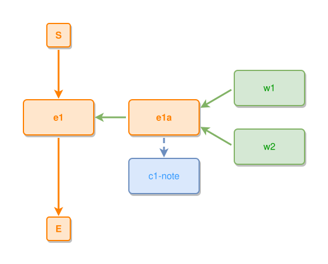

<!-- AUTO-GENERATED FILE - DO NOT EDIT -->
<!-- Generated by: gen-test-md -->
<!-- Command: go run ./cmd-dev/gen-test-md -->

# an-inner-events-thing-fan-keeps-its-sole-concept-below

> **⚠️ Warning:** This file is auto-generated. Manual changes will be lost when tests are regenerated.

**Source:** gl:docs/dev/layout-gen/layout-alg.md#L1239-L1243 | [docs/dev/layout-gen/layout-alg.md](../../docs/dev/layout-gen/layout-alg.md#an-inner-events-thing-fan-keeps-its-sole-concept-below)

## ipmt Content

```ipmt
e1 ::e
e1a ::e --::P--> e1
w1 ::t, w2 ::t --> e1a
e1a --> c1-note ::c
```

## Generated Files

- [an-inner-events-thing-fan-keeps-its-sole-concept-below.ipmt](an-inner-events-thing-fan-keeps-its-sole-concept-below.ipmt) - ipmt input
- [an-inner-events-thing-fan-keeps-its-sole-concept-below.json](an-inner-events-thing-fan-keeps-its-sole-concept-below.json) - Parsed structure
- [an-inner-events-thing-fan-keeps-its-sole-concept-below.layout.json](an-inner-events-thing-fan-keeps-its-sole-concept-below.layout.json) - Layout coordinates
- [an-inner-events-thing-fan-keeps-its-sole-concept-below.ipm.svg](an-inner-events-thing-fan-keeps-its-sole-concept-below.ipm.svg) - Rendered diagram

## Layout Validation Rules

Test line: 1239

✅ All 7 rules passed

- ✓ [Line 53](gl:docs/dev/layout-gen/layout-alg.md#L53): `each edge has max-bends=0` ([edges-run-straight-by-default.dsl](../layout-gen-rules/edges-run-straight-by-default.dsl))
- ✓ [Line 1256](gl:docs/dev/layout-gen/layout-alg.md#L1256): `#w1,#w2 have same center-x` ([an-inner-events-thing-fan-keeps-its-sole-concept-below.dsl](../layout-gen-rules/an-inner-events-thing-fan-keeps-its-sole-concept-below.dsl))
- ✓ [Line 1257](gl:docs/dev/layout-gen/layout-alg.md#L1257): `#w1 is right-of #e1a with gap=60` ([an-inner-events-thing-fan-keeps-its-sole-concept-below-02.dsl](../layout-gen-rules/an-inner-events-thing-fan-keeps-its-sole-concept-below-02.dsl))
- ✓ [Line 1258](gl:docs/dev/layout-gen/layout-alg.md#L1258): `#w2 is below #w1 with gap=40` ([an-inner-events-thing-fan-keeps-its-sole-concept-below-03.dsl](../layout-gen-rules/an-inner-events-thing-fan-keeps-its-sole-concept-below-03.dsl))
- ✓ [Line 1259](gl:docs/dev/layout-gen/layout-alg.md#L1259): `#e1a is vertically-centered-between #w1,#w2` ([an-inner-events-thing-fan-keeps-its-sole-concept-below-04.dsl](../layout-gen-rules/an-inner-events-thing-fan-keeps-its-sole-concept-below-04.dsl))
- ✓ [Line 1260](gl:docs/dev/layout-gen/layout-alg.md#L1260): `#e1a,#c1-note have same center-x` ([an-inner-events-thing-fan-keeps-its-sole-concept-below-05.dsl](../layout-gen-rules/an-inner-events-thing-fan-keeps-its-sole-concept-below-05.dsl))
- ✓ [Line 1261](gl:docs/dev/layout-gen/layout-alg.md#L1261): `#c1-note is below #e1a with gap=40` ([an-inner-events-thing-fan-keeps-its-sole-concept-below-06.dsl](../layout-gen-rules/an-inner-events-thing-fan-keeps-its-sole-concept-below-06.dsl))

## Rendered Diagram



This test case was automatically generated from the specification document.

The ipmt code block was extracted using [sync-test-cases](../../docs/dev/testing.md) and saved to [an-inner-events-thing-fan-keeps-its-sole-concept-below.ipmt](an-inner-events-thing-fan-keeps-its-sole-concept-below.ipmt), then parsed into the [JSON structure](an-inner-events-thing-fan-keeps-its-sole-concept-below.json) and laid out into [layout coordinates](an-inner-events-thing-fan-keeps-its-sole-concept-below.layout.json). The [SVG diagram](an-inner-events-thing-fan-keeps-its-sole-concept-below.ipm.svg) was rendered using [ipmsvg-gen](../../docs/ipmsvg-gen.md).
