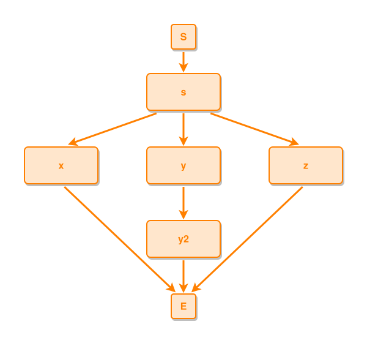

<!-- AUTO-GENERATED FILE - DO NOT EDIT -->
<!-- Generated by: gen-test-md -->
<!-- Command: go run ./cmd-dev/gen-test-md -->

# an-uneven-end-fan-turns-early-and-e-keeps-a-fan-gap

> **⚠️ Warning:** This file is auto-generated. Manual changes will be lost when tests are regenerated.

**Source:** gl:docs/dev/layout-gen/layout-alg.md#L2370-L2374 | [docs/dev/layout-gen/layout-alg.md](../../docs/dev/layout-gen/layout-alg.md#an-uneven-end-fan-turns-early-and-e-keeps-a-fan-gap)

## ipmt Content

```ipmt
s ::e --> x ::e
s --> y ::e
s --> z ::e
y --> y2 ::e
```

## Generated Files

- [an-uneven-end-fan-turns-early-and-e-keeps-a-fan-gap.ipmt](an-uneven-end-fan-turns-early-and-e-keeps-a-fan-gap.ipmt) - ipmt input
- [an-uneven-end-fan-turns-early-and-e-keeps-a-fan-gap.json](an-uneven-end-fan-turns-early-and-e-keeps-a-fan-gap.json) - Parsed structure
- [an-uneven-end-fan-turns-early-and-e-keeps-a-fan-gap.layout.json](an-uneven-end-fan-turns-early-and-e-keeps-a-fan-gap.layout.json) - Layout coordinates
- [an-uneven-end-fan-turns-early-and-e-keeps-a-fan-gap.ipm.svg](an-uneven-end-fan-turns-early-and-e-keeps-a-fan-gap.ipm.svg) - Rendered diagram

## Layout Validation Rules

Test line: 2370

✅ All 11 rules passed

- ✓ [Line 53](gl:docs/dev/layout-gen/layout-alg.md#L53): `each edge has max-bends=0` ([edges-run-straight-by-default.dsl](../layout-gen-rules/edges-run-straight-by-default.dsl))
- ✓ [Line 2397](gl:docs/dev/layout-gen/layout-alg.md#L2397): `#x,#y,#z have same y` ([an-uneven-end-fan-turns-early-and-e-keeps-a-fan-gap.dsl](../layout-gen-rules/an-uneven-end-fan-turns-early-and-e-keeps-a-fan-gap.dsl))
- ✓ [Line 2398](gl:docs/dev/layout-gen/layout-alg.md#L2398): `#E is below #y2 with gap=60` ([an-uneven-end-fan-turns-early-and-e-keeps-a-fan-gap-02.dsl](../layout-gen-rules/an-uneven-end-fan-turns-early-and-e-keeps-a-fan-gap-02.dsl))
- ✓ [Line 2399](gl:docs/dev/layout-gen/layout-alg.md#L2399): `edge #y2,#E is vertical` ([an-uneven-end-fan-turns-early-and-e-keeps-a-fan-gap-03.dsl](../layout-gen-rules/an-uneven-end-fan-turns-early-and-e-keeps-a-fan-gap-03.dsl))
- ✓ [Line 2400](gl:docs/dev/layout-gen/layout-alg.md#L2400): `each edge has max-bends=0 except #x,#E #z,#E` ([an-uneven-end-fan-turns-early-and-e-keeps-a-fan-gap-04.dsl](../layout-gen-rules/an-uneven-end-fan-turns-early-and-e-keeps-a-fan-gap-04.dsl))
- ✓ [Line 2401](gl:docs/dev/layout-gen/layout-alg.md#L2401): `edge #x,#E has max-bends=1` ([an-uneven-end-fan-turns-early-and-e-keeps-a-fan-gap-05.dsl](../layout-gen-rules/an-uneven-end-fan-turns-early-and-e-keeps-a-fan-gap-05.dsl))
- ✓ [Line 2402](gl:docs/dev/layout-gen/layout-alg.md#L2402): `edge #z,#E has max-bends=1` ([an-uneven-end-fan-turns-early-and-e-keeps-a-fan-gap-06.dsl](../layout-gen-rules/an-uneven-end-fan-turns-early-and-e-keeps-a-fan-gap-06.dsl))
- ✓ [Line 2403](gl:docs/dev/layout-gen/layout-alg.md#L2403): `edge #x,#E has min-corner-angle=110` ([an-uneven-end-fan-turns-early-and-e-keeps-a-fan-gap-07.dsl](../layout-gen-rules/an-uneven-end-fan-turns-early-and-e-keeps-a-fan-gap-07.dsl))
- ✓ [Line 2404](gl:docs/dev/layout-gen/layout-alg.md#L2404): `edge #z,#E has min-corner-angle=110` ([an-uneven-end-fan-turns-early-and-e-keeps-a-fan-gap-08.dsl](../layout-gen-rules/an-uneven-end-fan-turns-early-and-e-keeps-a-fan-gap-08.dsl))
- ✓ [Line 2405](gl:docs/dev/layout-gen/layout-alg.md#L2405): `edge #x,#E does not cross edge #y,#y2` ([an-uneven-end-fan-turns-early-and-e-keeps-a-fan-gap-09.dsl](../layout-gen-rules/an-uneven-end-fan-turns-early-and-e-keeps-a-fan-gap-09.dsl))
- ✓ [Line 2406](gl:docs/dev/layout-gen/layout-alg.md#L2406): `edge #z,#E does not cross edge #y,#y2` ([an-uneven-end-fan-turns-early-and-e-keeps-a-fan-gap-10.dsl](../layout-gen-rules/an-uneven-end-fan-turns-early-and-e-keeps-a-fan-gap-10.dsl))

## Rendered Diagram



This test case was automatically generated from the specification document.

The ipmt code block was extracted using [sync-test-cases](../../docs/dev/testing.md) and saved to [an-uneven-end-fan-turns-early-and-e-keeps-a-fan-gap.ipmt](an-uneven-end-fan-turns-early-and-e-keeps-a-fan-gap.ipmt), then parsed into the [JSON structure](an-uneven-end-fan-turns-early-and-e-keeps-a-fan-gap.json) and laid out into [layout coordinates](an-uneven-end-fan-turns-early-and-e-keeps-a-fan-gap.layout.json). The [SVG diagram](an-uneven-end-fan-turns-early-and-e-keeps-a-fan-gap.ipm.svg) was rendered using [ipmsvg-gen](../../docs/ipmsvg-gen.md).
