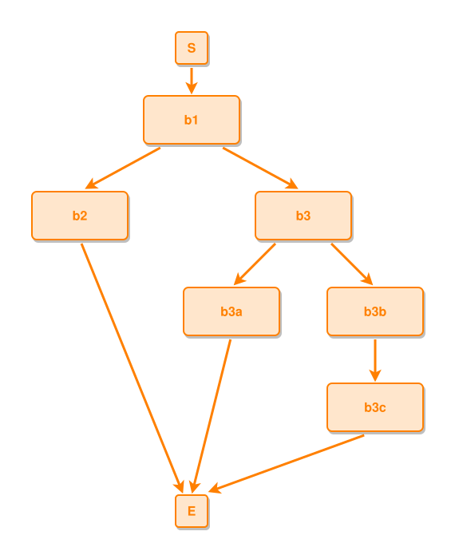

<!-- AUTO-GENERATED FILE - DO NOT EDIT -->
<!-- Generated by: gen-test-md -->
<!-- Command: go run ./cmd-dev/gen-test-md -->

# asymmetric-terminals-center-the-boundaries

> **⚠️ Warning:** This file is auto-generated. Manual changes will be lost when tests are regenerated.

**Source:** gl:docs/dev/layout-gen/layout-alg.md#L271-L275 | [docs/dev/layout-gen/layout-alg.md](../../docs/dev/layout-gen/layout-alg.md#asymmetric-terminals-center-the-boundaries)

## ipmt Content

```ipmt
b1 ::e --> b2 ::e, b3 ::e
b3 --> b3a ::e
b3 --> b3b ::e
b3b --> b3c ::e
```

## Generated Files

- [asymmetric-terminals-center-the-boundaries.ipmt](asymmetric-terminals-center-the-boundaries.ipmt) - ipmt input
- [asymmetric-terminals-center-the-boundaries.json](asymmetric-terminals-center-the-boundaries.json) - Parsed structure
- [asymmetric-terminals-center-the-boundaries.layout.json](asymmetric-terminals-center-the-boundaries.layout.json) - Layout coordinates
- [asymmetric-terminals-center-the-boundaries.ipm.svg](asymmetric-terminals-center-the-boundaries.ipm.svg) - Rendered diagram

## Layout Validation Rules

Test line: 271

✅ All 10 rules passed

- ✓ [Line 53](gl:docs/dev/layout-gen/layout-alg.md#L53): `each edge has max-bends=0` ([edges-run-straight-by-default.dsl](../layout-gen-rules/edges-run-straight-by-default.dsl))
- ✓ [Line 82](gl:docs/dev/layout-gen/layout-alg.md#L82): `type=event has width=120` ([one-event.dsl](../layout-gen-rules/one-event.dsl))
- ✓ [Line 83](gl:docs/dev/layout-gen/layout-alg.md#L83): `type=event has min-gap-to-others>=10` ([one-event-02.dsl](../layout-gen-rules/one-event-02.dsl))
- ✓ [Line 84](gl:docs/dev/layout-gen/layout-alg.md#L84): `type=boundary has size=40x40` ([one-event-03.dsl](../layout-gen-rules/one-event-03.dsl))
- ✓ [Line 305](gl:docs/dev/layout-gen/layout-alg.md#L305): `#S,#b1,#E have same center-x` ([asymmetric-terminals-center-the-boundaries.dsl](../layout-gen-rules/asymmetric-terminals-center-the-boundaries.dsl))
- ✓ [Line 306](gl:docs/dev/layout-gen/layout-alg.md#L306): `node #b3a keeps gap=25 from edge #b2,#E` ([asymmetric-terminals-center-the-boundaries-02.dsl](../layout-gen-rules/asymmetric-terminals-center-the-boundaries-02.dsl))
- ✓ [Line 307](gl:docs/dev/layout-gen/layout-alg.md#L307): `edge #b2,#E has source-side=bottom` ([asymmetric-terminals-center-the-boundaries-03.dsl](../layout-gen-rules/asymmetric-terminals-center-the-boundaries-03.dsl))
- ✓ [Line 308](gl:docs/dev/layout-gen/layout-alg.md#L308): `edge #b3c,#E has min-slope=0.25` ([asymmetric-terminals-center-the-boundaries-04.dsl](../layout-gen-rules/asymmetric-terminals-center-the-boundaries-04.dsl))
- ✓ [Line 309](gl:docs/dev/layout-gen/layout-alg.md#L309): `each edge has max-bends=0 except #b2,#E` ([asymmetric-terminals-center-the-boundaries-05.dsl](../layout-gen-rules/asymmetric-terminals-center-the-boundaries-05.dsl))
- ✓ [Line 310](gl:docs/dev/layout-gen/layout-alg.md#L310): `edge #b2,#E has max-bends=1` ([asymmetric-terminals-center-the-boundaries-06.dsl](../layout-gen-rules/asymmetric-terminals-center-the-boundaries-06.dsl))

## Rendered Diagram



This test case was automatically generated from the specification document.

The ipmt code block was extracted using [sync-test-cases](../../docs/dev/testing.md) and saved to [asymmetric-terminals-center-the-boundaries.ipmt](asymmetric-terminals-center-the-boundaries.ipmt), then parsed into the [JSON structure](asymmetric-terminals-center-the-boundaries.json) and laid out into [layout coordinates](asymmetric-terminals-center-the-boundaries.layout.json). The [SVG diagram](asymmetric-terminals-center-the-boundaries.ipm.svg) was rendered using [ipmsvg-gen](../../docs/ipmsvg-gen.md).
