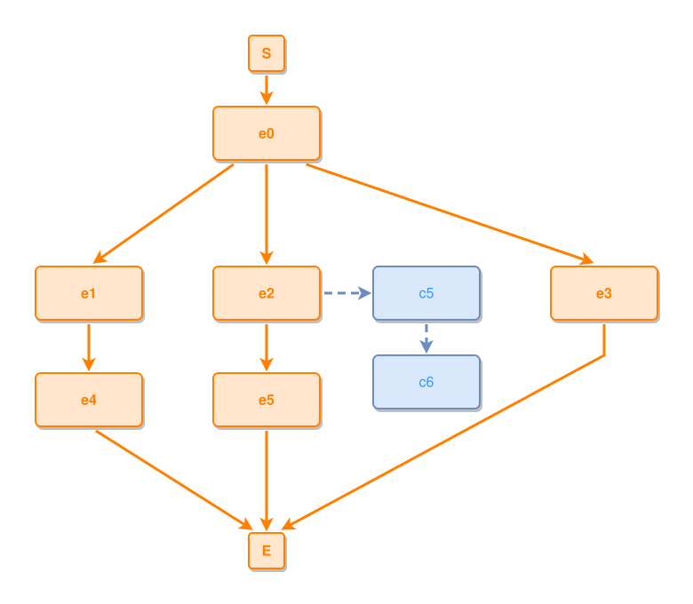

<!-- AUTO-GENERATED FILE - DO NOT EDIT -->
<!-- Generated by: gen-test-md -->
<!-- Command: go run ./cmd-dev/gen-test-md -->

# aux-chain-gets-its-own-corridor

> **⚠️ Warning:** This file is auto-generated. Manual changes will be lost when tests are regenerated.

**Source:** gl:docs/dev/layout-gen/layout-alg.md#L616-L623 | [docs/dev/layout-gen/layout-alg.md](../../docs/dev/layout-gen/layout-alg.md#aux-chain-gets-its-own-corridor)

## ipmt Content

```ipmt
e0 ::e --> e1 ::e
e0 --> e2 ::e
e0 --> e3 ::e
e1 --> e4 ::e
e2 --> e5 ::e
e2 --> c5 ::c
c5 --> c6 ::c
```

## Generated Files

- [aux-chain-gets-its-own-corridor.ipmt](aux-chain-gets-its-own-corridor.ipmt) - ipmt input
- [aux-chain-gets-its-own-corridor.json](aux-chain-gets-its-own-corridor.json) - Parsed structure
- [aux-chain-gets-its-own-corridor.layout.json](aux-chain-gets-its-own-corridor.layout.json) - Layout coordinates
- [aux-chain-gets-its-own-corridor.ipm.svg](aux-chain-gets-its-own-corridor.ipm.svg) - Rendered diagram

## Layout Validation Rules

Test line: 616

⚠️ 18/19 rules passed

- ✗ [Line 53](gl:docs/dev/layout-gen/layout-alg.md#L53): `each edge has max-bends=0` - **edge e3->E has 1 bends > max-bends 0 (each-edge default; if the detour is intended, add it to `except` and pin it with `edge #e3,#E has max-bends=1`)** ([edges-run-straight-by-default.dsl](../layout-gen-rules/edges-run-straight-by-default.dsl))
- ✓ [Line 82](gl:docs/dev/layout-gen/layout-alg.md#L82): `type=event has width=120` ([one-event.dsl](../layout-gen-rules/one-event.dsl))
- ✓ [Line 83](gl:docs/dev/layout-gen/layout-alg.md#L83): `type=event has min-gap-to-others>=10` ([one-event-02.dsl](../layout-gen-rules/one-event-02.dsl))
- ✓ [Line 84](gl:docs/dev/layout-gen/layout-alg.md#L84): `type=boundary has size=40x40` ([one-event-03.dsl](../layout-gen-rules/one-event-03.dsl))
- ✓ [Line 639](gl:docs/dev/layout-gen/layout-alg.md#L639): `each edge has max-bends=0 except #e3,#E` ([aux-chain-gets-its-own-corridor.dsl](../layout-gen-rules/aux-chain-gets-its-own-corridor.dsl))
- ✓ [Line 640](gl:docs/dev/layout-gen/layout-alg.md#L640): `edge #e3,#E has max-bends=1` ([aux-chain-gets-its-own-corridor-02.dsl](../layout-gen-rules/aux-chain-gets-its-own-corridor-02.dsl))
- ✓ [Line 641](gl:docs/dev/layout-gen/layout-alg.md#L641): `#e1,#e2,#e3 have same y` ([aux-chain-gets-its-own-corridor-03.dsl](../layout-gen-rules/aux-chain-gets-its-own-corridor-03.dsl))
- ✓ [Line 642](gl:docs/dev/layout-gen/layout-alg.md#L642): `#e1,#e4 have same center-x` ([aux-chain-gets-its-own-corridor-04.dsl](../layout-gen-rules/aux-chain-gets-its-own-corridor-04.dsl))
- ✓ [Line 643](gl:docs/dev/layout-gen/layout-alg.md#L643): `#e2,#e5 have same center-x` ([aux-chain-gets-its-own-corridor-05.dsl](../layout-gen-rules/aux-chain-gets-its-own-corridor-05.dsl))
- ✓ [Line 644](gl:docs/dev/layout-gen/layout-alg.md#L644): `#c5,#e2 have same y` ([aux-chain-gets-its-own-corridor-06.dsl](../layout-gen-rules/aux-chain-gets-its-own-corridor-06.dsl))
- ✓ [Line 645](gl:docs/dev/layout-gen/layout-alg.md#L645): `#c5 is right-of #e2 with gap=60` ([aux-chain-gets-its-own-corridor-07.dsl](../layout-gen-rules/aux-chain-gets-its-own-corridor-07.dsl))
- ✓ [Line 646](gl:docs/dev/layout-gen/layout-alg.md#L646): `#c6 is below #c5 with gap=40` ([aux-chain-gets-its-own-corridor-08.dsl](../layout-gen-rules/aux-chain-gets-its-own-corridor-08.dsl))
- ✓ [Line 647](gl:docs/dev/layout-gen/layout-alg.md#L647): `#c5,#c6 have same center-x` ([aux-chain-gets-its-own-corridor-09.dsl](../layout-gen-rules/aux-chain-gets-its-own-corridor-09.dsl))
- ✓ [Line 648](gl:docs/dev/layout-gen/layout-alg.md#L648): `node #c5 does not straddle edge #e3,#E` ([aux-chain-gets-its-own-corridor-10.dsl](../layout-gen-rules/aux-chain-gets-its-own-corridor-10.dsl))
- ✓ [Line 649](gl:docs/dev/layout-gen/layout-alg.md#L649): `node #c6 does not straddle edge #e3,#E` ([aux-chain-gets-its-own-corridor-11.dsl](../layout-gen-rules/aux-chain-gets-its-own-corridor-11.dsl))
- ✓ [Line 650](gl:docs/dev/layout-gen/layout-alg.md#L650): `node #c5 does not straddle edge #e2,#e5` ([aux-chain-gets-its-own-corridor-12.dsl](../layout-gen-rules/aux-chain-gets-its-own-corridor-12.dsl))
- ✓ [Line 651](gl:docs/dev/layout-gen/layout-alg.md#L651): `node #c6 does not straddle edge #e2,#e5` ([aux-chain-gets-its-own-corridor-13.dsl](../layout-gen-rules/aux-chain-gets-its-own-corridor-13.dsl))
- ✓ [Line 652](gl:docs/dev/layout-gen/layout-alg.md#L652): `node #c5 does not straddle edge #e0,#e3` ([aux-chain-gets-its-own-corridor-14.dsl](../layout-gen-rules/aux-chain-gets-its-own-corridor-14.dsl))
- ✓ [Line 653](gl:docs/dev/layout-gen/layout-alg.md#L653): `node #c6 does not straddle edge #e0,#e3` ([aux-chain-gets-its-own-corridor-15.dsl](../layout-gen-rules/aux-chain-gets-its-own-corridor-15.dsl))

## Rendered Diagram



This test case was automatically generated from the specification document.

The ipmt code block was extracted using [sync-test-cases](../../docs/dev/testing.md) and saved to [aux-chain-gets-its-own-corridor.ipmt](aux-chain-gets-its-own-corridor.ipmt), then parsed into the [JSON structure](aux-chain-gets-its-own-corridor.json) and laid out into [layout coordinates](aux-chain-gets-its-own-corridor.layout.json). The [SVG diagram](aux-chain-gets-its-own-corridor.ipm.svg) was rendered using [ipmsvg-gen](../../docs/ipmsvg-gen.md).
