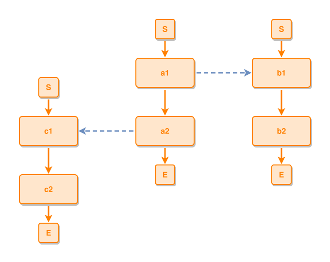

<!-- AUTO-GENERATED FILE - DO NOT EDIT -->
<!-- Generated by: gen-test-md -->
<!-- Command: go run ./cmd-dev/gen-test-md -->

# component-constellation-places-tied-components-around-the-hub

> **⚠️ Warning:** This file is auto-generated. Manual changes will be lost when tests are regenerated.

**Source:** gl:docs/dev/layout-gen/layout-alg.md#L2728-L2733 | [docs/dev/layout-gen/layout-alg.md](../../docs/dev/layout-gen/layout-alg.md#component-constellation-places-tied-components-around-the-hub)

## ipmt Content

```ipmt
a1 ::e --> a2 ::e
b1 ::e --> b2 ::e
c1 ::e --> c2 ::e
a1 --::X--> b1
a2 --::X--> c1
```

## Generated Files

- [component-constellation-places-tied-components-around-the-hub.ipmt](component-constellation-places-tied-components-around-the-hub.ipmt) - ipmt input
- [component-constellation-places-tied-components-around-the-hub.json](component-constellation-places-tied-components-around-the-hub.json) - Parsed structure
- [component-constellation-places-tied-components-around-the-hub.layout.json](component-constellation-places-tied-components-around-the-hub.layout.json) - Layout coordinates
- [component-constellation-places-tied-components-around-the-hub.ipm.svg](component-constellation-places-tied-components-around-the-hub.ipm.svg) - Rendered diagram

## Layout Validation Rules

Test line: 2728

✅ All 9 rules passed

- ✓ [Line 53](gl:docs/dev/layout-gen/layout-alg.md#L53): `each edge has max-bends=0` ([edges-run-straight-by-default.dsl](../layout-gen-rules/edges-run-straight-by-default.dsl))
- ✓ [Line 2746](gl:docs/dev/layout-gen/layout-alg.md#L2746): `#a1,#b1 have same y` ([component-constellation-places-tied-components-around-the-hub.dsl](../layout-gen-rules/component-constellation-places-tied-components-around-the-hub.dsl))
- ✓ [Line 2747](gl:docs/dev/layout-gen/layout-alg.md#L2747): `#a1 is left-of #b1 with gap=120` ([component-constellation-places-tied-components-around-the-hub-02.dsl](../layout-gen-rules/component-constellation-places-tied-components-around-the-hub-02.dsl))
- ✓ [Line 2748](gl:docs/dev/layout-gen/layout-alg.md#L2748): `#c1,#a2,#b2 have same y` ([component-constellation-places-tied-components-around-the-hub-03.dsl](../layout-gen-rules/component-constellation-places-tied-components-around-the-hub-03.dsl))
- ✓ [Line 2749](gl:docs/dev/layout-gen/layout-alg.md#L2749): `#c1 is left-of #a2 with gap=120` ([component-constellation-places-tied-components-around-the-hub-04.dsl](../layout-gen-rules/component-constellation-places-tied-components-around-the-hub-04.dsl))
- ✓ [Line 2750](gl:docs/dev/layout-gen/layout-alg.md#L2750): `edge #a1,#b1 has max-bends=0` ([component-constellation-places-tied-components-around-the-hub-05.dsl](../layout-gen-rules/component-constellation-places-tied-components-around-the-hub-05.dsl))
- ✓ [Line 2751](gl:docs/dev/layout-gen/layout-alg.md#L2751): `edge #a2,#c1 has max-bends=0` ([component-constellation-places-tied-components-around-the-hub-06.dsl](../layout-gen-rules/component-constellation-places-tied-components-around-the-hub-06.dsl))
- ✓ [Line 2752](gl:docs/dev/layout-gen/layout-alg.md#L2752): `edge #a2,#c1 has source-side=left` ([component-constellation-places-tied-components-around-the-hub-07.dsl](../layout-gen-rules/component-constellation-places-tied-components-around-the-hub-07.dsl))
- ✓ [Line 2753](gl:docs/dev/layout-gen/layout-alg.md#L2753): `edge #a2,#c1 has target-side=right` ([component-constellation-places-tied-components-around-the-hub-08.dsl](../layout-gen-rules/component-constellation-places-tied-components-around-the-hub-08.dsl))

## Rendered Diagram



This test case was automatically generated from the specification document.

The ipmt code block was extracted using [sync-test-cases](../../docs/dev/testing.md) and saved to [component-constellation-places-tied-components-around-the-hub.ipmt](component-constellation-places-tied-components-around-the-hub.ipmt), then parsed into the [JSON structure](component-constellation-places-tied-components-around-the-hub.json) and laid out into [layout coordinates](component-constellation-places-tied-components-around-the-hub.layout.json). The [SVG diagram](component-constellation-places-tied-components-around-the-hub.ipm.svg) was rendered using [ipmsvg-gen](../../docs/ipmsvg-gen.md).
