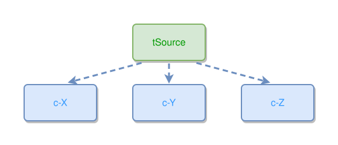

<!-- AUTO-GENERATED FILE - DO NOT EDIT -->
<!-- Generated by: gen-test-md -->
<!-- Command: go run ./cmd-dev/gen-test-md -->

# concept-collision-detection

> **⚠️ Warning:** This file is auto-generated. Manual changes will be lost when tests are regenerated.

**Source:** gl:docs/dev/layout-gen/layout-alg.md#L2820-L2821 | [docs/dev/layout-gen/layout-alg.md](../../docs/dev/layout-gen/layout-alg.md#concept-collision-detection)

## ipmt Content

```ipmt
tSource --> c-X ::c, c-Y ::c, c-Z ::c
```

## Generated Files

- [concept-collision-detection.ipmt](concept-collision-detection.ipmt) - ipmt input
- [concept-collision-detection.json](concept-collision-detection.json) - Parsed structure
- [concept-collision-detection.layout.json](concept-collision-detection.layout.json) - Layout coordinates
- [concept-collision-detection.ipm.svg](concept-collision-detection.ipm.svg) - Rendered diagram

## Layout Validation Rules

Test line: 2820

✅ All 1 rules passed

- ✓ [Line 53](gl:docs/dev/layout-gen/layout-alg.md#L53): `each edge has max-bends=0` ([edges-run-straight-by-default.dsl](../layout-gen-rules/edges-run-straight-by-default.dsl))

## Rendered Diagram



This test case was automatically generated from the specification document.

The ipmt code block was extracted using [sync-test-cases](../../docs/dev/testing.md) and saved to [concept-collision-detection.ipmt](concept-collision-detection.ipmt), then parsed into the [JSON structure](concept-collision-detection.json) and laid out into [layout coordinates](concept-collision-detection.layout.json). The [SVG diagram](concept-collision-detection.ipm.svg) was rendered using [ipmsvg-gen](../../docs/ipmsvg-gen.md).
