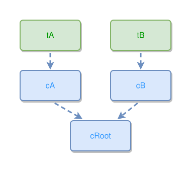

<!-- AUTO-GENERATED FILE - DO NOT EDIT -->
<!-- Generated by: gen-test-md -->
<!-- Command: go run ./cmd-dev/gen-test-md -->

# concept-fan-in-keeps-the-chain-gap-below-its-parents

> **⚠️ Warning:** This file is auto-generated. Manual changes will be lost when tests are regenerated.

**Source:** gl:docs/dev/layout-gen/layout-alg.md#L1811-L1813 | [docs/dev/layout-gen/layout-alg.md](../../docs/dev/layout-gen/layout-alg.md#concept-fan-in-keeps-the-chain-gap-below-its-parents)

## ipmt Content

```ipmt
tA ::t --> cA ::c --> cRoot ::c
tB ::t --> cB ::c --> cRoot
```

## Generated Files

- [concept-fan-in-keeps-the-chain-gap-below-its-parents.ipmt](concept-fan-in-keeps-the-chain-gap-below-its-parents.ipmt) - ipmt input
- [concept-fan-in-keeps-the-chain-gap-below-its-parents.json](concept-fan-in-keeps-the-chain-gap-below-its-parents.json) - Parsed structure
- [concept-fan-in-keeps-the-chain-gap-below-its-parents.layout.json](concept-fan-in-keeps-the-chain-gap-below-its-parents.layout.json) - Layout coordinates
- [concept-fan-in-keeps-the-chain-gap-below-its-parents.ipm.svg](concept-fan-in-keeps-the-chain-gap-below-its-parents.ipm.svg) - Rendered diagram

## Layout Validation Rules

Test line: 1811

✅ All 4 rules passed

- ✓ [Line 53](gl:docs/dev/layout-gen/layout-alg.md#L53): `each edge has max-bends=0` ([edges-run-straight-by-default.dsl](../layout-gen-rules/edges-run-straight-by-default.dsl))
- ✓ [Line 1824](gl:docs/dev/layout-gen/layout-alg.md#L1824): `#cRoot is horizontally-centered-between #cA,#cB` ([concept-fan-in-keeps-the-chain-gap-below-its-parents.dsl](../layout-gen-rules/concept-fan-in-keeps-the-chain-gap-below-its-parents.dsl))
- ✓ [Line 1825](gl:docs/dev/layout-gen/layout-alg.md#L1825): `#cRoot is below #cA with gap=40` ([concept-fan-in-keeps-the-chain-gap-below-its-parents-02.dsl](../layout-gen-rules/concept-fan-in-keeps-the-chain-gap-below-its-parents-02.dsl))
- ✓ [Line 1826](gl:docs/dev/layout-gen/layout-alg.md#L1826): `#cA,#cB have same y` ([concept-fan-in-keeps-the-chain-gap-below-its-parents-03.dsl](../layout-gen-rules/concept-fan-in-keeps-the-chain-gap-below-its-parents-03.dsl))

## Rendered Diagram



This test case was automatically generated from the specification document.

The ipmt code block was extracted using [sync-test-cases](../../docs/dev/testing.md) and saved to [concept-fan-in-keeps-the-chain-gap-below-its-parents.ipmt](concept-fan-in-keeps-the-chain-gap-below-its-parents.ipmt), then parsed into the [JSON structure](concept-fan-in-keeps-the-chain-gap-below-its-parents.json) and laid out into [layout coordinates](concept-fan-in-keeps-the-chain-gap-below-its-parents.layout.json). The [SVG diagram](concept-fan-in-keeps-the-chain-gap-below-its-parents.ipm.svg) was rendered using [ipmsvg-gen](../../docs/ipmsvg-gen.md).
