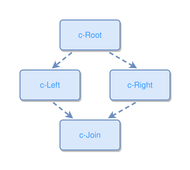

<!-- AUTO-GENERATED FILE - DO NOT EDIT -->
<!-- Generated by: gen-test-md -->
<!-- Command: go run ./cmd-dev/gen-test-md -->

# concept-hierarchy-diamond-pattern

> **⚠️ Warning:** This file is auto-generated. Manual changes will be lost when tests are regenerated.

**Source:** gl:docs/dev/layout-gen/layout-alg.md#L1947-L1951 | [docs/dev/layout-gen/layout-alg.md](../../docs/dev/layout-gen/layout-alg.md#concept-hierarchy-diamond-pattern)

## ipmt Content

```ipmt
c-Root ::c --> c-Left ::c
c-Root --> c-Right ::c
c-Left --> c-Join ::c
c-Right --> c-Join
```

## Generated Files

- [concept-hierarchy-diamond-pattern.ipmt](concept-hierarchy-diamond-pattern.ipmt) - ipmt input
- [concept-hierarchy-diamond-pattern.json](concept-hierarchy-diamond-pattern.json) - Parsed structure
- [concept-hierarchy-diamond-pattern.layout.json](concept-hierarchy-diamond-pattern.layout.json) - Layout coordinates
- [concept-hierarchy-diamond-pattern.ipm.svg](concept-hierarchy-diamond-pattern.ipm.svg) - Rendered diagram

## Layout Validation Rules

Test line: 1947

✅ All 5 rules passed

- ✓ [Line 53](gl:docs/dev/layout-gen/layout-alg.md#L53): `each edge has max-bends=0` ([edges-run-straight-by-default.dsl](../layout-gen-rules/edges-run-straight-by-default.dsl))
- ✓ [Line 1963](gl:docs/dev/layout-gen/layout-alg.md#L1963): `#c-Left,#c-Right have same y` ([concept-hierarchy-diamond-pattern.dsl](../layout-gen-rules/concept-hierarchy-diamond-pattern.dsl))
- ✓ [Line 1964](gl:docs/dev/layout-gen/layout-alg.md#L1964): `#c-Join is below #c-Left with gap=40` ([concept-hierarchy-diamond-pattern-02.dsl](../layout-gen-rules/concept-hierarchy-diamond-pattern-02.dsl))
- ✓ [Line 1965](gl:docs/dev/layout-gen/layout-alg.md#L1965): `#c-Root is above #c-Left with gap=40` ([concept-hierarchy-diamond-pattern-03.dsl](../layout-gen-rules/concept-hierarchy-diamond-pattern-03.dsl))
- ✓ [Line 1966](gl:docs/dev/layout-gen/layout-alg.md#L1966): `#c-Root,#c-Join have same center-x` ([concept-hierarchy-diamond-pattern-04.dsl](../layout-gen-rules/concept-hierarchy-diamond-pattern-04.dsl))

## Rendered Diagram



This test case was automatically generated from the specification document.

The ipmt code block was extracted using [sync-test-cases](../../docs/dev/testing.md) and saved to [concept-hierarchy-diamond-pattern.ipmt](concept-hierarchy-diamond-pattern.ipmt), then parsed into the [JSON structure](concept-hierarchy-diamond-pattern.json) and laid out into [layout coordinates](concept-hierarchy-diamond-pattern.layout.json). The [SVG diagram](concept-hierarchy-diamond-pattern.ipm.svg) was rendered using [ipmsvg-gen](../../docs/ipmsvg-gen.md).
