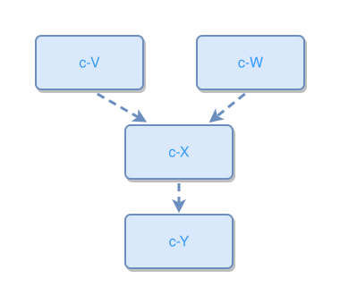

<!-- AUTO-GENERATED FILE - DO NOT EDIT -->
<!-- Generated by: gen-test-md -->
<!-- Command: go run ./cmd-dev/gen-test-md -->

# concept-hierarchy-multiple-roots

> **⚠️ Warning:** This file is auto-generated. Manual changes will be lost when tests are regenerated.

**Source:** gl:docs/dev/layout-gen/layout-alg.md#L2129-L2132 | [docs/dev/layout-gen/layout-alg.md](../../docs/dev/layout-gen/layout-alg.md#concept-hierarchy-multiple-roots)

## ipmt Content

```ipmt
c-V ::c --> c-X ::c
c-W ::c --> c-X
c-X --> c-Y ::c
```

## Generated Files

- [concept-hierarchy-multiple-roots.ipmt](concept-hierarchy-multiple-roots.ipmt) - ipmt input
- [concept-hierarchy-multiple-roots.json](concept-hierarchy-multiple-roots.json) - Parsed structure
- [concept-hierarchy-multiple-roots.layout.json](concept-hierarchy-multiple-roots.layout.json) - Layout coordinates
- [concept-hierarchy-multiple-roots.ipm.svg](concept-hierarchy-multiple-roots.ipm.svg) - Rendered diagram

## Layout Validation Rules

Test line: 2129

✅ All 4 rules passed

- ✓ [Line 53](gl:docs/dev/layout-gen/layout-alg.md#L53): `each edge has max-bends=0` ([edges-run-straight-by-default.dsl](../layout-gen-rules/edges-run-straight-by-default.dsl))
- ✓ [Line 2144](gl:docs/dev/layout-gen/layout-alg.md#L2144): `#c-V,#c-W have same y` ([concept-hierarchy-multiple-roots.dsl](../layout-gen-rules/concept-hierarchy-multiple-roots.dsl))
- ✓ [Line 2145](gl:docs/dev/layout-gen/layout-alg.md#L2145): `#c-X is below #c-V with gap=40` ([concept-hierarchy-multiple-roots-02.dsl](../layout-gen-rules/concept-hierarchy-multiple-roots-02.dsl))
- ✓ [Line 2146](gl:docs/dev/layout-gen/layout-alg.md#L2146): `#c-Y is below #c-X with gap=40` ([concept-hierarchy-multiple-roots-03.dsl](../layout-gen-rules/concept-hierarchy-multiple-roots-03.dsl))

## Rendered Diagram



This test case was automatically generated from the specification document.

The ipmt code block was extracted using [sync-test-cases](../../docs/dev/testing.md) and saved to [concept-hierarchy-multiple-roots.ipmt](concept-hierarchy-multiple-roots.ipmt), then parsed into the [JSON structure](concept-hierarchy-multiple-roots.json) and laid out into [layout coordinates](concept-hierarchy-multiple-roots.layout.json). The [SVG diagram](concept-hierarchy-multiple-roots.ipm.svg) was rendered using [ipmsvg-gen](../../docs/ipmsvg-gen.md).
