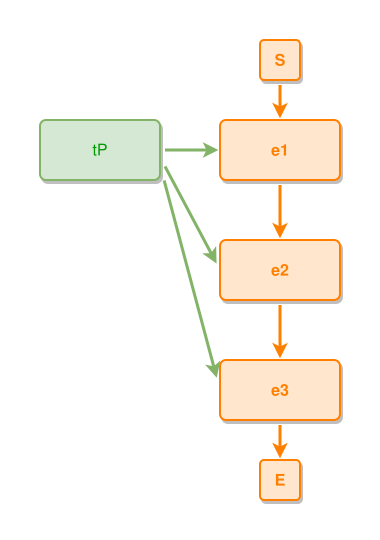

<!-- AUTO-GENERATED FILE - DO NOT EDIT -->
<!-- Generated by: gen-test-md -->
<!-- Command: go run ./cmd-dev/gen-test-md -->

# declaration-order-does-not-decide-where-a-chain-spanning-thing-sits

> **⚠️ Warning:** This file is auto-generated. Manual changes will be lost when tests are regenerated.

**Source:** gl:docs/dev/layout-gen/layout-alg.md#L1562-L1567 | [docs/dev/layout-gen/layout-alg.md](../../docs/dev/layout-gen/layout-alg.md#declaration-order-does-not-decide-where-a-chain-spanning-thing-sits)

## ipmt Content

```ipmt
e1 ::e
  --> e2 ::e
  --> e3 ::e

tP --> e3, e2, e1
```

## Generated Files

- [declaration-order-does-not-decide-where-a-chain-spanning-thing-sits.ipmt](declaration-order-does-not-decide-where-a-chain-spanning-thing-sits.ipmt) - ipmt input
- [declaration-order-does-not-decide-where-a-chain-spanning-thing-sits.json](declaration-order-does-not-decide-where-a-chain-spanning-thing-sits.json) - Parsed structure
- [declaration-order-does-not-decide-where-a-chain-spanning-thing-sits.layout.json](declaration-order-does-not-decide-where-a-chain-spanning-thing-sits.layout.json) - Layout coordinates
- [declaration-order-does-not-decide-where-a-chain-spanning-thing-sits.ipm.svg](declaration-order-does-not-decide-where-a-chain-spanning-thing-sits.ipm.svg) - Rendered diagram

## Layout Validation Rules

Test line: 1562

✅ All 15 rules passed

- ✓ [Line 53](gl:docs/dev/layout-gen/layout-alg.md#L53): `each edge has max-bends=0` ([edges-run-straight-by-default.dsl](../layout-gen-rules/edges-run-straight-by-default.dsl))
- ✓ [Line 1573](gl:docs/dev/layout-gen/layout-alg.md#L1573): `each edge has max-bends=0` ([declaration-order-does-not-decide-where-a-chain-spanning-thing-sits.dsl](../layout-gen-rules/declaration-order-does-not-decide-where-a-chain-spanning-thing-sits.dsl))
- ✓ [Line 1574](gl:docs/dev/layout-gen/layout-alg.md#L1574): `#tP is left-of #e1 with gap=60` ([declaration-order-does-not-decide-where-a-chain-spanning-thing-sits-02.dsl](../layout-gen-rules/declaration-order-does-not-decide-where-a-chain-spanning-thing-sits-02.dsl))
- ✓ [Line 1575](gl:docs/dev/layout-gen/layout-alg.md#L1575): `#tP,#e1 have same y` ([declaration-order-does-not-decide-where-a-chain-spanning-thing-sits-03.dsl](../layout-gen-rules/declaration-order-does-not-decide-where-a-chain-spanning-thing-sits-03.dsl))
- ✓ [Line 1576](gl:docs/dev/layout-gen/layout-alg.md#L1576): `edge #tP,#e1 has source-side=right` ([declaration-order-does-not-decide-where-a-chain-spanning-thing-sits-04.dsl](../layout-gen-rules/declaration-order-does-not-decide-where-a-chain-spanning-thing-sits-04.dsl))
- ✓ [Line 1577](gl:docs/dev/layout-gen/layout-alg.md#L1577): `edge #tP,#e2 has source-side=right` ([declaration-order-does-not-decide-where-a-chain-spanning-thing-sits-05.dsl](../layout-gen-rules/declaration-order-does-not-decide-where-a-chain-spanning-thing-sits-05.dsl))
- ✓ [Line 1578](gl:docs/dev/layout-gen/layout-alg.md#L1578): `edge #tP,#e3 has source-side=right` ([declaration-order-does-not-decide-where-a-chain-spanning-thing-sits-06.dsl](../layout-gen-rules/declaration-order-does-not-decide-where-a-chain-spanning-thing-sits-06.dsl))
- ✓ [Line 1579](gl:docs/dev/layout-gen/layout-alg.md#L1579): `edge #tP,#e1 has target-side=left` ([declaration-order-does-not-decide-where-a-chain-spanning-thing-sits-07.dsl](../layout-gen-rules/declaration-order-does-not-decide-where-a-chain-spanning-thing-sits-07.dsl))
- ✓ [Line 1580](gl:docs/dev/layout-gen/layout-alg.md#L1580): `edge #tP,#e2 has target-side=left` ([declaration-order-does-not-decide-where-a-chain-spanning-thing-sits-08.dsl](../layout-gen-rules/declaration-order-does-not-decide-where-a-chain-spanning-thing-sits-08.dsl))
- ✓ [Line 1581](gl:docs/dev/layout-gen/layout-alg.md#L1581): `edge #tP,#e3 has target-side=left` ([declaration-order-does-not-decide-where-a-chain-spanning-thing-sits-09.dsl](../layout-gen-rules/declaration-order-does-not-decide-where-a-chain-spanning-thing-sits-09.dsl))
- ✓ [Line 1582](gl:docs/dev/layout-gen/layout-alg.md#L1582): `edge #tP,#e1 has source-position=0.5` ([declaration-order-does-not-decide-where-a-chain-spanning-thing-sits-10.dsl](../layout-gen-rules/declaration-order-does-not-decide-where-a-chain-spanning-thing-sits-10.dsl))
- ✓ [Line 1583](gl:docs/dev/layout-gen/layout-alg.md#L1583): `edge #tP,#e3 has source-position=0.75` ([declaration-order-does-not-decide-where-a-chain-spanning-thing-sits-11.dsl](../layout-gen-rules/declaration-order-does-not-decide-where-a-chain-spanning-thing-sits-11.dsl))
- ✓ [Line 1584](gl:docs/dev/layout-gen/layout-alg.md#L1584): `edge #tP,#e1 does not cross edge #tP,#e2` ([declaration-order-does-not-decide-where-a-chain-spanning-thing-sits-12.dsl](../layout-gen-rules/declaration-order-does-not-decide-where-a-chain-spanning-thing-sits-12.dsl))
- ✓ [Line 1585](gl:docs/dev/layout-gen/layout-alg.md#L1585): `edge #tP,#e2 does not cross edge #tP,#e3` ([declaration-order-does-not-decide-where-a-chain-spanning-thing-sits-13.dsl](../layout-gen-rules/declaration-order-does-not-decide-where-a-chain-spanning-thing-sits-13.dsl))
- ✓ [Line 1586](gl:docs/dev/layout-gen/layout-alg.md#L1586): `edge #tP,#e1 does not cross edge #tP,#e3` ([declaration-order-does-not-decide-where-a-chain-spanning-thing-sits-14.dsl](../layout-gen-rules/declaration-order-does-not-decide-where-a-chain-spanning-thing-sits-14.dsl))

## Rendered Diagram



This test case was automatically generated from the specification document.

The ipmt code block was extracted using [sync-test-cases](../../docs/dev/testing.md) and saved to [declaration-order-does-not-decide-where-a-chain-spanning-thing-sits.ipmt](declaration-order-does-not-decide-where-a-chain-spanning-thing-sits.ipmt), then parsed into the [JSON structure](declaration-order-does-not-decide-where-a-chain-spanning-thing-sits.json) and laid out into [layout coordinates](declaration-order-does-not-decide-where-a-chain-spanning-thing-sits.layout.json). The [SVG diagram](declaration-order-does-not-decide-where-a-chain-spanning-thing-sits.ipm.svg) was rendered using [ipmsvg-gen](../../docs/ipmsvg-gen.md).
