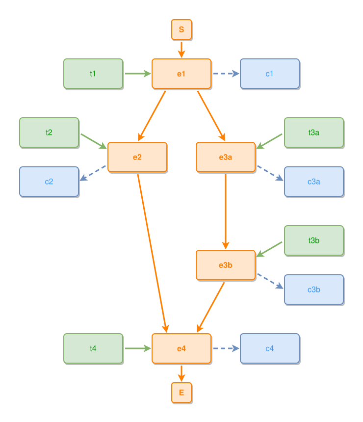

<!-- AUTO-GENERATED FILE - DO NOT EDIT -->
<!-- Generated by: gen-test-md -->
<!-- Command: go run ./cmd-dev/gen-test-md -->

# diamond-pattern-with-aux-on-every-event

> **⚠️ Warning:** This file is auto-generated. Manual changes will be lost when tests are regenerated.

**Source:** gl:docs/dev/layout-gen/layout-alg.md#L423-L437 | [docs/dev/layout-gen/layout-alg.md](../../docs/dev/layout-gen/layout-alg.md#diamond-pattern-with-aux-on-every-event)

## ipmt Content

```ipmt
e1 ::e --> e2 ::e, e3a ::e
e3a --> e3b ::e
e2 --> e4 ::e
e3b --> e4
t1 ::t --> e1
e1 --> c1 ::c
t2 ::t --> e2
e2 --> c2 ::c
t3a ::t --> e3a
e3a --> c3a ::c
t3b ::t --> e3b
e3b --> c3b ::c
t4 ::t --> e4
e4 --> c4 ::c
```

## Generated Files

- [diamond-pattern-with-aux-on-every-event.ipmt](diamond-pattern-with-aux-on-every-event.ipmt) - ipmt input
- [diamond-pattern-with-aux-on-every-event.json](diamond-pattern-with-aux-on-every-event.json) - Parsed structure
- [diamond-pattern-with-aux-on-every-event.layout.json](diamond-pattern-with-aux-on-every-event.layout.json) - Layout coordinates
- [diamond-pattern-with-aux-on-every-event.ipm.svg](diamond-pattern-with-aux-on-every-event.ipm.svg) - Rendered diagram

## Layout Validation Rules

Test line: 423

✅ All 18 rules passed

- ✓ [Line 53](gl:docs/dev/layout-gen/layout-alg.md#L53): `each edge has max-bends=0` ([edges-run-straight-by-default.dsl](../layout-gen-rules/edges-run-straight-by-default.dsl))
- ✓ [Line 82](gl:docs/dev/layout-gen/layout-alg.md#L82): `type=event has width=120` ([one-event.dsl](../layout-gen-rules/one-event.dsl))
- ✓ [Line 83](gl:docs/dev/layout-gen/layout-alg.md#L83): `type=event has min-gap-to-others>=10` ([one-event-02.dsl](../layout-gen-rules/one-event-02.dsl))
- ✓ [Line 84](gl:docs/dev/layout-gen/layout-alg.md#L84): `type=boundary has size=40x40` ([one-event-03.dsl](../layout-gen-rules/one-event-03.dsl))
- ✓ [Line 450](gl:docs/dev/layout-gen/layout-alg.md#L450): `#e2,#e3a have same y` ([diamond-pattern-with-aux-on-every-event.dsl](../layout-gen-rules/diamond-pattern-with-aux-on-every-event.dsl))
- ✓ [Line 451](gl:docs/dev/layout-gen/layout-alg.md#L451): `#e3a,#e3b have same center-x` ([diamond-pattern-with-aux-on-every-event-02.dsl](../layout-gen-rules/diamond-pattern-with-aux-on-every-event-02.dsl))
- ✓ [Line 452](gl:docs/dev/layout-gen/layout-alg.md#L452): `#S,#e1,#e4,#E have same center-x` ([diamond-pattern-with-aux-on-every-event-03.dsl](../layout-gen-rules/diamond-pattern-with-aux-on-every-event-03.dsl))
- ✓ [Line 453](gl:docs/dev/layout-gen/layout-alg.md#L453): `#e1 is horizontally-centered-between #e2,#e3a` ([diamond-pattern-with-aux-on-every-event-04.dsl](../layout-gen-rules/diamond-pattern-with-aux-on-every-event-04.dsl))
- ✓ [Line 454](gl:docs/dev/layout-gen/layout-alg.md#L454): `#t2 is left-of #e2 with gap=60` ([diamond-pattern-with-aux-on-every-event-05.dsl](../layout-gen-rules/diamond-pattern-with-aux-on-every-event-05.dsl))
- ✓ [Line 455](gl:docs/dev/layout-gen/layout-alg.md#L455): `#t2,#c2 have same center-x` ([diamond-pattern-with-aux-on-every-event-06.dsl](../layout-gen-rules/diamond-pattern-with-aux-on-every-event-06.dsl))
- ✓ [Line 456](gl:docs/dev/layout-gen/layout-alg.md#L456): `#t3a is right-of #e3a with gap=60` ([diamond-pattern-with-aux-on-every-event-07.dsl](../layout-gen-rules/diamond-pattern-with-aux-on-every-event-07.dsl))
- ✓ [Line 457](gl:docs/dev/layout-gen/layout-alg.md#L457): `#t3a,#c3a have same center-x` ([diamond-pattern-with-aux-on-every-event-08.dsl](../layout-gen-rules/diamond-pattern-with-aux-on-every-event-08.dsl))
- ✓ [Line 458](gl:docs/dev/layout-gen/layout-alg.md#L458): `#t3b is right-of #e3b with gap=60` ([diamond-pattern-with-aux-on-every-event-09.dsl](../layout-gen-rules/diamond-pattern-with-aux-on-every-event-09.dsl))
- ✓ [Line 459](gl:docs/dev/layout-gen/layout-alg.md#L459): `#t3b,#c3b have same center-x` ([diamond-pattern-with-aux-on-every-event-10.dsl](../layout-gen-rules/diamond-pattern-with-aux-on-every-event-10.dsl))
- ✓ [Line 460](gl:docs/dev/layout-gen/layout-alg.md#L460): `#t1 is left-of #e1 with gap=60` ([diamond-pattern-with-aux-on-every-event-11.dsl](../layout-gen-rules/diamond-pattern-with-aux-on-every-event-11.dsl))
- ✓ [Line 461](gl:docs/dev/layout-gen/layout-alg.md#L461): `#c1 is right-of #e1 with gap=60` ([diamond-pattern-with-aux-on-every-event-12.dsl](../layout-gen-rules/diamond-pattern-with-aux-on-every-event-12.dsl))
- ✓ [Line 462](gl:docs/dev/layout-gen/layout-alg.md#L462): `#t4 is left-of #e4 with gap=60` ([diamond-pattern-with-aux-on-every-event-13.dsl](../layout-gen-rules/diamond-pattern-with-aux-on-every-event-13.dsl))
- ✓ [Line 463](gl:docs/dev/layout-gen/layout-alg.md#L463): `#c4 is right-of #e4 with gap=60` ([diamond-pattern-with-aux-on-every-event-14.dsl](../layout-gen-rules/diamond-pattern-with-aux-on-every-event-14.dsl))

## Rendered Diagram



This test case was automatically generated from the specification document.

The ipmt code block was extracted using [sync-test-cases](../../docs/dev/testing.md) and saved to [diamond-pattern-with-aux-on-every-event.ipmt](diamond-pattern-with-aux-on-every-event.ipmt), then parsed into the [JSON structure](diamond-pattern-with-aux-on-every-event.json) and laid out into [layout coordinates](diamond-pattern-with-aux-on-every-event.layout.json). The [SVG diagram](diamond-pattern-with-aux-on-every-event.ipm.svg) was rendered using [ipmsvg-gen](../../docs/ipmsvg-gen.md).
