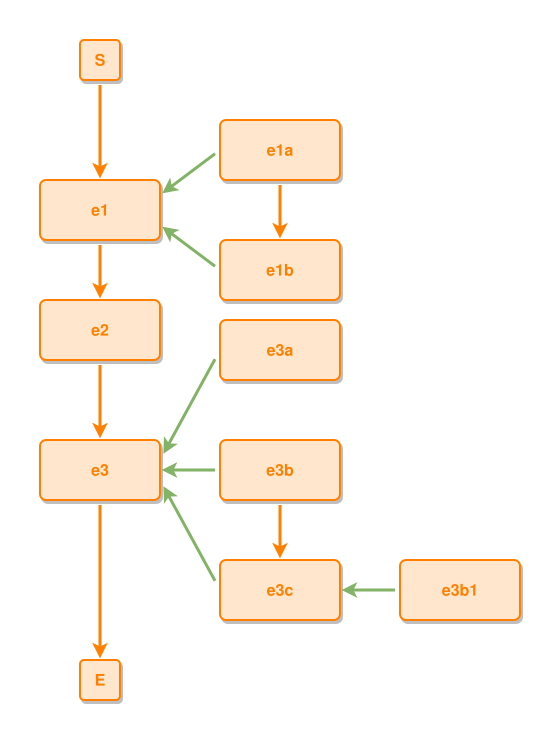

<!-- AUTO-GENERATED FILE - DO NOT EDIT -->
<!-- Generated by: gen-test-md -->
<!-- Command: go run ./cmd-dev/gen-test-md -->

# event-contains-connected-sub-events-and-sub-sub-events

> **⚠️ Warning:** This file is auto-generated. Manual changes will be lost when tests are regenerated.

**Source:** gl:docs/dev/layout-gen/layout-alg.md#L852-L858 | [docs/dev/layout-gen/layout-alg.md](../../docs/dev/layout-gen/layout-alg.md#event-contains-connected-sub-events-and-sub-sub-events)

## ipmt Content

```ipmt
e1 ::e <--::P-- e1a ::e, e1b ::e
e1 --> e2 ::e --> e3 ::e
e3 <--::P-- e3a ::e, e3b ::e, e3c ::e
e3c <--::P-- e3b1 ::e
e1a --> e1b
e3b --> e3c
```

## Generated Files

- [event-contains-connected-sub-events-and-sub-sub-events.ipmt](event-contains-connected-sub-events-and-sub-sub-events.ipmt) - ipmt input
- [event-contains-connected-sub-events-and-sub-sub-events.json](event-contains-connected-sub-events-and-sub-sub-events.json) - Parsed structure
- [event-contains-connected-sub-events-and-sub-sub-events.layout.json](event-contains-connected-sub-events-and-sub-sub-events.layout.json) - Layout coordinates
- [event-contains-connected-sub-events-and-sub-sub-events.ipm.svg](event-contains-connected-sub-events-and-sub-sub-events.ipm.svg) - Rendered diagram

## Layout Validation Rules

Test line: 852

✅ All 9 rules passed

- ✓ [Line 53](gl:docs/dev/layout-gen/layout-alg.md#L53): `each edge has max-bends=0` ([edges-run-straight-by-default.dsl](../layout-gen-rules/edges-run-straight-by-default.dsl))
- ✓ [Line 82](gl:docs/dev/layout-gen/layout-alg.md#L82): `type=event has width=120` ([one-event.dsl](../layout-gen-rules/one-event.dsl))
- ✓ [Line 83](gl:docs/dev/layout-gen/layout-alg.md#L83): `type=event has min-gap-to-others>=10` ([one-event-02.dsl](../layout-gen-rules/one-event-02.dsl))
- ✓ [Line 84](gl:docs/dev/layout-gen/layout-alg.md#L84): `type=boundary has size=40x40` ([one-event-03.dsl](../layout-gen-rules/one-event-03.dsl))
- ✓ [Line 876](gl:docs/dev/layout-gen/layout-alg.md#L876): `#e1,#e2,#e3 have same center-x` ([event-contains-connected-sub-events-and-sub-sub-events.dsl](../layout-gen-rules/event-contains-connected-sub-events-and-sub-sub-events.dsl))
- ✓ [Line 877](gl:docs/dev/layout-gen/layout-alg.md#L877): `#e1a,#e1b,#e3a,#e3b,#e3c have same center-x` ([event-contains-connected-sub-events-and-sub-sub-events-02.dsl](../layout-gen-rules/event-contains-connected-sub-events-and-sub-sub-events-02.dsl))
- ✓ [Line 878](gl:docs/dev/layout-gen/layout-alg.md#L878): `#e1a is right-of #e1 with gap=60` ([event-contains-connected-sub-events-and-sub-sub-events-03.dsl](../layout-gen-rules/event-contains-connected-sub-events-and-sub-sub-events-03.dsl))
- ✓ [Line 879](gl:docs/dev/layout-gen/layout-alg.md#L879): `#e3b1 is right-of #e3c with gap=60` ([event-contains-connected-sub-events-and-sub-sub-events-04.dsl](../layout-gen-rules/event-contains-connected-sub-events-and-sub-sub-events-04.dsl))
- ✓ [Line 880](gl:docs/dev/layout-gen/layout-alg.md#L880): `#e3c,#e3b1 have same y` ([event-contains-connected-sub-events-and-sub-sub-events-05.dsl](../layout-gen-rules/event-contains-connected-sub-events-and-sub-sub-events-05.dsl))

## Rendered Diagram



This test case was automatically generated from the specification document.

The ipmt code block was extracted using [sync-test-cases](../../docs/dev/testing.md) and saved to [event-contains-connected-sub-events-and-sub-sub-events.ipmt](event-contains-connected-sub-events-and-sub-sub-events.ipmt), then parsed into the [JSON structure](event-contains-connected-sub-events-and-sub-sub-events.json) and laid out into [layout coordinates](event-contains-connected-sub-events-and-sub-sub-events.layout.json). The [SVG diagram](event-contains-connected-sub-events-and-sub-sub-events.ipm.svg) was rendered using [ipmsvg-gen](../../docs/ipmsvg-gen.md).
