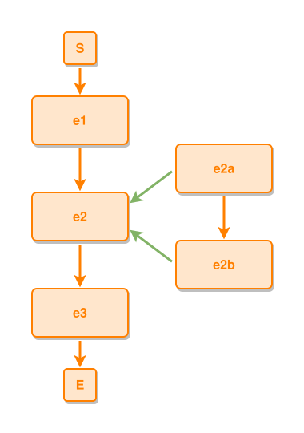

<!-- AUTO-GENERATED FILE - DO NOT EDIT -->
<!-- Generated by: gen-test-md -->
<!-- Command: go run ./cmd-dev/gen-test-md -->

# event-contains-sub-events-with-mixed-connections

> **⚠️ Warning:** This file is auto-generated. Manual changes will be lost when tests are regenerated.

**Source:** gl:docs/dev/layout-gen/layout-alg.md#L820-L823 | [docs/dev/layout-gen/layout-alg.md](../../docs/dev/layout-gen/layout-alg.md#event-contains-sub-events-with-mixed-connections)

## ipmt Content

```ipmt
e1 ::e --> e2 ::e --> e3 ::e
e2 <--::P-- e2a ::e, e2b ::e
e2a --> e2b
```

## Generated Files

- [event-contains-sub-events-with-mixed-connections.ipmt](event-contains-sub-events-with-mixed-connections.ipmt) - ipmt input
- [event-contains-sub-events-with-mixed-connections.json](event-contains-sub-events-with-mixed-connections.json) - Parsed structure
- [event-contains-sub-events-with-mixed-connections.layout.json](event-contains-sub-events-with-mixed-connections.layout.json) - Layout coordinates
- [event-contains-sub-events-with-mixed-connections.ipm.svg](event-contains-sub-events-with-mixed-connections.ipm.svg) - Rendered diagram

## Layout Validation Rules

Test line: 820

✅ All 8 rules passed

- ✓ [Line 53](gl:docs/dev/layout-gen/layout-alg.md#L53): `each edge has max-bends=0` ([edges-run-straight-by-default.dsl](../layout-gen-rules/edges-run-straight-by-default.dsl))
- ✓ [Line 82](gl:docs/dev/layout-gen/layout-alg.md#L82): `type=event has width=120` ([one-event.dsl](../layout-gen-rules/one-event.dsl))
- ✓ [Line 83](gl:docs/dev/layout-gen/layout-alg.md#L83): `type=event has min-gap-to-others>=10` ([one-event-02.dsl](../layout-gen-rules/one-event-02.dsl))
- ✓ [Line 84](gl:docs/dev/layout-gen/layout-alg.md#L84): `type=boundary has size=40x40` ([one-event-03.dsl](../layout-gen-rules/one-event-03.dsl))
- ✓ [Line 843](gl:docs/dev/layout-gen/layout-alg.md#L843): `#e2 is vertically-centered-between #e2a,#e2b` ([event-contains-sub-events-with-mixed-connections.dsl](../layout-gen-rules/event-contains-sub-events-with-mixed-connections.dsl))
- ✓ [Line 844](gl:docs/dev/layout-gen/layout-alg.md#L844): `#e2a is right-of #e2 with gap=60` ([event-contains-sub-events-with-mixed-connections-02.dsl](../layout-gen-rules/event-contains-sub-events-with-mixed-connections-02.dsl))
- ✓ [Line 845](gl:docs/dev/layout-gen/layout-alg.md#L845): `#e2a,#e2b have same center-x` ([event-contains-sub-events-with-mixed-connections-03.dsl](../layout-gen-rules/event-contains-sub-events-with-mixed-connections-03.dsl))
- ✓ [Line 846](gl:docs/dev/layout-gen/layout-alg.md#L846): `#S,#e1,#e2,#e3,#E have same center-x` ([event-contains-sub-events-with-mixed-connections-04.dsl](../layout-gen-rules/event-contains-sub-events-with-mixed-connections-04.dsl))

## Rendered Diagram



This test case was automatically generated from the specification document.

The ipmt code block was extracted using [sync-test-cases](../../docs/dev/testing.md) and saved to [event-contains-sub-events-with-mixed-connections.ipmt](event-contains-sub-events-with-mixed-connections.ipmt), then parsed into the [JSON structure](event-contains-sub-events-with-mixed-connections.json) and laid out into [layout coordinates](event-contains-sub-events-with-mixed-connections.layout.json). The [SVG diagram](event-contains-sub-events-with-mixed-connections.ipm.svg) was rendered using [ipmsvg-gen](../../docs/ipmsvg-gen.md).
