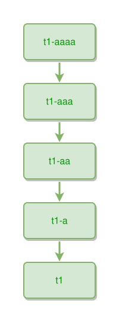

<!-- AUTO-GENERATED FILE - DO NOT EDIT -->
<!-- Generated by: gen-test-md -->
<!-- Command: go run ./cmd-dev/gen-test-md -->

# five-things-connected

> **⚠️ Warning:** This file is auto-generated. Manual changes will be lost when tests are regenerated.

**Source:** gl:docs/dev/layout-gen/layout-alg.md#L1591-L1592 | [docs/dev/layout-gen/layout-alg.md](../../docs/dev/layout-gen/layout-alg.md#five-things-connected)

## ipmt Content

```ipmt
t1-aaaa --> t1-aaa --> t1-aa --> t1-a --> t1
```

## Generated Files

- [five-things-connected.ipmt](five-things-connected.ipmt) - ipmt input
- [five-things-connected.json](five-things-connected.json) - Parsed structure
- [five-things-connected.layout.json](five-things-connected.layout.json) - Layout coordinates
- [five-things-connected.ipm.svg](five-things-connected.ipm.svg) - Rendered diagram

## Layout Validation Rules

Test line: 1591

✅ All 13 rules passed

- ✓ [Line 53](gl:docs/dev/layout-gen/layout-alg.md#L53): `each edge has max-bends=0` ([edges-run-straight-by-default.dsl](../layout-gen-rules/edges-run-straight-by-default.dsl))
- ✓ [Line 1605](gl:docs/dev/layout-gen/layout-alg.md#L1605): `edge #t1-aaaa,#t1-aaa has type=partof` ([five-things-connected.dsl](../layout-gen-rules/five-things-connected.dsl))
- ✓ [Line 1606](gl:docs/dev/layout-gen/layout-alg.md#L1606): `edge #t1-aaa,#t1-aa has type=partof` ([five-things-connected-02.dsl](../layout-gen-rules/five-things-connected-02.dsl))
- ✓ [Line 1607](gl:docs/dev/layout-gen/layout-alg.md#L1607): `edge #t1-aa,#t1-a has type=partof` ([five-things-connected-03.dsl](../layout-gen-rules/five-things-connected-03.dsl))
- ✓ [Line 1608](gl:docs/dev/layout-gen/layout-alg.md#L1608): `edge #t1-a,#t1 has type=partof` ([five-things-connected-04.dsl](../layout-gen-rules/five-things-connected-04.dsl))
- ✓ [Line 1609](gl:docs/dev/layout-gen/layout-alg.md#L1609): `#t1-a is above #t1 with gap=40` ([five-things-connected-05.dsl](../layout-gen-rules/five-things-connected-05.dsl))
- ✓ [Line 1610](gl:docs/dev/layout-gen/layout-alg.md#L1610): `#t1-a,#t1 have same center-x` ([five-things-connected-06.dsl](../layout-gen-rules/five-things-connected-06.dsl))
- ✓ [Line 1611](gl:docs/dev/layout-gen/layout-alg.md#L1611): `#t1-aa is above #t1-a with gap=40` ([five-things-connected-07.dsl](../layout-gen-rules/five-things-connected-07.dsl))
- ✓ [Line 1612](gl:docs/dev/layout-gen/layout-alg.md#L1612): `#t1-aa,#t1-a have same center-x` ([five-things-connected-08.dsl](../layout-gen-rules/five-things-connected-08.dsl))
- ✓ [Line 1613](gl:docs/dev/layout-gen/layout-alg.md#L1613): `#t1-aaa is above #t1-aa with gap=40` ([five-things-connected-09.dsl](../layout-gen-rules/five-things-connected-09.dsl))
- ✓ [Line 1614](gl:docs/dev/layout-gen/layout-alg.md#L1614): `#t1-aaa,#t1-aa have same center-x` ([five-things-connected-10.dsl](../layout-gen-rules/five-things-connected-10.dsl))
- ✓ [Line 1615](gl:docs/dev/layout-gen/layout-alg.md#L1615): `#t1-aaaa is above #t1-aaa with gap=40` ([five-things-connected-11.dsl](../layout-gen-rules/five-things-connected-11.dsl))
- ✓ [Line 1616](gl:docs/dev/layout-gen/layout-alg.md#L1616): `#t1-aaaa,#t1-aaa have same center-x` ([five-things-connected-12.dsl](../layout-gen-rules/five-things-connected-12.dsl))

## Rendered Diagram



This test case was automatically generated from the specification document.

The ipmt code block was extracted using [sync-test-cases](../../docs/dev/testing.md) and saved to [five-things-connected.ipmt](five-things-connected.ipmt), then parsed into the [JSON structure](five-things-connected.json) and laid out into [layout coordinates](five-things-connected.layout.json). The [SVG diagram](five-things-connected.ipm.svg) was rendered using [ipmsvg-gen](../../docs/ipmsvg-gen.md).
